# Fundamentos de JavaScript
## Modulo 1. Introducción al curso
### Clase 1 *Bienvenidos al Curso de Fundamentos de JavaScript*

Nuestro profesor será Sacha Lifszyc y es desarrollador Full Stack desde hace varios años, hoy en día trabaja en Restorando un startup dedicado a hacer reservas para restaurantes.

A lo largo del curso aprenderemos las bases sólidas para dominar el lenguaje JavaScript. Veremos desde lo más básico como: variables, tipos de datos y operadores, e iremos avanzando con los condicionales y las estructuras de control. Luego veremos los conceptos relacionados con asincronismo, uno de los aspectos fundamentales de JavaScript, usando callbacks, promesas y async await. Y finalmente crearemos un juego de Simón dice en el que pondremos en práctica todo lo aprendido.

### Clase 2 *Repositorio del curso*

Bienvenidos de nuevo al curso.

En este material van a encontrar el enlace directo al repositorio que el profesor va a estar mencionando y utilizando a lo largo de todo el curso: https://github.com/platzi/FundamentosJSCurso

Están todos los archivos de los que se hará mención. En caso de que tengan alguna duda, usen el sistema de discusiones y estaremos respondiendo a la brevedad

Recuerden compartir sus proyectos con la comunidad.

¡Comencemos!

## Modulo 2. Primeros pasos en JavaScript
### Clase 3 *Variables*
A lo largo de todo el curso estaremos utilizando las siguientes herramientas:

- **Navegador:** Durante el curso se utiliza el navegador Chrome, aunque no hay preferencias y puede usar cualquiera. La razón por la se seleccionó Chrome se debe a que está disponible en todos los sistemas operativos y va a permitir que todos el mismo código, además ya incorporo mucho de las nuevas funcionales que trae el nuevo lenguaje de JavaScript.
- **Editor de texto:** Nuevamente no hay preferencias, pueden usar cualquier editor (Atom, Bloc de Nota, Sublime Text, Visual Studio Code).

**Primeros pasos**

Creamos un archivo de tipo html (que nos permitirá visualizar todo) y otro archivo de tipo javascript (que es donde trabajaremos).

Si abrimos el archivo Clase1.html en el navegador:

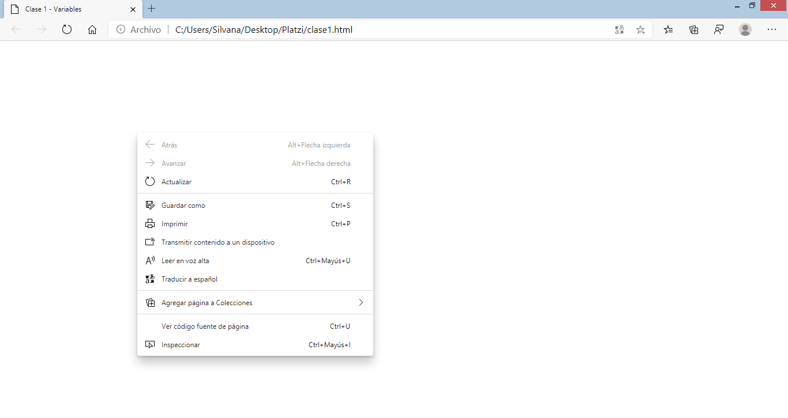

Y damos inspeccionar nos permitirá interactuar con el html:

Vamos a nuestro editor de texto, el archivo html creamos un esqueleto básico:

En el cuerpo (body) escribimos script que nos permitirá incluir o llamar nuestro código de tipo JavaScript.

**Hola mundo**

Para imprimir algo en la consola, es decir, darle un mensaje 'secreto' al usuario usamos el comando: ***console.log()***

Siempre que empezamos en un nuevo lenguaje o un framework nuevo es bueno hacer un 'hola mundo' como práctica, en JavaScript es de la siguiente manera:

***console.log('Hola mundo')***

Al guardar y cargar nuevamente la página html, podemos ver el resultado en la consola:

**Definir una variable**

Una de las manera de declarar y asignar una variable en JavaScript es la siguiente:

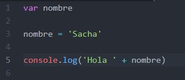

Esto nos imprimirá un 'Hola nombre'.

Otra manera también es:

Concatenamos el texto con el signo + (más).

Si por ejemplo deseamos concatenar dos variables y decir 'Hola nombre apellido', es:

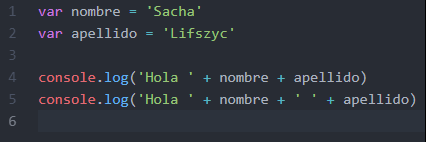

- De la primera forma nos queda pegado el nombre y el apellido.
- De la segunda forma ponemos un espacio en blanco entre el nombre y el apellido.

También podemos declarar y asignar todo en una misma línea:

**Débilmente tipado**

JavaScript es un lenguaje débilmente tipado, es decir, no hay nada que me diga que la variable nombre tiene que ser texto y solo acepta valores de tipo string.

Esto nos imprimirá un 'Hola Sacha Lifszyc' y un 'Tengo 28 años'.

Pero si hacemos lo siguiente:

Aunque nos imprime lo mismo, podemos ver como nuestra edad empieza como un número y termina siendo un string. Esto es algo que no debemos perder de vista a la hora de desarrollar en JavaScript.

**NOTA**

- El string puede ser con comilla doble o simple, es totalmente indistinto pero por convicción el más usado es la comilla simple.
- Se puede ver que no se ha escrito el punto y coma al final de cada sentencia o línea del programa. Se podría incluir y el programa seguirá funcionando correctamente. En JavaScript el punto y coma es algo visual o una convección el si deseamos escribirlo o no, si bien hay algunos casos en donde no funciona pero son casos muy puntuales.

### Clase 4 *Variables: Strings*
Los strings son cadenas de texto. Para indicar que estamos usando una cadena de texto debemos de colocar las comillas simples o dobles.

**Convertir una cadena en mayúscula**

El método toUpperCase devuelve el valor de la cadena convertida a mayúsculas. No afecta al valor de la cadena en sí mismo.

**Convertir una cadena en minúscula**

El método toLowerCase devuelve el valor de la cadena convertida a minúsculas. No afecta al valor de la cadena en sí misma.

**Imprimir un único carácter de la cadena**

Los caracteres de una cadena se indexan de izquierda a derecha. El índice del primer carácter es 0, y el índice del último carácter en una cadena llamada nombreCadena es nombreCadena.length - 1. Si el índice que usted proporciona está fuera del rango, JavaScript devuelve una cadena vacía.

Un índice es un entero entre 0 y 1 menos que la longitud de la cadena. Si no se proporciona ningún índice charAt() utilizará 0.

Sacha está compuesto de la siguiente forma:

Por tanto:

- 0, imprime el primer carácter.
- 4, imprime el último carácter.

**Cantidad caracteres en una cadena**

Esta propiedad devuelve el número de caracteres de una cadena. UTF-16, el formato usado por JavaScript, usa 16 bits para representar los caracteres más comunes, pero necesita usar dos caracteres para otros menos usados, así que es posible que el valor devuelto por length no corresponda al número de caracteres de la cadena.

Para una cadena vacía, length es 0.

**Concatenar cadenas**

Ya sabemos que podemos concatenar dos cadenas de la siguiente forma:

Hay otra forma de concatenar string que es un más nueva y mejor porque es un poco más clara:

Se llama interpolación de cadenas y utilizan las comillas invertidas o backticks para delimitar sus contenidos, en vez de las tradicionales comillas simples o dobles de las cadenas de texto normales. La interpolación permite utilizar cualquier expresión válida de JavaScript (como por ejemplo la suma de dos variables) dentro de una cadena y obtener como resultado la cadena completa con la expresión evaluada.

Las partes variables se denominan placeholders y utilizan la sintaxis ${ } para diferenciarse del resto de la cadena. Como dentro de las partes variables de la cadena se puede incluir cualquier expresión válida de JavaScript, en la práctica sirven para mucho más que mostrar el contenido de una variable.

**Substring**

Para conseguir los caracteres de una cadena que comienzan en una localización especificada y de acuerdo al número de caracteres que se especifiquen, podemos hacerlo de dos maneras.

Por ejemplo, si queremos conseguir la segunda y la tercera letra del nombre podemos hacerlo de la siguiente manera:

Pero tenemos el método ***substr()***:

***substr()*** tiene dos parámetros, uno para el carácter de inicio y otro para el último carácter de la longitud deseada.

**RETO: Encuentra la última letra del nombre.**

### Clase 5 *Variables: Números*

Los tipos de número pueden ser enteros, decimales o dobles

**Adición**

La operación adición se produce mediante la suma de número:

**Resta**

La operación de resta se produce cuando se sustraen el resultado de los operadores, produciendo su diferencia:

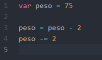

**Ejemplo 1**

Tenemos una variable peso con un valor de 75, a peso le restamos 2, por otra parte tenemos una variable sandwich con el valor 1. Ahora a la variable peso sumamos el peso actual más el valor del sandwich para obtener el resultado:

**Ejemplo 2**

Al ejemplo anterior le agregamos una nueva variable llamada jugarFutbol con un valor de 3 y a nuestra variable peso le restamos el valor de jugarFutbol:

**Producto**

El operador multiplicación produce el producto de la multiplicación de los operandos:

***RECUERDA: Al hacer una operación con decimales debemos realizar operaciones adicionales para conseguir un resultado preciso:***

- **Math.roud:** Devuelve el valor del número dado redondeado al entero más cercano.
  - Si la porción fraccionaría del número es 0.5 o mayor, el argumento es redondeado al siguiente número entero superior.
  - Si la porción de la fracción del número es menor a 0.5, el argumento es redondeado al siguiente número entero inferior.

- **toFixed():** Es un método que formatea un número usando notación de punto fijo.
  - toFixed() devuelve una representación de cadena que no usa notación exponencial y tiene exactamente X dígitos después del decimal. El número se redondea si es necesario, y la parte fraccional se rellena con ceros si es necesario para que tenga la longitud especificada.

Para regresar la cadena nuevamente a un número:

- **parseFloat():** Toma una cadena y la convierte en número de punto flotante.
  - Si encuentra un carácter diferente al signo (+ o -), numerales (0-9), un punto decimal o un exponente, devuelve el valor hasta ese punto e ignora ese carácter y todos los correctos siguientes. Se permiten espacios anteriores y posteriores.
  - Si el primer carácter no se puede convertir a número, parseFloat devuelve NaN.

**División**

El operador división se produce el cociente de la operación donde el operando izquierdo es el dividendo y el operando derecho es el divisor:

### Clase 6 *Funciones*

Las funciones son fracciones de código reutilizable. En términos generales, una función es un "subprograma" que puede ser llamado por código externo (o interno en caso de recursión) a la función. Al igual que el programa en sí mismo, una función se compone de una secuencia de declaraciones, que conforman el llamado cuerpo de la función. Se pueden pasar valores a una función, y la función puede devolver un valor.

**FUNCTION**

La función está compuesta por:

- **function:** Palabra reservada que crea un nuevo objeto function.
- **imprimirEdad:** Es el nombre la función.
- **():** El nombre de un argumento que se pasará a la función. Una función puede tener hasta 255 argumentos.
- **{ instrucciones }:** Las instrucciones que forman el cuerpo de la función.

**Sin parámetro vs Con parámetro**

Si bien ambos códigos son aceptados y pueden ser ejecutados, es a la hora de reutilizar el código cuando se puede notar la diferencia entre ambos. Por ejemplo, deseamos que el nombre ahora sea 'Vicky' y la edad 24, si ponemos otro imprimirEdad('Vicky', 24) debajo de cada uno veremos que el primer código nos seguirá imprimiendo con el nombre Sacha y la edad 28, pero el segundo SI cambiara tanto el nombre como la edad.

**Reutilizar código**

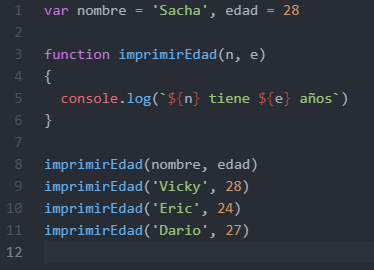

Como se ha dicho, Function nos permite reutilizar el código enviado diferentes valores mediante los parámetros.

**Débilmente tipado**

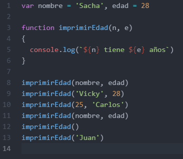

Recordemos que JavaScript es un lenguaje débilmente tipado, es decir, que sin importar si los parámetros que le pasemos a la función estén invertidos o incluso incompletos él intentara ejecutar el código.

**¿Qué son las palabras reservadas?**

Son palabras que no pueden ser utilizadas como variables, funciones, métodos o identificadores de objetos. Nosotros NO podemos escribir algo como ***var var = 15*** o ***var function = 'Sacha'***.

### Clase 7 *El alcance de las funciones*
Una variable que no está definida dentro del cuerpo de una función es una variable global:

Por el contrario, una variable definida dentro de una función es una variable local:

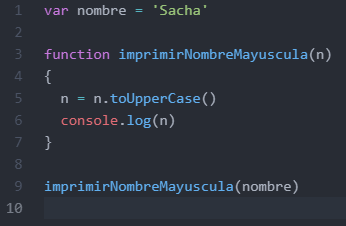

Para que la ejecución de una función no modifique una variable global usamos parámetros en lugar de pasar directamente la variable.

También es posible utilizar el mismo nombre para una variable global y para el parámetro de una función con un alcance local:

**window**

El objeto window representa la ventana que contiene un documento DOM.

Tomemos en cuenta el primer ejemplo:

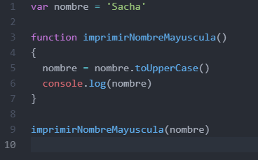

Si escribimos nombre en la consola nos aparece 'Sacha' sin mayúscula, pero al escribir window.nombre nos imprime 'SACHA':

### Clase 8 *Objetos*
Un objeto es una colección de propiedades, y una propiedad es una asociación entre un nombre (o clave) y un valor. El valor de una propiedad puede ser una función, en cuyo caso la propiedad es conocida como un método. Además de los objetos que están predefinidos en el navegador, puedes definir tus propios objetos.

Por ejemplo, si deseamos tener un nombre con el valor 'Sacha' y otro con el valor 'Dario', esto:

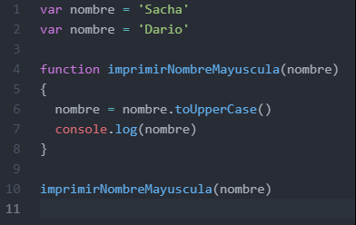

No podemos ponerlo de esta forma, porque estaríamos pisando la variable.

Una opción sería:

Pero si deseáramos más nombre entonces estaríamos creando nuevas variables como ***nombrePepito***, ***nombreVicky*** y llamando nuevamente a la función.

Un objeto siendo un entidad independiente con propiedades y tipos, está construida de esta forma:

- **var:** Declara la variable.
- **sacha, dario:** Los nombres del objeto.
- **{ clave: valor }:** Los objetos son delimitados por llaves, compuesto por una clave y un valor que se separan entre sí por dos puntos.

Un objeto puede tener todos los atributos que sean necesarios. En el ejemplo creamos un objeto 'sacha' y otro objeto 'dario', ambos con nombres, apellidos y edad. También, escribir el nombre de un objeto separado por un punto del nombre de un atributo, nos permite acceder al valor de dicho atributo para ese objeto.

También podemos ingresar directamente dentro del console.log sin la necesidad de la variable nombre:

Las últimas versiones de JavaScript nos permiten desglosar el objeto para acceder únicamente al atributo que nos interesa. Esto se consigue encerrando el nombre del atributo entre llaves { }:

Podemos llamar a la función sin hacer referencia a una variable, creando un nuevo objeto dentro:

Debemos tener cuidado cuando hacemos esto porque si enviamos una función sin enviar nada o creamos un nuevo objeto sin nombre nos puede salir error, porque JavaScript intentara acceder al atributo nombre de algo que no se lo estamos pasando:

### Clase 9 *Desestructurar objetos*
La desestructuración de objetos es una expresión de JavaScript que permite desempacar valores de arreglos o propiedades de objetos en distintas variables, es decir, para no duplicar las variables introducir el nombre de la variable como parámetro de la segunda variable.

**RETO: Crear una función que imprima el nombre y la edad de la siguiente forma; Hola, me llamo nombre y tengo edad años**

### Clase 10 *Parámetros como referencia o como valor*
JavaScript se comporta de manera distinta cuando le pasamos un objeto como parámetro. Cuando los objetos se pasan como una referencia:

Estos se modifican fuera de la función:

Si por ejemplo hacemos esto:

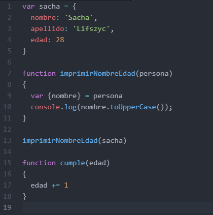

El valor no cambia:

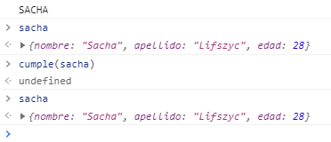

Para solucionar esto se puede crear un objeto diferente. Esto lo podemos hacer colocando tres puntos antes del nombre:

Creamos otra variable, sachaMasViejo, y ahora tenemos tanto la edad original (28) como la nueva edad (29):

### Clase 11 *Comparaciones en JavaScript*
Existen varias maneras de comparar variables u objetos dentro de JavaScript. En el primer ejemplo le asignamos a 'x' un valor numérico y a 'y' un string:

JavaScript tiene comparaciones estrictas y abstractas.

Una comparación estricta (por ejemplo, ===) solo es verdadera si los operandos son del mismo tipo y los contenidos coinciden. La comparación abstracta más comúnmente utilizada (por ejemplo, ==) convierte los operandos al mismo tipo antes de hacer la comparación.

En el ejemplo podemos ver como '==' nos da true o verdadero pues ambos son cuatro, mientras que '===' nos imprime false o falso debido a que los dos son de distintos tipos.

***RECUERDA: Se recomienda que cada vez que deseamos hacer una comparación hacer uso de '===', esto para evitar que JavaScript compare dos variables que son distintos tipos.***

**Comparando objetos**

Tenemos dos objetos, ambos tienen un atributo nombre con el mismo valor:

Pero al realizar la comparación:

Nos resulta falso en ambos casos, esto se debe a que, a pesar de que tanto 'sacha' como 'otraPersona' son del tipo Objeto, ambos referencian a diferentes objetos.

**¿Cómo hacer que dos objetos sean iguales?**

Tenga en cuenta que un objeto se convierte en una primitiva si, y solo si, su comparando es una primitiva. Si ambos operandos son objetos, se comparan como objetos, y la prueba de igualdad es verdadera solo si ambos refieren el mismo objeto.

Si realizamos la comparación:

Si desglosamos el objeto en otro:

Nos dará falso, porque al desestructurar el objeto estamos creando un nuevo objeto.

Si regresamos al ejemplo de objetos iguales, le cambiamos el nombre al objeto otraPersona y realizamos la comparación:

Nos dará true (verdadero) porque ambos referencia al mismo objeto sin importar que el valor del atributo nombre sea diferentes.

Lo mismo sucede con el objeto 'sacha' y el objeto 'otraPersona' cuyo atributo nombre contenga el mismo valor, al realizar la comparación:

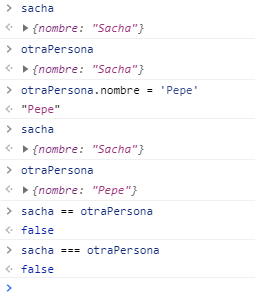

Seguirá imprimiendo false (falso) porque ambos referencian a objetos distintos.

**Datos primitivos**

En JavaScript, un primitive (valor primitivo, tipo de dato primitivo) son datos que no son un objeto y no tienen métodos. Hay 6 tipos de datos primitivos: string, number, bigint, boolean, undefined y symbol. También hay null, que aparentemente es primitivo, pero de hecho es un caso especial para cada Object.

La mayoría de las veces, un valor primitivo se representa directamente en el nivel más bajo de la implementación del lenguaje. Todos los primitivos son inmutables, es decir, no se pueden modificar. Es importante no confundir un primitivo en sí mismo con un valor primitivo asignado a una variable. Se puede reasignar un nuevo valor a la variable, pero el valor existente no se puede cambiar de la misma forma en que se pueden modificar los objetos, los arreglos y las funciones.

- **String:** Se utiliza para representar datos textuales. Es un conjunto de "elementos" de valores enteros sin signo de 16 bits. Cada elemento ocupa una posición en la cadena. El primer elemento está en el índice 0, el siguiente en el índice 1, y así sucesivamente. La longitud de una cadena es el número de elementos que contiene.
- **Number:** Es un primitivo de tipo numérico que no tiene específico para los números enteros y de coma flotante.
- **Bigint:** Es un primitivo numérico en JavaScript que puede representar números enteros con precisión arbitraria. Puede almacenar y operar de forma segura en números enteros grandes incluso más allá del límite seguro de enteros para Number.
- **Boolean:** Representa una entidad lógica y puede tener dos valores: true y false. 
- **Undefined:** Es una variable a la que no se le ha asignado valor, o no se ha declarado en absoluto (no se declara, no existe).
- **Symbol:** Es un valor primitivo único e inmutable y se puede utilizar como clave de una propiedad de objeto (ve más abajo). En algunos lenguajes de programación, los símbolos se denominan "átomos".
- **Null:** Es un literal de Javascript que representa intencionalmente un valor nulo o "vacío".

## Modulo 3. Estructuras de Control y Funciones
### Clase 12 *Condicionales*
Los condicionales nos permiten decidir el flujo de nuestro código. Mediante un condicional decidiremos si se ejecuta una parte de nuestro código cuando se cumpla o no cierta condición.

En el ejemplo tenemos a Sacha con una serie de profesiones con valor de verdadero o falso:

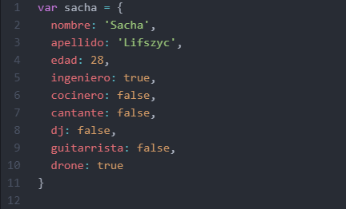

Con las condicionales podemos hacer que nos imprima 'Sacha es: ' y el nombre de la profesión si es verdadera (true):

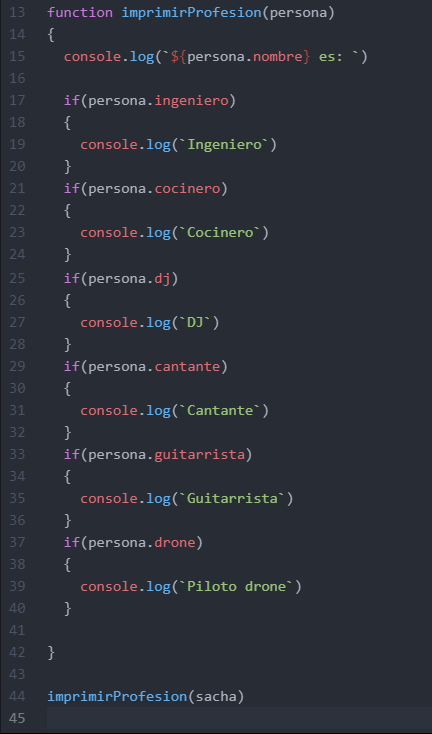

La condicional if también tiene otra parte que suele acompañarlo, else:

**Condicional if… else**

Ejecuta una sentencia si una condición especificada es evaluada como verdadera (en el ejemplo evalúa si la profesión es verdadera). Si la condición es evaluada como falsa, otra sentencia puede ser ejecutada.

***RETO: Crea una función que contenga una condicional e imprima 'Sacha es mayor de edad' o 'Sacha es menor de edad' teniendo en cuenta su edad.***

### Clase 13 *Funciones que retornan valores*
Tomemos como ejemplo nuestro reto anterior de mayor o menor de edad y agreguemos otra persona:

Para hacer más legible este programa podemos desglosar las funciones en funciones más pequeñas que retornen un valor:

Debemos tener en cuenta que, para incluir el 18 en el rango de edad, se utiliza el símbolo >= (mayor o igual que) y no el símbolo > (mayor que).

**Magic Number:** Son números dispersos en los bloques de código que crean dos grandes problemas, la poca semántica (información sobre su uso) y la posibilidad de que ese número se propague N filas, lo que significa N cambios en diferentes lugares.

Para evitar estos problemas convertirnos nuestro 18 en una variable:

Pero nosotros deseamos que no se cambie, que no deseamos que su valor cambie a través de la reasignación así que lo convertirnos en una constante (const), por buena práctica se utiliza mayúscula para escribir el nombre separado por guiones bajos (_):

### Clase 14 *Arrow functions*
Arrow Functions (Función Flecha) es una alternativa compacta a una expresión de función tradicional, pero es limitada y no se puede utilizar en todas las situaciones.

Una de las formas de definir una función sin nombre es asignándola una la variable:

Cuando se declara una función con variable es recomendado hacerlo con un const para que no sea redeclarado.

Con el Arrow Function se elimina la palabra 'function' del código y colocamos una flecha entre el argumento y el corchete de apertura:

Si el argumento es solamente uno, podemos quitar los paréntesis, suprimir los corchetes y eliminar la palabra 'return' ya que queda implícito:

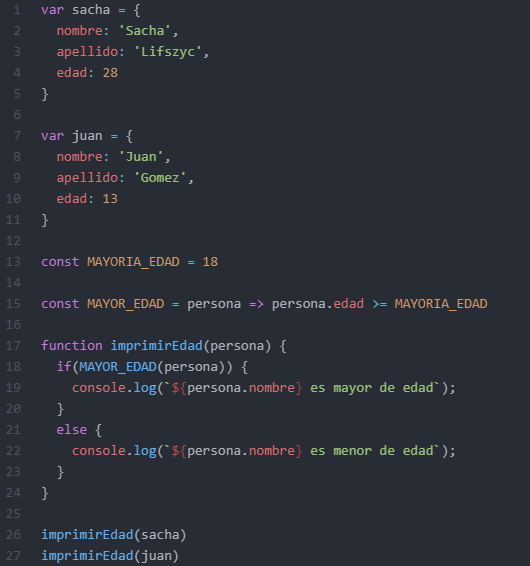

Si desglosamos el objeto para acceder al atributo que deseamos debemos volver a poner nuevamente los paréntesis:

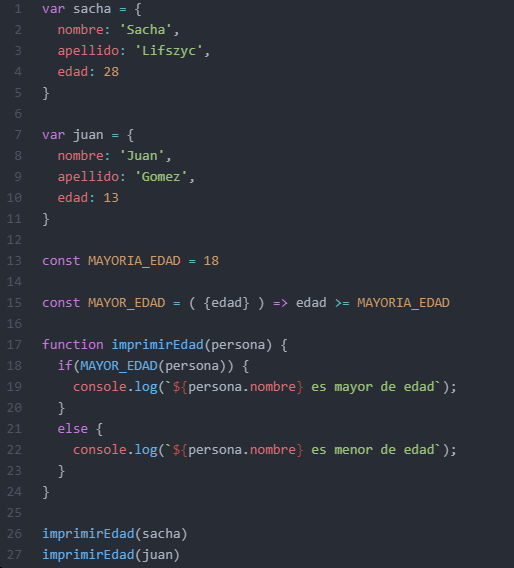

Otro ejemplo seria si quisiéramos hacer una función que permita o niegue un acceso según la edad, para eso  llamamos a la función MAYOR_EDAD y ponemos un símbolo de exclamación (!) que negara la condición que siga:

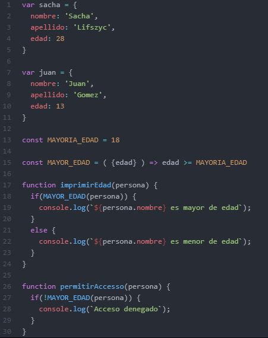

***RETO: Escribir la función imprimirEdad con Arrow Functions y completar la función permitirAcceso para que nos imprima si tenemos un acceso denegado  o permitido.***

### Clase 15 *Estructuras repetitivas: for*
El bucle for se utiliza para repetir una o más instrucciones un determinado número de veces. Consiste en tres expresiones opcionales, encerradas en paréntesis y separadas por puntos y comas, seguidas de una sentencia ejecutada en un bucle.

**Sintaxis:**

***for ([expresión-inicial]; [condición]; [expresión-final]) {

	sentencia

}***

En el ejemplo tenemos a una persona (Sacha) que baja o sube de peso durante un año (365 días):

**Math.random()**

Una función que retorna un punto flotante, un número pseudoaleatorio dentro del rango [0, 1). Esto quiere decir, desde el 0 (incluido) hasta el 1 pero sin incluirlo (excluido), el cual se puede escalar hasta el rango deseado. La implementación selecciona la semilla inicial hasta el algoritmo que genera el número aleatorio; este no puede ser elegido o cambiado por el usuario.

### Clase 16 *Estructuras repetitivas: while*
While crea un bucle que ejecuta una sentencia especificada mientras cierta condición se evalúe como verdadera. Dicha condición es evaluada antes de ejecutar la sentencia

**Sintaxis:**

***while (condición) {

	sentencia

}***

En el ejemplo tenemos nuestra persona (Sacha) que debe adelgazar 3kg y vamos contando los días hasta que esa condición se cumpla:

En ocasiones nuestro código puede fallar por errores de sintaxis o errores lógicos. En caso de que quieras verificar tu código, debes utilizar un debugger, el código se detiene cada vez que lee esta palabra.

**Incrementar**

El operador Incremento ( ++ ) incrementa su operando en uno.

- Si se utiliza como un postfix, entonces devuelve el valor antes de incrementar.
- Si se usa como un prefijo, entonces devuelve el valor después de incrementar.

**POSTFIX**

En este caso, a se incrementa después de configurar b . Entonces, b será 5, y c será 6.

**PREFIX**

En este caso, a se incrementa antes de configurar b . Entonces, b será 6, y c será 6.

### Clase 17 *Estructuras repetitivas: do-while*
La sentencia do-while (hacer mientras) crea un bucle que ejecuta una sentencia especificada, hasta que la condición de comprobación se evalúa como falsa. La condición se evalúa después de ejecutar la sentencia, dando como resultado que la sentencia especificada se ejecute al menos una vez.

**Sintaxis:**

***do {

	sentencia

} while (condición)***

En el ejemplo tenemos un contador que suma la cantidad de veces que fuimos a ver si llovía:

### Clase 18 *Condicional múltiple: switch*
La declaración switch evalúa una expresión, comparando el valor de esa expresión con una instancia case, y ejecuta declaraciones asociadas a ese case, así como las declaraciones en los case que siguen.

**Sintaxis:**

***switch (expresión) {

  case valor_1:

  Sentencia ejecutada cuando el resultado de expresión coincide con el valor_1

    break;

  case valor_2:

  Sentencia ejecutada cuando el resultado de expresión coincide con el valor_2

    break;

  ...

  case valor_N:

 Sentencia ejecutada cuando el resultado de expresión coincide con el valor_N

    break;

  default:

  Sentencia ejecutada cuando ninguno de los valores coincide con el valor de la expresión

    break;

}***

También vimos **prompt** que muestra un diálogo con mensaje opcional que solicita al usuario que introduzca un texto.

En el ejemplo tenemos un prompt que solicita un signo zodiacal para imprimir el horóscopo del día:

## Modulo 4. Arrays
### Clase 19 *Introducción a arrays*
### Clase 20 *Filtrar un array*
### Clase 21 *Transformar un array*
### Clase 22 *Reducir un array a un valor*
