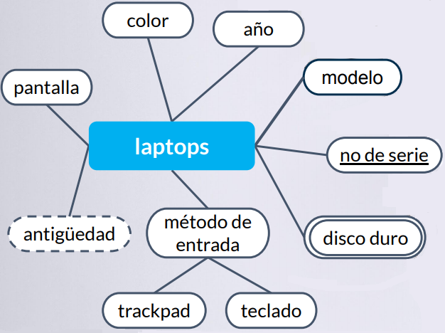
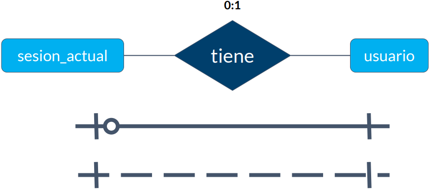
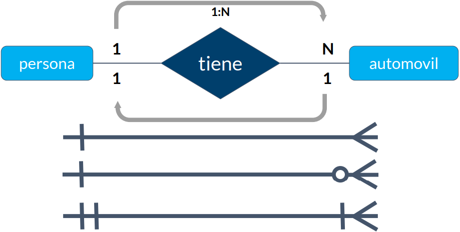
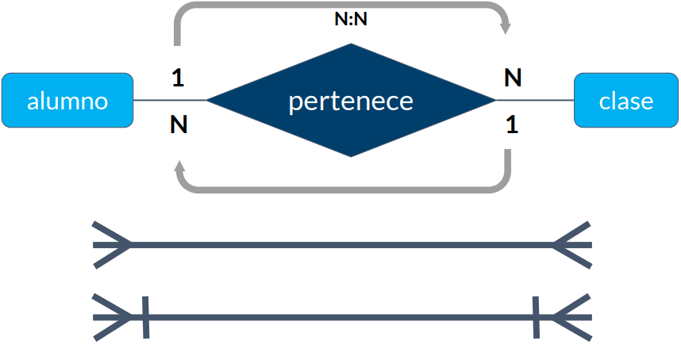
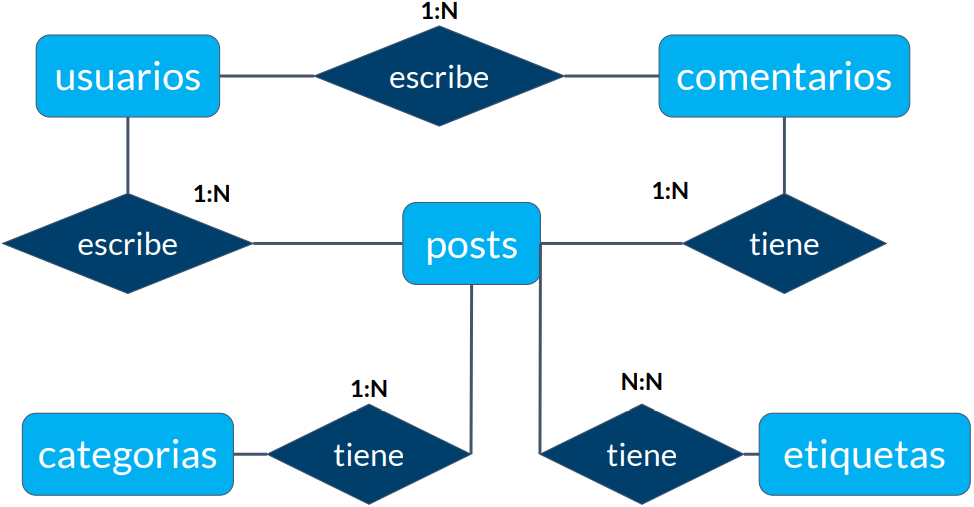
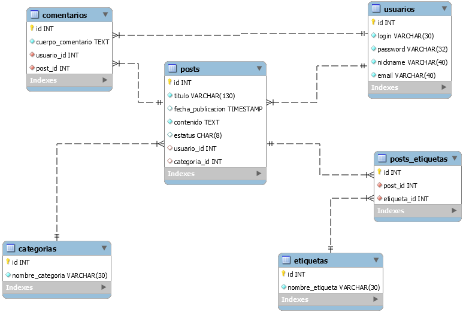

# Fundamentos de Base de Datos
## Modulo 1. Bienvenida conceptos básicos y contexto histórico de las Bases de Datos
### Clase 1 *Expert Session: resuelve tus dudas sobre las bases de datos*
### Clase 2 *Bienvenida conceptos básicos y contexto histórico de las Bases de Datos*

Tu profesor será Israel Vázquez, senior web developer en San Francisco, seminarista de bases de datos y entusiasta data engineering.

**Historia de la persistencia de la información**

Históricamente la información se pasaba de boca en boca, pero eso distorsionaba la información de manera rápida. Desde la antigüedad se empezaron a dar cuenta que era necesario guardar la información de forma que no cambiara y persistiera más allá del tiempo de vida del ser humano, es por esto que se inventaron los sistemas de escrituras primitivos.

Una de las primeras escrituras encontradas, arqueológicamente, es la Escritura Cuneiforme que, aunque sea primitiva, es compleja en su estructura y la guardaban básicamente tallándolas en piedras o tablas de arcillas, pero tenían varias desventajas como no eran transportables o que las tabillas de arcillas se rompían fácilmente. Entonces se dio un salto y apareció el papiro o pergamino, eran más portátiles y ligeros, pero con la desventaja de que fueron basados en materia animal o vegetal y, por ello, se descomponían con facilidad o era fácil que fueran anidados por hongos. Fueron los chinos quienes revolucionaron el papel, contaba con la ventaja de ser transportable y no fácilmente destruible.

Pasaron varios siglos antes del siguiente salto, en el siglo XX tenemos el Microfilme, fue una tecnología que almacenaba datos de manera virtualmente infinita, la desventaja estaba en que guardar la información, leerla o modificarla requería maquinas muy especializadas que no eran fáciles de conseguir y no era muy fácil el proceso. La siguiente gran revolución son los medios digitales; discos duros, discos de estado sólido, discos compactos, en estos se guarda la información en formato de 1 y 0. Después de eso existió un periodo de recesión en los que no hubo grandes cambios hasta la aparición de la nube.

La nube tiene un gran pro comparada con los otros métodos de almacenamiento ya que es accesible desde cualquier parte del mundo, es centralizada y puede ser usada por varias personas al mismo tiempo.

**¿Qué son las bases de datos?**

Las bases de datos entran cuando hacemos la transición a medios digitales y, ahora, en la nube. Nos servían para complementar la arquitectura de Von Neumann, que es la arquitectura de computación clásica que incluyen una CPU, memoria y elementos de entrada y salida.

**Tipos de bases de datos**

- **Relacionales:** es un tipo de base de datos que almacena y proporciona acceso a puntos de datos relacionados entre sí. Se basan en el modelo relacional, una forma intuitiva y directa de representar datos en tablas. En una base de datos relacional, cada fila de la tabla es un registro con un ID único llamado clave. Las columnas de la tabla contienen atributos de los datos, y cada registro generalmente tiene un valor para cada atributo, lo que facilita el establecimiento de las relaciones entre los puntos de datos. Algunos ejemplos son; SQL Server, Oracle, MariaDB.

- **No relacionales:** conocidas como NoSQL, están diseñadas específicamente para modelos de datos específicos y tienen esquemas flexibles para crear aplicaciones modernas. Las bases de datos NoSQL son ampliamente reconocidas porque son fáciles de desarrollar, por su funcionalidad y el rendimiento a escala. Algunos ejemplos son; MongoDB, Cassandra, neo4j.

**Servicios**

- **Auto administrado:** es la base de datos que tú instalas en tu computadora o tu servidor y te encargas de las actualizaciones, mantenimiento, etc.
- **Administrado:** son servicios que ofrecen las nubes modernas, tú la utilizas pero no debes instalarla u ocuparte del mantenimiento o actualizaciones.

## Modulo 2. Introducción a las bases de datos relacionales
### Clase 3 *Historia de las RDB*

Las bases de datos surgen de la necesidad de conservar la información más allá de lo que existe en la memoria RAM.

En el esquema de arquitectura de Von Neumann básicamente se contempla la memoria principal, que es lo que conocemos como RAM, y se contempla el procesamiento de datos, pero irónicamente no se contempla el guardado de datos persistentes. Cuando tuvimos la necesidad de guardar y extraer fácilmente se empezaron formas inteligentes de hacer esto.

La primera fue la base de datos basadas en archivos, que no es lo mismo a la base de datos basadas en documentos, básicamente guardar los datos en un archivo de texto plano, fáciles de guardar pero muy difíciles de traer nuevamente en una forma ordenada o de realizar consultas más complejas. Ante la necesidad de algo un poco más estructurado nacen las bases de datos relacionales, el inventor es Edgar Codd que dejó 12 reglas o mandamientos para asegurar de que toda la filosofía de las bases de datos no se pierdan en el boca a boca o con prácticas un poco diferentes. Codd se aseguró de que el estándar fuera más consistente, más sólido.

**12 reglas de Codd**

- **Regla 0:** *Regla de fundación.* Cualquier sistema que se proclame como relacional, debe ser capaz de gestionar sus bases de datos enteramente mediante sus capacidades relacionales.
- **Regla 1:** *Regla de la información.* Toda la información en la base de datos es representada unidireccionalmente por valores en posiciones de las columnas dentro de filas de tablas. Toda la información en una base de datos relacional se representa explícitamente en el nivel Lógico exactamente de una manera: con valores en tablas.
- **Regla 2:** *Regla del acceso garantizado.* Todos los datos deben ser accesibles sin ambigüedad. Esta regla es esencialmente una nueva exposición del requisito fundamental para las llaves primarias. Dice que cada valor escalar individual en la base de datos debe ser lógicamente direccionable especificando el nombre de la tabla, la columna que lo contiene y la llave primaria.
- **Regla 3:** *Regla del tratamiento sistemático de valores nulos.* El sistema de gestión de base de datos debe permitir que haya campos nulos. Debe tener una representación de la "información que falta y de la información inaplicable" que sea sistemática y distinta de todos los valores regulares.
- **Regla 4:** *Catálogo dinámico en línea basado en el modelo relacional.* El sistema debe soportar un catálogo en línea, el catálogo relacional, que da acceso a la estructura de la base de datos y que debe ser accesible a los usuarios autorizados.
- **Regla 5:** *Regla comprensiva del sublenguaje de los datos.* El sistema debe soportar por lo menos un lenguaje relacional que:
1. Tenga una sintaxis lineal.
2. Puede ser utilizado de manera interactiva.
3. Tenga soporte de operaciones de definición de datos, operaciones de manipulación de datos (actualización así como la recuperación), de control de la seguridad e integridad y operaciones de administración de transacciones.
- **Regla 6:** *Regla de actualización de vistas.* Todas las vistas que son teóricamente actualizables deben poder ser actualizadas por el sistema.
- **Regla 7:** *Alto nivel de inserción, actualización y borrado.* El sistema debe permitir la manipulación de alto nivel en los datos, es decir, sobre conjuntos de tuplas. Esto significa que los datos no solo se pueden recuperar de una base de datos relacional a partir de filas múltiples y/o de tablas múltiples, sino que también pueden realizarse inserciones, actualización y borrados sobre varias tuplas y/o tablas al mismo tiempo y no solo sobre registros individuales.
- **Regla 8:** *Independencia física de los datos.* Los programas de aplicación y actividades del terminal permanecen inalterados a nivel lógico aunque realicen cambios en las representaciones de almacenamiento o métodos de acceso.
- **Regla 9:** *Independencia lógicas de los datos.* Los programas de aplicación y actividades del terminal permanecen inalterados a nivel lógico aunque se realicen cambios a las tablas base que preserven la información. La independencia de datos lógica es más difícil de lograr que la independencia física de datos.
- **Regla 10:** *Independencia de la integridad.* Las restricciones de integridad se deben especificar por separado de los programas de aplicación y almacenarse en la base de datos. Debe ser posible cambiar esas restricciones sin afectar innecesariamente a las aplicaciones existentes.
- **Regla 11:** *Independencia de la distribución.* La distribución de porciones de base de datos en distintas localizaciones debe ser invisible a los usuarios de la base de datos. Los usos existentes deben continuar funcionando con éxito:
1. Cuando una versión distribuida del SGBD se carga por primera vez
2. Cuando los datos existentes se redistribuyen en el sistema.
- **Regla 12:** *La regla de la no subversión.* Si el sistema proporciona una interfaz de bajo nivel de registro, aparte de una interfaz relacional, esa interfaz de bajo nivel no debe permitir su utilización para subvertir el sistema. Por ejemplo para sortear las reglas de seguridad relacional o las restricciones de integridad. Esto es debido a que a algunos sistemas no relacionales previamente existentes se les añadió una interfaz relacional pero, al mantener la interfaz nativa, seguía existiendo la posibilidad de trabajar no relacionalmente.

**Álgebra relacional**

Es un conjunto de operaciones que describen paso a paso cómo computar una respuesta sobre las relaciones, tal y como éstas son definidas en el modelo relacional. Denominada de tipo procedimental, a diferencia del Cálculo relacional que es de tipo declarativo.

Describe el aspecto de la manipulación de datos. Estas operaciones se usan como una representación intermedia de una consulta a una base de datos y, debido a sus propiedades algebraicas, sirven para obtener una versión más optimizada y eficiente de dicha consulta.

### Clase 4 *Entidades y atributos*

Principales elementos que vamos a manejar en el día a día a la hora de construir base de datos:

**Entidad**

Una entidad es algo similar a un objeto (programación orientada a objetos) que representa algo en el mundo real, incluso algo abstracto, que se le pueden extraer propiedades o atributos.

**Atributo**

Los atributos son las características o propiedades de una entidad. Cada uno de los elementos de la entidad poseen los mismos atributos y a cada atributo se le asigna un valor único por cada elemento.

**Tipos de atributos**

- **Atributos compuestos:** es un atributo que se puede subdividir en otros.
- **Atributos simples:** es aquel atributo que no se puede subdividir.
- **Atributos de un solo valor:** son los que pueden tener un único valor.
- **Atributos multivaluados:** son aquellos que pueden tener muchos valores.
- **Atributo derivado:** es aquel que se puede deducir de otro/s atributos/s mediante un algoritmo. Puesto que se puede calcular, no se guarda en la base de datos.
- **Dominio de un atributo:** es el conjunto de los posibles valores que ese atributo puede poseer.
- **Valor nulo de los atributos:** los atributos de una entidad-instancia pueden no tener ningún valor para algún atributo concreto. En estos casos, también se dice que el atributo tiene valor nulo.

**Atributos llaves**

Es un campo o una combinación de campos que identifica de forma única a cada fila de una tabla. Pueden ser:

- **Naturales:** son inherentes al objeto como el número de serie
- **Artificiales:** no es inherente al objeto y se asigna de manera arbitraria.

**Entidades Fuetes vs Entidades Débiles**

Una entidad fuerte es aquella que no necesita de otra entidad débil para existir. Una entidad débil es aquella que sí que necesita de otra para existir.

Por ejemplo, en una librería lo que realmente vende a los clientes no son libro, sino los ejemplares de ese libro que tiene la librería adquiridas. Las entidades débiles se representan mediante un doble rectángulo; es decir, un rectángulo con doble línea.

Existen dos tipos de dependencias en las entidades débiles:

- **Dependencia por existencia**

  Las ocurrencias de la entidad débil pueden identificarse mediante un atributo identificador clave sin necesidad de identificar la entidad fuerte relacionada.

  

- **Dependencia por identidad**

  La entidad débil no puede ser identificada sin la entidad fuerte relacionada.

  

### Clase 5 *Entidades de Platzi Blog*

Empezamos nuestro proyecto, el cual será un manejador de Blogpost.

**¿Por qué un manejador de Blogpost?**

En primer lugar porque la mayoría de nosotros estamos familiarizados con todos los conceptos y con el funcionamiento de un sistema de blogs. Y en segundo lugar, porque este sistema también nos provee de una serie de retos interesantes que vamos a tener que resolver en el curso y que seguramente te vas a encontrar en tu proyecto también, de esta manera vamos a ir poco a poco librando estos obstáculos y llegando a un resultado final coherente para que tú lo puedas hacer de igual manera con tu proyecto.

**Primer paso**

Debemos identificar las entidades.

- Posts
- Usuarios
- Comentarios
- Categorías

**Segundo paso**

Debemos pensar en los atributos. De hecho es inseparable pensar en los atributos y las entidades debido a que cuando se piensa en un objeto generalmente se nos viene a la cabeza lo que lo hace diferente o lo que lo hace un objeto.

- Posts:
  - Id
  - Título
  - Fecha de publicación
  - Contenido
  - Estatus
  - Etiquetas

- Usuarios
	- Id
	- Login
	- Password
	- Nickname
	- Email

- Comentarios
	- Id
	- Cuerpo del comentario

- Categorías
	- Id
	- Nombre de la categoría

### Clase 6 *Relaciones*

Las relaciones es la manera en que empezamos a ligar las diferentes entidades u objetos. Se representan mediante rombos y, por convención, se definen a través de verbos.

**Cardinalidad**

La cardinalidad es una restricción en una relación que especifica el número de instancias de entidad que una entidad específica puede estar relacionada a través de la relación

**Tipos de cardinalidad**

- **Cardinalidad: 1 a 1**

  En una relación de uno a uno, un registro de una tabla se asocia a uno y solo un registro de otra tabla. Por ejemplo, una persona solo puede tener un dato de contacto y un dato de contacto solo puede pertenecerle a una persona.

  

- **Cardinalidad: 0 a 1**

  Es una relación un opcional a uno, un registro de una tabla puede estar asociado a un solo registro de otra tabla. Por ejemplo, una sesión actual tiene un usuario pero un usuario no necesariamente puede estar en una sesión.

  

- **Cardinalidad: 1 a N**

  En una relación de uno a muchos, un registro de una tabla se puede asociar a uno o varios registros de otra tabla. Por ejemplo, una persona puede tener varios automóviles pero el automóvil solo le pertenece a una sola persona.

  

- **Cardinalidad: 0 a N**

  Es una relación un opcional a muchos, varios registros de una tabla puede estar asociado a uno o varios registros de otra tabla. Por ejemplo, un paciente pertenece a una habitación pero una habitación puede estar vacía o tener varios pacientes.

  

- **Cardinalidad: N a N**

  Esta relación la estaremos viendo en la siguiente clase.

### Clase 7 *Múltiples muchos*

Una relación de muchos a muchos se produce cuando varios registros de una tabla se asocian a varios registros de otra tabla. Por ejemplo, existe una relación de muchos a muchos entre los alumnos y las clases: los alumnos pueden pertenecer a varias clases y las clases pueden pertenecer a varios alumnos.

Por lo general, los sistemas de bases de datos relacionales no permiten implementar una relación directa de muchos a muchos entre dos tablas. Tenga en cuenta el ejemplo de seguimiento de facturas. Si había muchas facturas con el mismo número de factura y uno de sus clientes preguntó acerca de ese número de factura, no sabría a qué número se refería. Este es el motivo por el que se debe asignar un valor exclusivo a cada factura.

Para evitar este problema, puede dividir la relación de muchos a muchos en dos relaciones de uno a muchos mediante el uso de una tercera tabla denominada tabla de unión. Cada registro de una tabla de unión incluye un campo de coincidencia que contiene el valor de las claves principales de las dos tablas que se unen. En la tabla de unión, estos campos de coincidencia son claves externas. Estos campos de clave externa se rellenan con datos, ya que los registros de la tabla de unión se crean desde cualquiera de las tablas que se unen.

Siguiendo con el ejemplo de alumnos y clases, se incluye una tabla Alumnos, que contiene un registro para cada estudiante, y una tabla Clases, que contiene un registro para cada clase. Una tabla de unión, Matrículas, crea una relación de uno a muchos, una entre cada una de las dos tablas.

### Clase 8 *Diagrama ER*

Un diagrama entidad-relación es una herramienta para el modelado de datos que permite representar las entidades relevantes de un sistema de información así como sus interrelaciones y propiedades. Este modelo representa a la realidad a través de un esquema gráfico que ilustra cómo las entidades se relacionan entre sí dentro de un sistema. Son un reflejo de la estructura gramatical y emplean entidades como sustantivos y relaciones como verbos.

### Clase 9 *Diagrama Físico: tipos de datos y constraints*

Antes de llevar todo a la práctica debemos convertir nuestro diagrama a uno físico.

El diagrama físico representa como se construirá el modelo en la base de datos. Un modelo de base de datos física muestra todas las estructuras de tabla, incluidos el nombre de columna, el tipo de datos de columna, las restricciones de columna, la clave principal, la clave externa y las relaciones entre las tablas.

**Tipos de datos**

- **Texto**
  - **CHAR(n):** almacena datos de carácter en un campo de longitud fija. Los datos pueden ser una serie de letras, números y otros caracteres de un solo byte o varios bytes que pueden ser utilizados por el juego de códigos del entorno local de la base de datos.
  - **VARCHAR(n):** almacena series de caracteres de hasta 255 bytes en un campo de longitud variable. Los datos pueden consistir en letras, números y símbolos. CHARACTER VARYING se maneja exactamente igual que el tipo de datos VARCHAR.
  - **TEXT:** almacena cualquier clase de datos de texto. Las columnas TEXT suelen almacenar memorándums, capítulos de manuales, documentos comerciales, archivos de origen de programas y otros tipos de información de texto.
- **Número**
  - **INT o INTERGER:** almacena números enteros grandes. Un entero grande es un entero binario con una precisión de 31 bits. El rango oscila entre -2147483648 y +2147483647.
	- **BIGINT:** enteros muy grandes. Un entero muy grande es un entero binario con una precisión de 63 bits. El rango de los enteros muy grandes oscila entre -9223372036854775808 y +9223372036854775807.
	- **SMALLINT:** enteros pequeños. Un entero pequeño es un entero binario con una precisión de 15 bits. El rango oscila entre -32768 y +32767.
	- **DECIMAL(n, s):** permite almacenar números decimales empaquetados con una coma decimal implícita. La posición de la coma decimal la determinan la precisión y la escala del número. La escala, que es el número de dígitos en la parte de la fracción del número, no puede ser negativa ni mayor que la precisión. La precisión máxima es de 31 dígitos.
	- **NUMERIC(n, s):** sinónimo de decimal.
- **Fecha/hora**
	- **DATE:** almacena fechas, un valor de tres partes que representa un año, mes y día.
	- **TIME:** almacena horas, un valor de tres partes que representa las horas, minutos y segundos.
	- **DATETIME:** almacena una fecha del calendario combinada con las horas del día.
	- **TIMESTAMP:** una indicación de fecha y hora es un valor de siete partes que representa una fecha y hora mediante año, mes, día, hora, minuto, segundo y microsegundo.
- **Lógicos**
	- **BOOLEAN:** un campo puede almacenar true, false y null. El tipo de dato booleano no es SQL estándar.

**Constraints (Restricciones)**

	- **NOT NULL:** Se asegura que la columna no tenga valores nulos
	- **UNIQUE:** Se asegura que cada valor en la columna no se repita
	- **PRIMARY KEY:** Es una combinación de NOT NULL y UNIQUE
	- **FOREIGN KEY:** Identifica de manera única una tupla en otra tabla
	- **CHECK:** Se asegura que el valor en la columna cumpla una condición dada
	- **DEFAULT:** Coloca un valor por defecto cuando no hay un valor especificado
	- **INDEX:** Se crea por columna para permitir búsquedas más rápidas

### Clase 10 **
### Clase 11 **
### Clase 12 **
