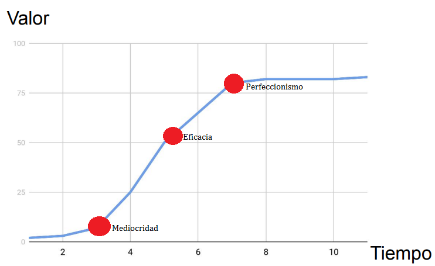

# Gestion Efectiva del Tiempo
### Modulo 1. Conocer los conceptos de la gestión del tiempo
#### Clase 1 *Expert Session: gestiona tu tiempo y resuelve tus dudas con Beatriz Ibañez*
#### Clase 2 *Por qué o para qué gestionar el tiempo*
De seguro más de una vez en la semana te sientes abrumado y no sabes por donde comenzar el trabajo que tienes.

En la actualidad hemos desarrollado una sensación de urgencia porque en las tendencias actuales, sentimos que todo va más rápido y que la velocidad aumenta, haciéndonos sentir que debemos cumplir más tareas y nos genera la necesidad de ser más efectivos.
**Tendencias actuales:**
- Desarrollo de tecnología
- Globalización
- Velocidad de los procesos

La gestión del tiempos nos ayuda a entender como comenzar el trabajo. Los procesos y flujos de trabajo han cambiado, pero el tiempo que tenemos es el mismo
Los procesos cambian, la gestión debe cambiar
- Tiempo: 24 horas, 7 días
- Flujos de trabajo: procesos y actividades en todos los aspectos de tu vida.
Debemos enfocarnos en mejorar y optimizar los flujos de trabajo y las tareas que debemos hacer, y así evitar sentirnos inefectivos. Es necesario tomar la decisión sobre que tareas vamos hacer y cuales no son necesarios realizarlas.

*Para tener una optimización eficaz de nuestro tiempo, debemos hacer que la tecnología trabaje a nuestro favor y no sea una fuente de inefectividad

#### Clase 3 *Productividad*
Multitasking: Multitarea

En el punto uno tenemos una agenda inicial, donde anotamos las actividades que planeamos hacer en esta semana. Punto dos, a lo largo de la semana aparecen nuevas actividades o tareas a realizar. Punto 3, nos desenfocamos por completo y aparece la pregunta; ¿Estamos ocupados o somos productivos?

Ser multitasking nos hace perder el enfoque, nos ocupa y nos quita productividad y no sabemos por dónde debemos empezar. Lo importante es gestionar las distracciones y la perdida de enfoque de tu programación personal.

Producción vs Recursos
La producción son: productos, servicios, clientes, etc.
Los recursos son: mano de obra, materiales, energía, etc.

En términos de gestión personal, la producción son las culminaciones de tareas, proyectos, actividades, etc. Mientras que el recurso seria el tiempo, la salud o incluso tú mismo.

El enfoque de la gestión del tiempo cae en la calidad; al tiempo que tenemos sacarle el mejor provecho para cumplir nuestro compromisos con la mejor calidad y eficacia posible.

*Productividad: cantidad de tareas y resultados que podemos generar vs los recursos y tiempo que empleamos para lograrlo.*

¿Como llegamos al punto de calidad optimizando nuestro tiempo?
La grafica nos enseña tres puntos importantes:
- Mediocre: utilizamos poco tiempo para hacer una tarea y el resultado es de poca calidad
- Perfeccionista: utilizamos más tiempo del necesario para terminar una tarea
- Eficacia: es el tiempo que debemos tratar de lograr. Consiste en entregarle el tiempo necesario para lograr obtener un producto de calidad

*Recuerda: estar ocupado no es lo mismo que ser productivo*****
