# Curso de Introducción a Java SE
## Modulo 1. Conocer a Java como lenguaje de programación
### Clase 1 *¿Qué es Java?*

¡Te damos la bienvenida al Curso Básico de Java SE!

La profesora será Anahí Salgado quien nos transmitirá en este curso la razón de ser del lenguaje, comprenderemos todos los problemas y veremos cómo Java ha tomado una posición de no quedarse atrás para dar una mejor propuesta como lenguaje de programación.

Este curso de introducción es tan solo el primer paso en toda una carrera que se necesita para entender Java Standar Edition, pero poco a poco iremos viendo cómo se compone ya que Java tiene dos categorías o versiones: la Categoría Standar y la categoría Enterprise.

**Ruta de aprendizaje para la categoría Standar Edition**

1. Curso Básico de Java SE
2. Curso de Java SE: Orientado a Objeto
3. Curso de Java SE: Programación Funcional

Java se compone de varias cosas y en este momento estamos aprendiendo el primer nivel de la categoría SE. Aquí veremos la sintaxis del lenguaje, como declarar una variable, trabajar con bucles y condiciones, las funciones, entre otras cosas. Básicamente todo lo que tenga que ver con los fundamentos del lenguaje en sí. Es más, si ya tenemos conocimiento sobre programar este curso es perfecto para aplicar lo aprendido, poner esos conocimientos en práctica en otro lenguaje, aprender un nuevo lenguaje este curso también funciona, o solo quieres afianzar más tus conocimiento sobre esos fundamentos que ya conoces. Además, estaremos viendo mucho sobre la lógica de programación, un poco de algoritmos y todo aplicado a Java.

Sabemos que Java por naturaleza es orientada a objeto y si no lo sabes no debes preocuparte porque lo estaremos viendo a detalle en la segunda parte de la ruta de aprendizaje Java Standar Edition. Será un curso puramente orientado a objetos donde veremos desde en cómo debemos pensar y hacia donde tenemos que ir, hasta como resolver problemas con esta filosofía orientada a objetos.

Y por si fuera poco, Java como tal no es un lenguaje funcional, pero tiene características de los lenguajes orientados a la programación funcional y eso lo estaremos viendo en la última parte de esta ruta. Profundizaremos todo en Java SE edición programación funcional donde veremos otra forma de pensar, otro paradigma y en como las reglas del juego cambian en programación funcional.

Recuerda, esto es tan solo el primer paso de todo lo que nos espera en nuestra travesía con Java. Pero…

**¿Qué es Java?**

Java es un lenguaje de programación que nos servir para aplicar algoritmos y resolver problemas. Fue creado en 1991 por James Gosling, quien en realidad es una persona bastante interesante.

James Gosling es uno de esos nerd vintage que tenían otra forma de pensamiento y que quería impulsar la programación para que fuera alcanzable, que todos pudieran hacerlo y que además sus programas pudieran llegar lo más lejos posible. Ese era su forma de pensamiento y por eso creo Java como un lenguaje de programación multiplataforma que pueden correrlo en sistemas operativos Windows, Mac, Linux e incluso sistemas operativos móviles.

Fue empleado de Sun Microsystems en donde empezó toda la magia, ahí creo Java y después James se convirtió en el vicepresidente de la compañía. Tenía una filosofía bastante interesante al querer alcanzar muchos dispositivos y poner la programación al alcance de todos. Luego, en 2009, Sun Microsystems es comprada por Oracle y es aquí donde las cosas comienzan a ponerse un poco confusas para Java en cuanto a su filosofía. Desde que Oracle compra Java vinieron una serie de cambio al que muchos programadores no estuvieron tan de acuerdo, sin embargo, tener el respaldo de una compañía tan grande aseguraba que Java sea mejor mantenido, que diera mejores soportes y se vuelva mucho más empresarial.

Mientras estuvo involucrado con Oracle, James Gosling realmente no se sintió tan a gusto ya que sus filosofías, sus paradigmas de vida y formas de pensamientos eran completamente distintas. Así fue como en 2010, James Gosling decidió salirse de Oracle, y declaro en su blog personal la siguiente frase:
«Casi cualquier cosa que pudiera decir es honesta y haría más daño que bien»

En realidad, James Gosling no quería decir nada más acerca de lo que estaba sucediendo ahí dentro, pero sabemos que este hecho y el hecho de que ahora Java le perteneciera a Oracle traía un antes y un después en la vida de este lenguaje.

Java además es un lenguaje de programación de alto nivel. ¿Qué significa que sea de alto nivel?

Teniendo en cuenta nuestra escala similar a un termómetro de colores podemos decir que un lenguaje de bajo nivel está compuesto por los lenguajes máquina (que es el sistema de códigos directamente interpretable por un circuito microprogramable) como ensamblador, de echo toda la zona roja le pertenece al ensamblador y un pedacito le pertenece al lenguaje C. Toda esa zona en rojo es considerada de bajo nivel y así se va subiendo hasta una zona de más alto que es un lugar donde es mucho más fácil programar, son los lenguajes de programación que mucho más modernos, fáciles de manipular en términos de memoria, optimización de recursos o en términos de simplemente declarar una variable es mucho más sencillo hacerlo en estos lenguajes que si lo hiciéramos en un lenguaje de bajo nivel.

Java se encuentra más o menos en la escala de amarillo, no es tan natural como un lenguaje de alto nivel como lo son Ruby o Python que son lenguajes bastante sencillo de entender. Entonces, podemos decir que un lenguaje de alto nivel es un lenguaje fácil para la comprensión humana, que facilitan el comunicarse con el humano y después hacer su magia para llegar hasta el bajo nivel.

**Categorías de Java**

Como ya lo hemos dicho, Java esencialmente tiene dos categorías: Java Standar Edition y Java Enterprise Edition. Ya vimos una ruta de aprendizaje para entender cómo funciona Java SE, pero lo que no sabes es que Java EE también cuenta con su propia ruta.

Es muy importante que aprendas primero muy bien la parte Standar de Java, toda la base del lenguaje y la sintaxis para desarrollar aplicaciones. En la parte Standar básicamente estaremos desarrollando aplicaciones de escritorio o consola, mientras en la parte de Enterprise las aplicaciones tendrán su lugar mucho mejor en la web, es mucho mejor en servidores ya que son aplicaciones mucho más distribuidas y cuya interacción con el usuario es mucho más amigables. Entonces digamos que la parte de Java Standar es como un primer nivel para llegar al siguiente que es Java Enterprise.

Nos enfocaremos mucho en el lenguaje, especialmente porque Java tiene la filosofía «Write Once, Run Anywhere» o WORA que significa que lo aprendido aquí en la versión estándar puede ser llevado a la versión enterprise. Es decir, lo que escribas en Java lo puedes correr en cualquier lugar y en cualquier sistema operativo, por eso Java es interoperable, multiplataforma.

### Clase 2 *Versiones de Java y JDK*

Cuando comenzamos a aprender Java la primera cosa rara con la que nos encontramos es el Java Development Kit o JDK que se compone de los tres elementos siguientes:

- Java Runtime Environment (JRE)
- Compilador de Java
- APIs de desarrollo

La parte más importante es la del JRE, es la máquina virtual que permite a Java ser multiplataforma, que al escribir el mismo código funcione igual en todos los dispositivos y sistemas operativos. Sin este elemento, la filosofía de «Write Once, Run Anywhere» no podría ser posible. Además, si bien decimos el JRE equivale a la máquina virtual, en realidad se compone de otros elementos más como algunas bibliotecas que hacen funcionar la máquina virtual entre otros. Sin embargo, JRE siempre estará asociado a la máquina virtual, quien es el que crea la magia multiplataforma.

El segundo elemento que trae consigo el JDK es el compilador de Java, el encargado de hacer que nuestro programa escrito en lenguaje Java sea traducido al lenguaje bytecode que finalmente es interpretado por la máquina virtual. Es decir, el compilador de Java toma el lenguaje de Java y lo traduce a algo que la máquina virtual si pueda ejecutar y leer.

Otro elemento también muy importante y el más interesante de todos son las API (Application Programming Interface) de desarrollo. Estas API de desarrollo son la base que nos proporciona el lenguaje de programación para nosotros crear nuestros propios lenguajes, es decir, cuando estamos programando con Java no vamos a partir de cero, si no que ya vamos a tener una base de elementos ya listo para que lo tomemos y creemos nuestros programas. Las API han ido evolucionando y se le fueron agregando elementos conforma va siendo las necesidades de la modernidad y la tecnología hoy en día.

**Tabla de versiones de Java**

Esta es una tabla con todas las versiones de Java que existen hasta hoy, puede ser que en el momento en que veas esta clase se hayan añadido algunas otras, pero en general estas son las versiones más importantes de Java.

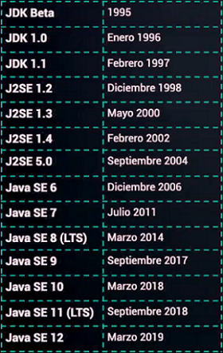

Notaremos que tenemos estos nombres particulares:

Y eso se debe a que esas versiones fueron llamadas Java 2 Platform Standar Edition, también existen en otras categorías como el Java 2 Platform Enterprise Edition. Fueron creadas hace mucho tiempo y existieron con ese nombre hasta el 2004.

Desde la versión Java SE 6 es cuando comenzó a llamarse Java Standar Edition acortando el nombre y también fue la primera versión que se promovía para ser una versión más robusta, para ambientes de producción, profesionales o de desarrollo. Además, a partir de esta versión comenzó a popularizarse Java ya que las compañías empezaron a adquirirlo como parte de su ambiente de desarrollo y fue aquí donde la oferta laboral para Java exploto y se necesitaba mucho programadores que supieran a partir de esa versión.

No es hasta a partir del año 2017 con la versión 9 que tenemos una versión muy interesante y controversial, pero también importante para la comunidad de Java porque en esta versión se anunció que las actualizaciones se estarían haciendo cada seis meses.

Esta noticia trajo sentimientos encontrados porque si analizamos el listado de fechas podemos fijarnos que desde la versión 8 en 2014 tuvieron que pasar aproximadamente tres años para que existiera una nueva actualización y así debíamos de esperar años para que saliera una nueva versión, y esto no le gustaba a los programadores porque sentían que el lenguaje se quedaba atrás con respecto a otros lenguajes de programación, así que este tipo de programadores fueron quienes se alegaron porque ahora tendrían cada seis meses una actualización del JDK. Pero esto traía más dolores de cabeza de lo que se pensaba ya que si existiera una actualización del lenguaje cada seis meses, esto iba a provocar algunas incompatibilidades entre las versiones anteriores y sería muy difícil darle soporte a las versiones anteriores porque cada seis meses tendrían que estar actualizadas, habría cambios en los códigos y estar dándole mantenimiento.

Para solucionar estos problemas Java creo la versión LTS o Long Term Support que son versiones que tendrían soporte por tres años.

Sin embargo, se continuaría teniendo las versiones que salen de manera inmediata cada seis meses con pequeños detalles, porque en realidad no son tantos cambios, sino que son pequeños detalles al lenguajes los que se cambian. Pero tener una versión que cada tres años se le da soporte es muy común en lenguajes de programación o sistemas operativos que son precisamente del tipo open source. La última versión registrada del tipo Long Term Support, que son versiones en las que realmente podemos confiar precisamente porque tenemos más soporte, es la versión 11 y esto puede ser comprobado en la página de [Education Oracle](https://education.oracle.com/oracle-certification-path/product_267 "Education Oracle").

Pero no todo está bien con Java y es aquí donde comienza a ponerse duro y complicado pues la versión 11 es la primera versión de Java con licencia. Es aquí donde comienza a ponerse interesante, y es que Oracle comienza a cobrar una licencia por el uso de Java, aunque hay algunos detalles que si nos permite utilizarlo de forma free.

Solamente podemos usarlo Free (gratis) en ambientes de desarrollo y de testing, estas son las única forma, pero si es que nosotros queremos llevarlo a un ambiente de producción, porque este es el principal uso de Java en compañías grandes que lo manejan en producción, tendremos que pagar y estas son las [cifras registradas](http://www.oracle.com/us/corporate/pricing/price-lists/java-se-subscription-pricelist-5028356.pdf "cifras registradas"):

- 2.5 USD al mes por usuario de escritorio.
- 25 USD por procesador para aplicaciones de servidor.

Y es aquí donde la comunidad y el ideal del cual fue concebido Java tiene mucho más peso. La comunidad de Java había creado desde hace muchos años la versión open source del JDK, una versión realmente gratis donde podemos utilizar Java en ambientes de producción o de desarrollo. Básicamente [OpenJDK](https://openjdk.java.net/ "OpenJDK") es la versión open source de Java Standar Edition que existe desde hace mucho más tiempo del que creemos, pero que se ha comenzado a ser conocida por el cobro de licencia.

Existe desde la versión Java SE 6, lo ha impulsado Sun Microsystems en el año 2006 y esto es una ventaja y una desventaja porque ya no dependemos de una compañía como tal si no de una comunidad, pero una comunidad fuerte que está siendo apoyando mucho por la compañía Red Hat. Sin embargo, la comunidad es bastante madura y tiene mucha experiencia, y se están tomando muy enserio este proyecto.

Entonces, OpenJDK es un proyecto en el que podemos confiar, aportar si es que queremos aunque no es tan sencillo pues debemos pasar por dos ingenieros; uno es de Sun Microsystems y otro de Oracle que realizaran la revisión del código. Pero, en general, la comunidad está ahí aportando y las personas que están haciendo este JDK están muy comprometidas con esto y están dándole bastante soporte a este proyecto.

### Clase 3 *Las herramientas más usadas de Java*

Es importante que veamos cómo se encuentra Java en cuanto a su uso, las herramientas que existen para programar y como la gente está adoptando las nuevas versiones de JDK que existen, si es que las personas en los ambientes de producción lo están adoptando fácilmente.

No solo veremos las herramientas en el ambiente de escritorio con Java, sino que también veremos algunas con la parte distribuida de Java en los ambientes de servidores.

**¿Cuáles son las herramientas más usadas en Java?**

En cuanto a la adopción de versiones de Java tenemos la siguiente gráfica:

Estas son estadísticas recabadas hasta inicios del 2019 que fue donde obtuvimos la nueva versión, Java 12. En el gráfico podemos ver que la mayoría de los ambientes están definidos con Java 8, es decir, la mayoría de las compañías que están adoptando JDK en sus ambientes de desarrollo es con la versión 8 de Java la cual es la última versión LTS "gratuito", sin licencia. Sin embargo, esta versión solo tendrá soporte hasta diciembre del 2020, a partir de ahí el soporte se comenzara a adquirir con licencia como se hizo con Java 11.

Observando la gráfica podemos ver una adopción menor en la versión 11, que es la segunda LTS de Java. Además de una adopción nula con la versión 12 que de hecho ni siquiera aparece. La versión 7 también es bastante utilizada, pero en definitiva la versión Java 8 es la más querida y con esto anunciamos que durante el transcurso del curso estaremos hablando de las dos versiones, Java 8 y Java 11.

¿Por qué ambas versiones? Pues, porque desde la versión 10 de Java se trajeron algunos cambios interesantes que es algo que la comunidad e incluso desarrolladores cuyo fuerte no es Java ha empezado a demandar: la inferencia de los tipos de datos. En la versión 10 tenemos una modificación a la forma en como declaramos variables y es por esto que estaremos viendo las dos versiones. Estaremos utilizando principalmente de Java 8 para lo que necesitamos del curso, de hecho podríamos estar haciendo completamente el curso con esta versión, pero dado el cambio en la declaración de variables que tenemos a partir de Java 10 también estaremos viendo la versión 11 LTS. Por supuesto, estaremos usando OpenJDK y veremos su instalación.

En cuanto a servidores tenemos otro tipo de ambiente y solo será dejado como dato curioso. La versión más utilizada para construir proyectos web es Maven y la alternativa, como principal competidor esta Gradle. De hecho, Maven es bastante grande, casi el doble de Gradle, pero hasta el día de hoy ambos son usados en la construcción de proyectos web. 

- **Maven:** Es una de las herramientas más útiles a la hora de utilizar librerías de terceros. Maven se utiliza en la gestión y construcción de software. Posee la capacidad de realizar ciertas tareas claramente definidas, como la compilación del código y su empaquetado. Es decir, hace posible la creación de software con dependencias incluidas dentro de la estructura del JAR.
- **Gradle:** Es una herramienta de automatización de la construcción de nuestro código que bebe de las aportaciones que han realizado herramientas como ant y maven pero intenta llevarlo todo un paso más  allá. Para empezar se apoya en Groovy y en un DSL (Domain Specific Language) para trabajar con un lenguaje sencillo y claro a la hora de construir el build comparado con Maven. Por otro lado dispone de una gran flexibilidad que permite trabajar con ella utilizando otros lenguajes y no solo Java. Dispone por otro lado  de un sistema de gestión de dependencias sólido.

En cuanto a frameworks de trabajo en el tema de servidor con Java Enterprise es Spring. Es muy importante aprender Spring con Hibernate, y específicamente las versiones más utilizadas son la versión 2 y la versión 1.5.

- **Spring:** Es un framework de código abierto para la creación de aplicaciones empresariales Java, con soporte para Groovy y Kotlin. Tiene una estructura modular y una gran flexibilidad para implementar diferentes tipos de arquitectura según las necesidades de la aplicación.
- **Hibernate:** Es una herramienta de mapeo objeto-relacional (ORM)  que facilita el mapeo de atributos en una base de datos tradicional, y el modelo de objetos de un aplicación mediante archivos declarativos o anotaciones en los beans de las entidades que permiten establecer estas relaciones. Es decir, que agiliza la relación entre la aplicación y nuestra base de datos SQL, de un modo que optimiza nuestro flujo de trabajo evitando caer en código repetitivo.

**Entornos de Desarrollos Integramos**

Un entorno de desarrollo integrado (IDE del inglés Integrated Development Environment ) es un sistema de software para el diseño de aplicaciones que combina herramientas del desarrollador comunes en una sola interfaz gráfica de usuario.

Realmente no necesitamos de un IDE para programar con Java ya que podemos hacerlo simplemente usando el bloc de notas y guardando los archivos con la extensión .java, y utilizando la terminal de línea de comando. Pero las IDE's existen porque precisamente tienen integrado el editor de código, compilador, depurador y constructor de interfaz gráfica para aquellos programas que estén trabajando con la parte interfaz gráfica de Java.

Hay bastante competencia en cuanto a IDE, pero la "oficial" y la cual Oracle recomienda es NetBeans. En cambio, la comunidad apoya mucho a Eclipse, llego al punto de que era considerado el #1 entre los tres competidores. Sin embargo, IntelliJ IDEA se ha impulso mucho con un editor de código inteligente y es particularmente el favorito de todos los desarrolladores que trabajan con Java y necesitan una forma más fácil de programar, por lo que en cuestión de estadísticas es IntelliJ IDEA el ganador.

La adopción más sencilla para un IDE es con IntelliJ IDEA, además de que cuenta con una versión gratuita y una versión comercial. Aunque cabe mencionar que tanto Eclipse como NetBeans también cuentan con sus versiones gratuitas.

### Clase 4 *Creando un entorno de desarrollo en Java en Windows*

Es momento de crear un entorno de desarrollo en Windows. Para eso vamos al sitio oficial de [IntelliJ IDEA](https://www.jetbrains.com/idea/download/#section=windows "IntelliJ IDEA"):

Como podemos ver tenemos las dos versiones. Ultimate es la versión de paga, mientras que la versión gratis y la cual descargaremos es la Community. Damos click en Download para que comience la descarga.

Mientras esperamos que termine vamos a sitio de para descargar nuestro [JDK](https://adoptopenjdk.net/ "JDK") y ahí vamos a descargar las dos versiones del JDK que estaremos ocupando durante el curso:

Seleccionamos la versión 8 LTS y damos click en el botón azul para empezar la descarga. Una vez finalizada la descarga, repetimos ese proceso para descargar la versión 11 LTS.

**Instalación de IntelliJ IDEA**

Vamos a la carpeta donde esta descargada el instalador, damos click derecho y "Ejecutar como administrador", o simplemente doble click sobre el archivo de instalación, después nos aparece una ventana que nos pide permiso para que la aplicación realice cambios en la computadora:

Aceptamos y nos aparece la ventana de instalación, damos click en Next:

Nos aparece el directorio donde se instalara el programa, damos click en Next nuevamente:

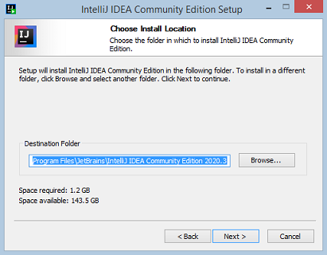

Usaremos la opción por defecto, así que Next:

Damos click en Install:

Y ya comienza la instalación:

Al terminar la instalación damos simplemente click en Finish:

**Instalación del JDK**

Damos doble click sobre el archivo y nos aparece la ventana de instalación, damos click en Siguiente:

Aceptamos los términos de la licencia y después damos click en Siguiente:

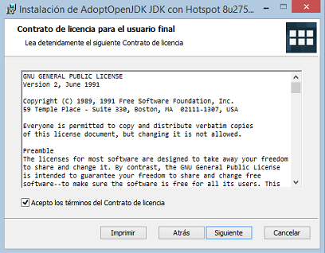

Damos click en Siguiente:

Damos click en Instalar:

Nos saltara una ventana para pedirnos el permiso, aceptamos y ya comienza la instalación:

Y al terminar simplemente damos click en Finalizar:

Ya tenemos el JDK versión 8 en nuestras computadoras. Repetimos este proceso para la versión 11.

**Utilizando IntelliJ IDEA**

Cuando ejecutamos el programa nos parece la licencia de JetBrains, aceptamos y damos click en Continue:

Después nos pregunta si queremos compartir datos, esto ya depende de cada persona en mi caso le doy a Don't Send para no compartir:

Una vez hecho todo eso, IntelliJ IDEA nos dará la bienvenida:

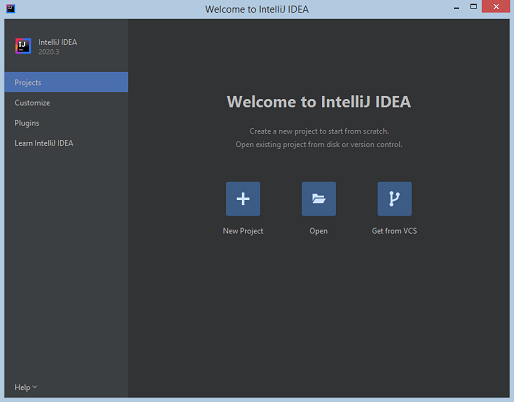

¿Qué significan los botones del costado?

- **Projects:** Podemos empezar un nuevo proyecto, abrir uno u obtener desde VCS que es un sistema de control de versiones.
- **Costume:** Aquí podemos realizar cambios en la apariencia, elegir un tema Light o Darcula dependiendo de los gusto, cambiar el tamaño de fuente y demás.
- **Plugins:** Los complementos que podemos instalar para ampliar nuestra funciones.
- **Learn IntelliJ IDEA:** Para aprender más sobre el programa.

**Creando proyecto con IntelliJ IDEA**

Ya podríamos crear nuestro primer proyecto con IntelliJ IDEA. Para eso damos click en New Project:

Seleccionaremos  nuestra SDK, para eso en la parte superior donde dice Project SDK, abrimos y elegimos Add JDK:

Vamos a la carpeta donde tenemos guardado nuestro JDK y elegimos la versión 8, y damos click en Ok:

Hacemos lo mismo con la versión 11 y ya está:

Tenemos las dos versiones del JDK para comenzar a trabajar en nuestros proyectos.

### Clase 5 *Creando un entorno de desarrollo en Java en Mac*

Es momento de instalar IntelliJ IDEA y OpenJDK en los sistemas operativos MacOS, para eso vamos a los mismo sitios web y descargamos los instaladores.

**Instalación de IntelliJ IDEA**

Damos click al instalador y nos saldrá una ventana:

Lo único que debemos de realizar es arrastrar el icono a la ventana de aplicación:

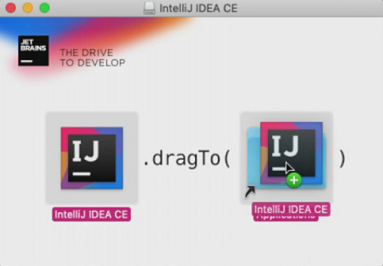

Esperamos a que nos copie todo:

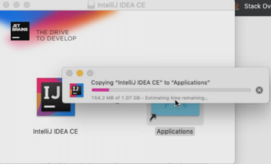
 
Una vez que se termine lo podemos encontrar entre las Aplicaciones y lo podemos abrir:

Nos saltara una ventana de mensaje y damos click en Open para que nos abra el programa:

**Instalación del JDK**

Damos click sobre el instalador y nos aparecerá una ventana de asistente. Hacemos click en Continue:

Click en Continue:

Click en Agree para aceptar la licencia:

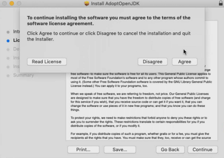

Click en Install y es ahora cuando comienza a instalarnos el JDK:

Tal vez en algún momento te pida la contraseña para que se pueda instalar un nuevo programa o no lo haga dependiendo de la configuración. Esperamos unos momentos y ya nos terminó de instalar por completo el JDK:

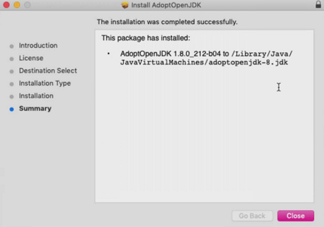

Finalizamos nuestra instalación del JDK versión 8 y repetimos el proceso para la versión 11.

**Utilizando IntelliJ IDEA**

Cuando abrimos el programa nos aparecerá una ventana con la licencia de JetBrains, aceptamos y damos click en Continue:

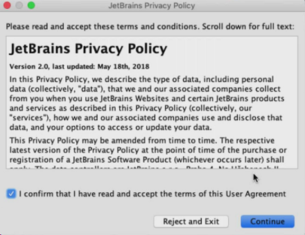

Después nos pregunta si queremos compartir datos, esto depende de cada quien, pero en nuestro caso damos click en Don't Send para rechazar:

Lo siguiente que veremos es la ventana para elegir el tema que queremos. Elegimos uno de nuestra preferencia y damos click en Next:

Damos click en Next a todas las siguientes ventanas:

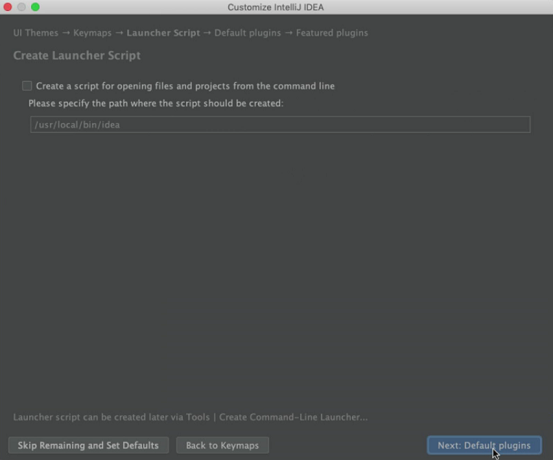

Aquí damos click en Start Using IntelliJ IDEA:

Con esto ya nos abrirá nuestro programa y ya tenemos listo nuestro entorno de desarrollo en Mac:

***NOTA: Dado que utilizaremos la configuración por defecto del programa todo fue Next y no tuvimos que hacer ningún cambio.***

### Clase 6 *Creando un entorno de desarrollo en Java en Linux*

Si tú eres usuario de Linux, a continuación aprenderemos a instalar Java OpenJDK en la versión Ubuntu.

Abre tu terminal de la siguiente forma:

Selecciona el que dice: **Terminal**

Nota: A partir de ahora necesitarás tu contraseña de usuario **root**

Una vez abierta comenzaremos actualizando los paquetes del sistema para evitar cualquier error con los siguientes comandos:

Esto puede demorar un poco.

**Instalando OpenJDK 8**

Simplemente corre el siguiente comando:

Listo te pediará algunas confirmaciones, responde S y a partir de ese momento quedará instalado.

**Instalando OpenJDK 11**

Como es una versión nueva debemos añadir un repositorio para poder descargar el paquete de ahí mismo. Lo hacemos de la siguiente forma:

Actualiza con el siguiente comando:

Ahora sí ya podemos descargar el paquete de la siguiente forma:

Cambia la versión de Java que desees en ese momento
Verifica la versión de Java que tienes instalada

Para cambiarla escribe el siguiente comando

Solo como confirmación vuelve a revisar la versión para verificar que se haya cambiado.

### Clase 7 *Escribe tu primer Hola Mundo en Java*

Ahora que ya tenemos listo nuestro entorno de desarrollo ya sea en Windows, Linux o Mac es hora que hagamos nuestro primer 'Hola Mundo'. El «Hola Mundo», que se hace comúnmente en cualquier lenguaje de programación, es el primer programa y consiste en tan solo imprimir un texto y mostrarlo en la consola. Este programa sirve para entender y verificar que nuestro entorno de desarrollo está totalmente configurado y que además estamos aprendiendo un poco más las bases del lenguaje, para eso sirve un Hola Mundo.

Si queremos comenzar con un Hola Mundo debemos partir de los archivos van a ser reconocidos por tener la extensión **.java**. Los archivos de Java literalmente van a ser archivos con una extensión como esta, por lo tanto cuando creamos un archivo lo que deberíamos ver es un archivo como este:

Y para crearlo usaremos nuestro entorno de desarrollo, pero no está de más decirte que algunas veces podrías estar trabajando este HolaMundo así de simple y sencillo con un editor de código y tu consola de comandos. Podrías crear un archivo **HolaMundo.java**, escribir las líneas de código que veremos a continuación, compilarlo y entonces obtener el resultado. Pero nosotros tenemos listo nuestro IDE y lo haremos aquí.

Lo primero por lo que debemos partir antes de encontrarnos con palabras desconocidos es el Método Main. El **Método Main** es el punto de entrada en la aplicación Java, no es exclusivo del lenguaje ya que otros lo manejan como Kotlin (que está basado en Java), Dart y también en Python existe algo similar al método Main. En general, el método Main es una palabra que traducida significa principal y que ambos van a compartir un método que sirve para ser el método de entrada para la aplicación, es por donde comenzara el programa y lo primero que se ejecutara cuando el programa este corriendo.

Un método main en Java luce de la siguiente manera:

- **// acciones:** Son todas las acciones que queremos que nuestro programa realice, todo lo que deseamos que viva en el programa lo ponemos ahí dentro.

Entonces, si nosotros por alguna razón olvidáramos escribir este método main y corriéramos nuestro programa, lo que nos va a saltar es un error como este:

Por eso es importante que siempre tener en cualquier programa un método main.

**Nuestro primer código**

Abrimos el programa de IntelliJ IDEA y hacemos click New Projects:

Nos aparece una ventana cuya zona izquierda nos muestra todas las opciones que la versión Community nos da para trabajar:

Entonces, elegimos la versión de Java con la queremos trabajar. En este caso estaremos trabajando con la versión 8, damos click a Next.

Nos aparece esta ventana, también damos click a Next:

Escribimos el nombre del programa y damos click en Finish:

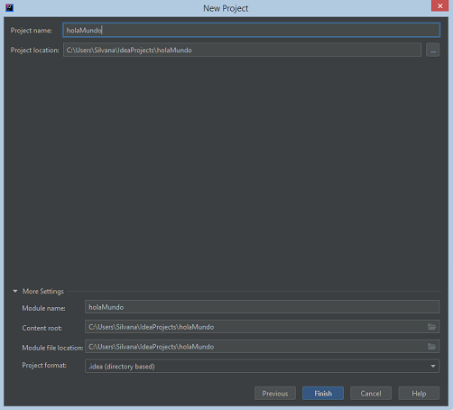

En este momento ya tenemos creado el archivo de nuestro programa, entendamos de que se compone:

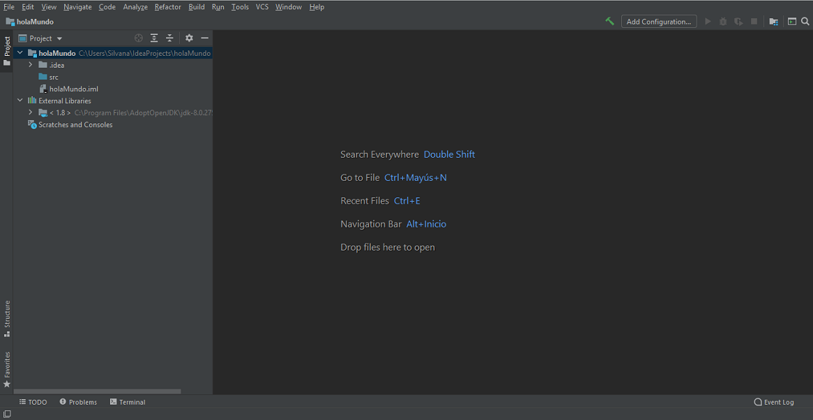

Tenemos:

- **holaMundo:** Es el sistema de archivos, la carpeta principal del archivo donde podemos encontrar algunos archivos que tienen que ver con el IDE.
- **External Libraries:** Es donde están configuradas todas las librerías externas y el JDK se le considera una librería externa.

Para crear nuestra primera clase en Java damos click derecho sobre la carpeta src, vamos a New y ahí seleccionamos Java Class:

Nos aparece una ventana pequeña donde ponemos el nombre que tendrá nuestro archivo, no es necesario poner la extensión .java porque el programa IntelliJ IDEA lo hará automáticamente, y después presionamos Enter:

Ahora podemos ver que en la carpeta src nos parece el archivo de holaMundo.java y es momento de trabajar en nuestro código:

**Hola Mundo**

En la parte del editor de código escribimos nuestro método main y también vemos nuestro primer atajo. Cuando escribimos sou nos saldrá una serie de opciones para imprimir según nuestra necesidad:

- **sout:** Es el atajo para imprimir una cadena.
- **souf:** Es el atajo para imprimir una cadena formateada.
- **soutm:** Es el atajo para imprimir la clase y el nombre del método actual.
- **soutp:** Es el atajo para imprimir los nombres y los valor del parámetros del método.
- **soutv:** Es el atajo para imprimir un valor.

- **public class holaMundo**

	- La primera parte es el modificador de acceso a la clase, en este caso es **public**, es decir, publico y tendremos acceso a él desde cualquier clase o instancia sin importar el paquete o procedencia de ésta.
	- La segunda parte es donde utilizamos la palabra reservada **class** para definir una clase.
	- La tercera parte, **holaMundo**, es el nombre de nuestra clase.
  
- **public static void main(String[] args)**
  
	-  Lo que debes saber en primer lugar es que el método **main()** es el punto de entrada de la aplicación, es decir, es el punto en el que comienza la ejecución de esta. Es por ello que ha de ser **public** (accesible desde fuera de la clase) y **static** (se puede ejecutar sin una instancia de la clase).
	- La palabra **void** indica que el método no retorna ningún valor, solamente imprimirá en pantalla.
	- **String[] args:** Es el parámetro **args** es un array de **String** que debe aparecer obligatoriamente como argumento del método main en un programa Java. Aunque se le suele dar el nombre args, no es obligatorio que este parámetro se llame así, podemos darle el nombre que queramos.
	- **¿Para qué sirve el String[] args?** Es la definición de los argumentos que recibe el método main. En este caso se recibe un argumento. Los paréntesis [] indican que el argumentos es un arreglo y la palabra String es el tipo de los elementos del arreglo. Por lo tanto main recibe como argumento un arreglo de strings que corresponden a los argumentos con que se invoca el programa.
	- **System.out.println():** En Java hay algunos objetos que existen por defecto (como en cualquier entorno de desarrollo). Uno de ellos es el objeto denominado **System.out**. Este objeto dispone de un método llamado **println** que nos permite imprimir algo por pantalla en una ventana de consola.

Para ejecutar nuestro programa damos click derecho sobre el editor y elegimos Run o también podemos presionar, como vemos en la imagen, **Control + Mayúscula + F10**:

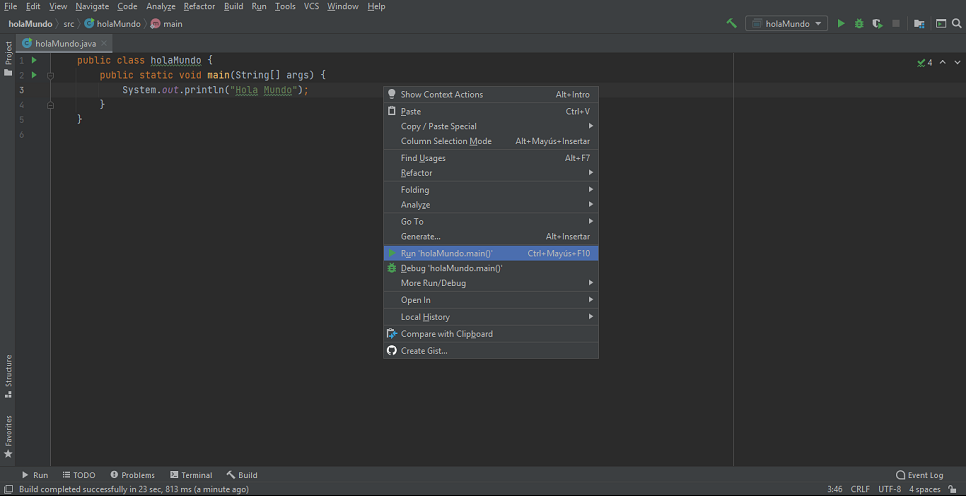

Finalmente, en la zona inferior que se conoce como la consola de Java,  podemos ver los mensajes que nos lanzan el compilador:

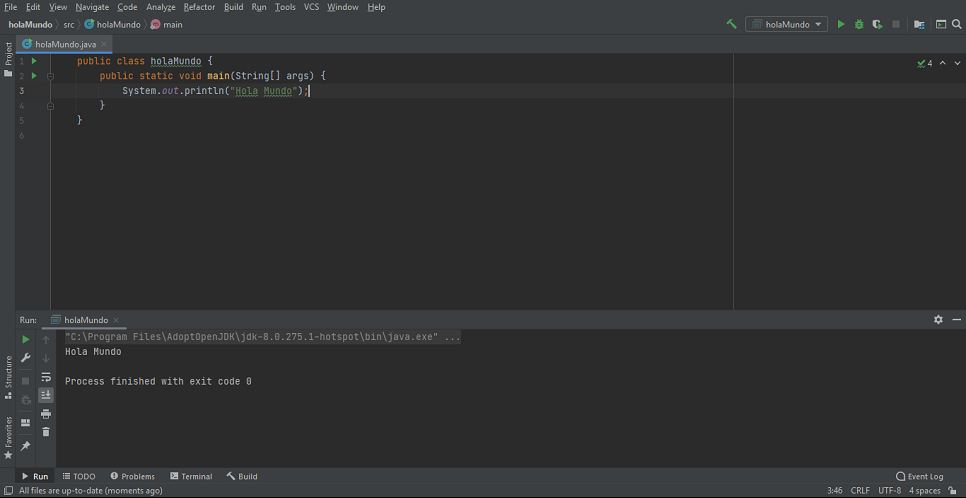

### Clase 8 *Etapas de la programación en Java*

Si tu primer «Hola Mundo» funciono es momento de celebrar porque todo salió muy bien. Pero la verdad es que lo hicimos todo rápido, trabajamos en el código, lo ejecutamos y nuestro maravillosos IDE nos sopló muchas palabras, ahora nos queda la duda… ¿Qué fue lo que paso realmente?

**Etapas de la programación**

Tenemos la siguiente que nos muestra el proceso por el que paso nuestro programa y es tiempo de analizarlo:

- Lo primero que hacemos es trabajar con nuestro archivo Java. Creamos un archivo con la extensión .java, en este caso holaMundo.java, que será el código fuente del programa. Recordemos que la única funcionalidad, el único objeto que tiene nuestro programa es imprimir un texto.
- Después, cuando nosotros damos click en Run, se activa el compilador. Este comando que se conoce también como javac, si lo estuviéramos utilizando en una terminal, en esta ocasión y gracias a nuestro IDE podemos usarlo simplemente presionando un botón.

	- Lo que sucede realmente es que cuando nosotros damos click a Run se activa el compilador que empieza a analizar nuestro código Java y lo traduce a un lenguaje que la computadora pueda leer para luego finalmente mostrarnos ese mensaje.
  
- Al compilar obtenemos códigos Bytecode y son archivos con extensión .class que contiene un montón de símbolos y cosas raras si es que lo abrimos, pero ese es el efecto del compilador; traducir el código fuente de Java a un lenguaje que pueda ser leído por nuestra computadora a través de la máquina virtual.
- La última fase es la JVM o la Java Virtual Machine que es la encargada de crearnos el efecto multiplataforma que tiene nuestro lenguaje.

Analicemos un poco más detalladamente lo que hicimos:

- Escribimos código fuente con extensión .java.
- Cuando el compilador actúa lo que en realidad hace es compilar el código, analizar y verificar que todo esté bien.
- Luego lo carga, como si esté preparando nuestro archivo .class, da una última verificación para analizar que el archivo .class se haya construido correctamente.
- Finalmente se lo manda al JVM para que lo interprete y, el JVM ejecuta y nos muestra el mensaje de «Hola Mundo».

**Compilado e Interpretado**

Una de las grandes controversias que existen en internet es sobre cómo funciona Java, si es compilado o interpretado, pero la verdad es que este lenguaje es ambos: compilado e interpretado.

Lo que nos da esa idea es eso que sucede dentro del compilador: compilar, cargar y verificar. Ya que existen lenguajes de programación que son únicamente interpretados, como JavaScript o PHP que cuando estamos escribiendo en uno de esos lenguajes y recargamos el sitio se empieza a interpretar línea por línea, y si ocurre un error o algo está mal escrito entonces va a dejar de interpretarse las siguientes líneas o simplemente no nos va a mostrar nada.

Para el caso de los lenguajes compilados lo que asegura la compilación es que esté bien hecha, que al menos no ocurra ningún error de sintaxis, y entonces, cuando la JVM interpreta ese compilado, nos genere la menor cantidad de errores posibles.

**Bytecode**

Volviendo a nuestro entorno de desarrollo, si observamos podemos ver que en el lado izquierdo tenemos la composición de carpetas y archivos que tiene nuestro proyecto, y nos aparece una carpeta nueva. Esta carpeta nueva de hecho está marcándose en rojo y dice "out", si lo abrimos y empezamos a ver lo que tiene dentro podemos encontrar el archivo holaMundo.class.

Si somos curiosos y queremos abrirlo podemos ir al lugar donde este guardado el proyecto, navegar un poco hasta encontrar el archivo, darle click derecho, "Abrir con" y elegimos un programa predeterminado para abrirlo, en mi caso lo abrí con el Bloc de notas. Este es el código que se nos creó a partir del código fuente:

Esto es precisamente el efecto del compilador, el bytecode que lee nuestra máquina virtual, y la capa de seguridad que Java agrega a nuestro programa. No expone el código fuente como en otros lenguajes de programación, lo que si se expone es un bytecode no entendible al ojo humano, pero que sin ser totalmente incorruptible. Si realizamos un poco de ingeniería inversa podemos conseguir el código fuente, por supuesto hay muchos hack para romper la seguridad, pero en general Java se cubre y nos da una capa de seguridad, y es trayendo nuestro archivo .class con el bytecode.

**DATO CURIOSO**

La palabra java (lenguaje de programación orientado a objetos, independiente del sistema operativo usado en aplicaciones de Internet) viene del topónimo Java, una isla de Indonesia, entre Sumatra, Borneo y Bali. Esta isla produce mucho café, de ahí que java, en inglés es sinónimo de café. Los programadores le dieron ese nombre, pues tomaron mucho café cunado crearon este lenguaje.

El nombre de la isla deriva del sánscrito Yavadvipa, compuesto con yava (cereal, cebada) y dvipa (isla).

### Clase 9 *La JShell de Java*

Sabías que Java tiene una herramienta interactiva en dónde puedes ir probando segmentos de código en vez de realizar todo el proceso de creación de un programa en Java. Escribir, compilar y correr.

Su nombre es ***jshell*** y está disponible desde la versión 9 de Java.

Abre tu consola de comandos o terminal, corre el siguiente comando:

**Ejercicio 1**

Investiga cómo cambiar la versión de Java desde tu consola de comandos o terminal y compártenos en la sección de discusiones los comandos que ejecutaste.

**Ejercicio 2**

Asegúrate de tener definida una versión superior a la 8.

Ahora desde tu terminal escribe el siguiente comando para abrir nuestra ***jshell***

Ahora escribe la línea de código para imprimir un texto (no olvides poner ; y dar enter).
