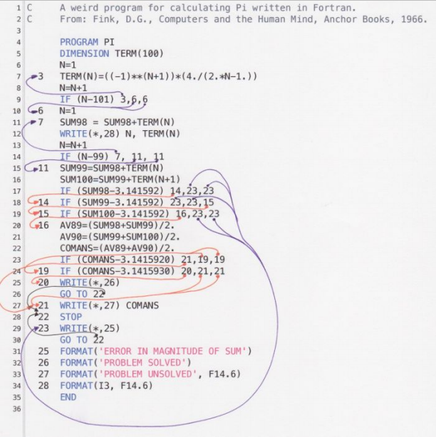
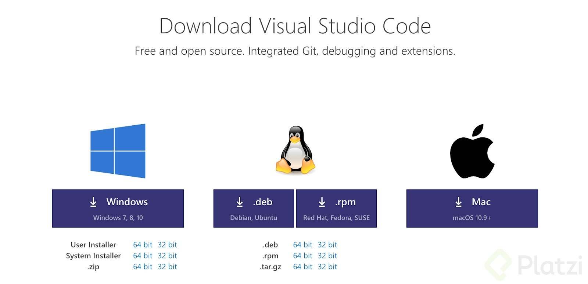
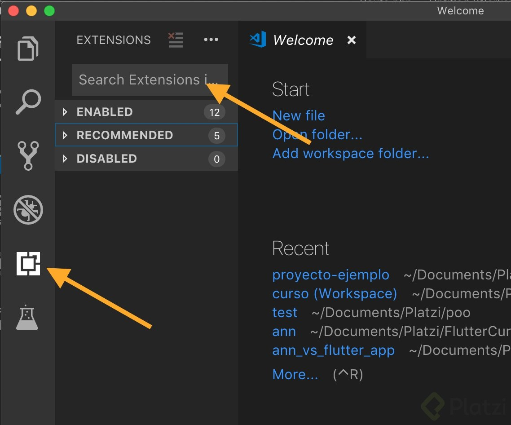
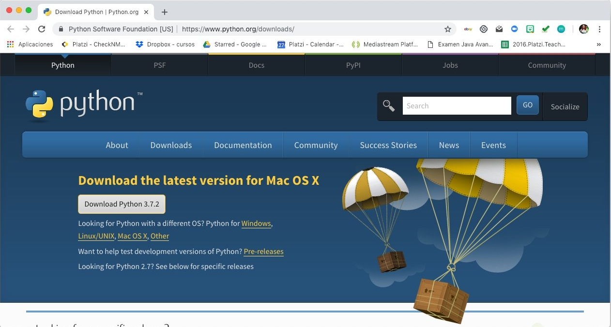
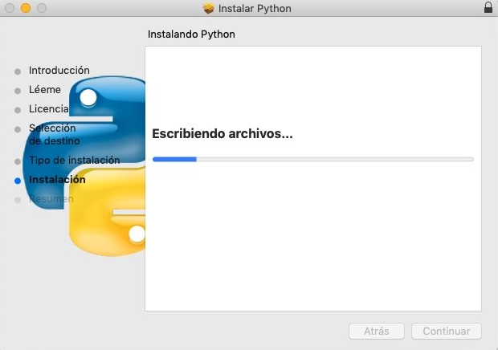
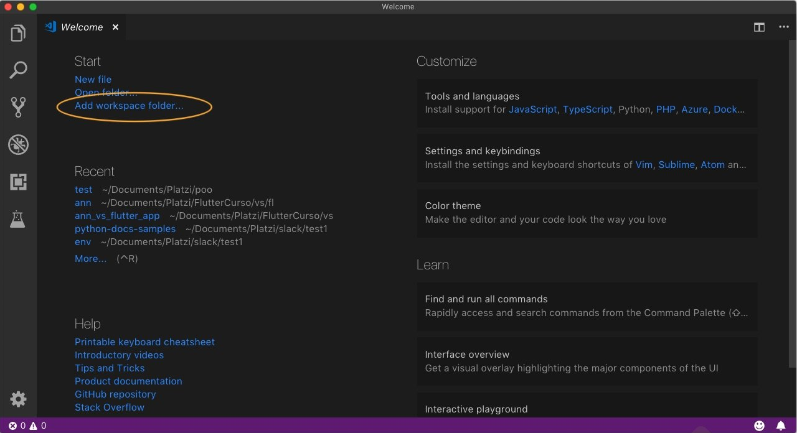
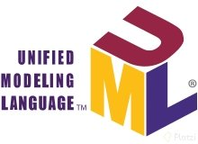
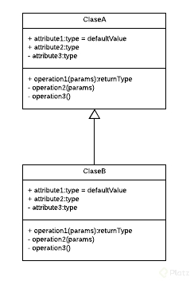

# Curso de Programación Estructurada
## Modulo 1. Bienvenida e Introducción
### Clase 1 *¿Por qué aprender Programación Orientada a Objetos?*

¡Bienvenidos al curso de Programación Orientada a Objetos!

Te presentamos a la profesora de este curso: Anahí Salgado, ella ha sido desarrolladora por aproximadamente unos 8 años y la Programación Orientada a Objetos ha sido clave en su análisis y desarrollo para cualquier sistema, aplicación móvil, cualquier cosa con la que se ha topado por desarrollar. A la par ha sido profesora unos 6 años donde ha conjugado su pasión por enseñar al mismo tiempo que la de desarrollar y le ha encantado enseñar programación a todas las edades.

Hoy en día forma parte del Education Team en Platzi, podemos encontrarla en otros varios cursos en las rutas de Java, Android y Firebase. La Programación Orientada a Objetos ha sido clave en todos esos cursos siempre comienza analizando problemas, modelando problemas y al final programado las soluciones.

**¿Porque es importante aprender Programación Orientada a Objetos?**
- **Programar más rápido:** Tener un análisis previo de lo que estas realizando te ayudará a generar código mucho más veloz en comparación a otros. Siempre que te tomes un tiempo para analizar, para retomar, para pensar lo que estás haciendo antes de ir directamente al código te ayudara a que programes mucho más rápido.
- **Dejar de ser Programador Jr.:** Analizar tus problemas y entender mejor la Programación Orientada a Objetos dejaras de ser un Programador Junior. Para la mayoría de los reclutadores estas son las preguntas más frecuente: ¿Qué es encapsulamiento?, ¿Qué es Abstracción?, ¿Qué es Herencia?, ¿Qué es Polimorfismo?
  
    Estas son una de sus preguntas favoritas, con la Programación Orientada a Objetos dejaremos de ser Programadores Junior y pasaremos a ser Programadores Senior, dominaremos estos conceptos que seguramente nos harán en una entrevista de trabajo de programación.

- **Dejar de copiar y pegar código:** Esto es el síndrome de todos los Programadores Jr. que comienzan construyendo sus aplicaciones, trayendo trozos de código de aquí y allá hasta que finalmente arman su aplicación y se sienten super orgullosos. Pero, ¿Qué pasa con esas aplicaciones? Se convierten en pequeños Frankenstein donde de repente no sabemos de dónde comienzan ni por donde terminan, o en donde está la parte que está fallando. La POO te ayudara a tomar el control del proyecto, tomar el control del código, y entonces generar código de calidad, proyectos profesionales y por supuestos que dejes de copiar y pegar.

En resumen, al dejar de ser un Programador Jr. y poder analizar mucho mejor tus programas, poder programar mucho más rápido, dominar las entrevistas de trabajo podrás ser un Programador Sr y conseguir un mejor salario. Los reclutadores, los líderes técnicos, toda la gente de programación piden bases sólidas en POO, por eso las personas que llegan a dominar estos conceptos se llegan a considerar Programadores Sr. aquellos que saben aplicarlos para resolver problemas de la vida real.

**¿Qué vamos hacer en este curo?**
- **Analizar**
  - Observación
  - Entendimiento
  - Lectura

  Durante nuestro análisis lo que estaremos haciendo es observar, entender y leer muy bien la situación del problema, que está ocurriendo y comenzaremos a pensar de forma distinta.

- **Plasmar**
  - Diagramas
	
  Posteriormente iremos a un diagrama a plasmar nuestro análisis. A generar algo gráfico.
    
  Lo recomendables es comenzar con un análisis técnico, un poco teórico, posteriormente por unos bocetos de papel y finalmente ir a los diagramas para generar un efecto gráfico. Algo que sea un poco más amigable

- **Programar**
  - Lenguajes de Programación

  Aquí programaremos lo que acabamos de diagramar. En este curso no usaremos un solo lenguaje de programación, sino que aprenderemos varios, en cómo llevar nuestro análisis en varios lenguajes y tener una variabilidad.

### Clase 2 *¿Qué resuelve la Programación Orientada a Objetos?*

En la clase anterior ya vimos cuán importante es la POO, así que ahora aprenderemos un poco lo que nos resuelve la Programación Orientada a Objetos.

Primeramente, si estas comenzando este curso de seguro vienes del curso Programación Estructurada donde estuviste aprendiendo a programar con C, resolviendo problemas con un lenguaje de programa generada de forma secuencial, es decir, una línea tras otra tras otra. Esencialmente la Programación Orientada a Objetos se dedica a resolver mucho de los huecos que la programación estructurada nos dejó en el camino. No es del todo malo, sino que a medida que van creciendo los problemas te darás cuenta que necesitamos reutilizar código, que sea más corto, que resuelva muchos problemas que la programación estructurada nos está dejando en el camino, y por supuesto la POO nace de todos los problemas dejados por la programación estructurada.

**Problemas de la Programación Estructurada**

- **Código muy largo:** Nos resuelve los códigos largos, extremadamente largo. Tal vez en el curso anterior no lo notamos porque la dimensión del proyecto debió ser la adecuada para aprender lo suficiente sobre la programación estructurada, pero a medida que un sistema va creciendo y se va haciendo más robusta, el código que genera la Programación Estructurada es extremadamente largo de tal forma que los programadores vintage, aquellos programadores acostumbrados a la Programación Estructurada con lenguajes como COBOL, FORTRAN, esos lenguajes muy estructurados hacía que estos tipos de programadores cobraran literalmente por línea de código (hoy sabemos que cobrar por línea de código es una locura), y al tener tantas líneas de código nos dejaba con programas que tuvieran 3000 o 4000 líneas. Y esto hacía que sea difícil entender, leer, analizar o depurar algún bug teniendo un código de esta forma.
- **Si algo falla, todo se rompe:** Otro problema de la Programación Estructurada es que, como se ejecuta una línea tras otra secuencialmente, si algo sucedía en el camino el programa tronaba. Si algo no funcionaba todo se rompía. El programa tronaba absolutamente, no había forma de salvarlo, y entonces todo lo que seguía después de la línea que rompía el código ya no se ejecutaba.
- **Difícil de mantener:** Por supuesto, teniendo un código muy largo y si algo fallaba o se rompía, era muy difícil de mantener.

**Código Espagueti**

El código espagueti es un término "despectivo" que se utiliza para los programas de computación que tienen una estructura de control de flujo compleja e incomprensible. Su nombre deriva del hecho que este tipo de código parece asemejarse a un plato de espaguetis, es decir, un montón de hilos intrincados y anudados.

Tradicionalmente suele asociarse este estilo de programación con lenguajes básicos y antiguos, donde el flujo se controlaba mediante sentencias de control muy primitivas como GOTO y utilizando números de línea.

Muchos programadores consideran que escribir código espagueti es un verdadero desastre, pero lo cierto es que no tiene nada de malo, si esto permite a la persona entender la comprensión del problema, lo inadecuado sería considerar que ese código está terminado. Lo más importante es utilizar la refactorización, es decir iterar sobre varios repasos del código.

Podemos decir que lo importante es ir de más a menos, en un principio el código espagueti puede ser la base enredada de lo que se quiere programar, pero al momento de refactorizar, se tendrá que ser cada vez más específico.

Un ejemplo del Código Espagueti:

Los Callback Hell también podrían considerarse como Códigos Espaguetis:

### Clase 3 *Paradigma Orientado a Objetos*

La Programación Orientada a Objetos (POO o OOP, Object Oriented Programming) viene de una filosofía o una forma de pensar, una metodología de pensamiento, que es la Orientación a Objetos.

**Orientación a Objetos**

Específicamente surge a partir de los problemas que tienen los programadores que necesitamos plasmar en código. Cuando tienes un sistema o reto que resolver con software o programación se considera un problema, una necesidad, algo que resolver. Y lo que sucede aquí es que no sabemos por dónde empezar, por dónde comenzar a analizar, a plasmar las líneas de código.

La Orientación a Objetos surge precisamente de la análisis que hacemos a nuestro problema para que posteriormente podamos plasmarlo en código. Entonces, analizar un problema en forma de objetos para posteriormente llevarlos a una solución de código, eso significa la Orientación a Objetos, que empieces a ver todo de forma que lo orientes a un objeto ubicado a los problemas y que sea mucho más sencillo llevarlo a una solución en código.

Entonces, lo que decimos es que la Programación Orientación a Objetos es un paradigma

**¿Qué significa que sea un Paradigma?**

Un paradigma es la teoría que suministra la base y modelo para resolver problemas.

La Orientación a Objetos lo que hace es resolver problemas. Es tener una manera de pensar orientada a objetos que nos permita resolver problemas para llevarlo a código.

Eso quiere decir que POO es un Paradigma de Programación Orientación a Objetos y se va a componer de 4 elementos:
- Clases
- Propiedades
- Métodos
- Objetos

Además de tener 4 pilares:
- Encapsulamiento
- Abstracción
- Herencia
- Polimorfismo

### Clase 4 *Lenguajes Orientados a Objetos*

Existen muchos lenguajes para programar orientado a objetos, y por supuesto en tu camino como desarrollador te vas a encontrar con algunos de ellos o vas a definirte especializar con alguno de ellos. Se que vas apasionarte por un lenguaje, es la historia de todo desarrollador que ama el lenguaje con el que aprendió. Por supuesto, no te cases con ningún lenguaje si no que aprendas de todos.

Algunos de los lenguaje de Programación Orientada a Objetos son:

- Java
- PHP
- Python
- JavaScript
- C#
- Ruby
- Kotlin

La mayoría de los cursos de Programación Orientado a Objetos te lo enseñan con Java, pero en este curso estaremos viendo varios lenguajes al mismo tiempo para entender como la POO se aplica en cada uno de ellos y así, al finalizar este curso, puedas elegir el que más te agrade.

**Java**

- Orientado a Objetos naturalmente
- Android
- Server Side
- Extensión: .java

Java es un lenguaje de programación orientado a objetos especialmente diseñado para permitir a los desarrolladores disponer de una plataforma de continuidad. Java se distingue de otros paradigmas de la programación (como la programación funcional o lógica) porque los desarrolladores pueden retomar o actualizar algo que ya han acabado, en oposición a empezar de cero. Los objetos mantienen el código bien organizado y resulta fácilmente modificable de ser necesario.

Hay muchas aplicaciones y sitios web que no funcionarán, probablemente, a menos que tengan Java instalado y cada día se crean más. Java es rápido, seguro y fiable. Desde ordenadores portátiles hasta centros de datos, de consolas para juegos hasta computadoras avanzadas, de teléfonos móviles hasta Internet, Java está en todas partes, si es ejecutado en una plataforma no tiene que ser recompilado para correr en otra.

**PHP**

- Lenguaje interpretado
- Pensado para la web
- Extensión: .php

Es un lenguaje muy odiado o muy amado pasionalmente. PHP es un lenguaje de scripting de código abierto, destinado a desarrollar aplicaciones para la web y crear páginas web, favoreciendo la conexión entre los servidores y la interfaz de usuario. Las ventajas de PHP son su flexibilidad y su alta compatibilidad con otras bases de datos. Además, PHP es considerado como un lenguaje fácil de aprender.

**Python**

- Diseñado para ser fácil de usar
- Múltiples uso: Web, Server Side, Análisis de Datos, Machine Learning, etc.
- Extensión: .py

Python es un lenguaje de programación de propósito general muy poderoso y flexible, a la vez que sencillo y fácil de aprender cuya filosofía hace hincapié en una sintaxis que favorezca un código legible. Se trata de un lenguaje de programación multiparadigma, dado que soporta orientación a objetos, programación funcional (aunque en menor medida) y programación imperativa. No sólo eso, sino que además usa un tipado dinámico y multiplataforma.

**JavaScript**

- Lenguaje interpretado
- Orientado a Objetos pero basado en prototipos
- Pensado para la web
- Extensión: .js

JavaScript es un lenguaje de programación que se utiliza principalmente para crear páginas web dinámicas. Técnicamente, JavaScript es un lenguaje de programación interpretado, por lo que no es necesario compilar los programas para ejecutarlos. En otras palabras, los programas escritos con JavaScript se pueden probar directamente en cualquier navegador sin necesidad de procesos intermedios.

No conviene confundir JavaScript con Java, que es un lenguaje de programación muy diferente. La confusión proviene del nombre, registrado por la misma empresa creadora de Java (Sun Microsystems). JavaScript se creó posteriormente, y la empresa norteamericana lo que hizo simplemente fue cambiar el nombre que le habían puesto sus creadores al comprar el proyecto (LiveScript). El lenguaje de programación Java está orientado a muchas más cosas que la web desde sus inicios.

**Entorno de Desarrollo**

Es un conjunto de procedimientos y herramientas que se utilizan para desarrollar un código fuente o programa. Este término se utiliza a veces como sinónimo de entorno de desarrollo integrado (IDE), que es la herramienta de desarrollo de software utilizado para escribir, generar, probar y depurar un programa. También proporcionan a los desarrolladores una interfaz de usuario común (UI) para desarrollar y depurar en diferentes modos.

A la hora de elegir en entorno de desarrollo o IDE (Integrated Development Environment) es fundamental tener definido qué lenguaje de programación se va a utilizar tanto en el Frontend como en el Backend.

En nuestro caso usaremos un entorno de desarrollo que soporta todos los lenguajes que estaremos viendo en esta clase que es el: Visual Studio Code.

### Clase 5 *Instalando Visual Studio Code*

Pues que comience la aventura y digo aventura porque te darás cuenta de lo emocionante que será poder trabajar 4 lenguajes de programación en un solo entorno de desarrollo y sí, precisamente eso es lo que nos resuelve Visual Studio Code el cual será nuestro campeón en este curso.

Visual Studio Code lo puedes encontrar en las tres versiones básicas de Sistema Operativo (Windows, Mac y Linux) y lo puedes descargar directo en este enlace: https://code.visualstudio.com/download. Es muy ligero y basta con un Siguiente, siguiente, siguiente para instalar.

Cuando la instalación haya finalizado verás algo como esto:

¡Súper! Todo salió bien. Ahora pasemos a configurarlo para cada lenguaje.

Primero ubica la sección de Extensiones o en inglés Extensions, además de la barra de Search porque estaremos buscando la extensión para cada lenguaje.

**Java**

En la barra de Search Extensions escribe: Java Extension Pack y da clic en el botón verde Install.

Ahora, para tener una mejor experiencia en Debugging, instala el Debugger for Java, el cual encuentras siguiendo el procedimiento anterior.

Listo, terminamos con Java. Aprende más en este [enlace](https://code.visualstudio.com/docs/languages/java "enlace").

Ahora vamos por Python.

**Python**

Comencemos instalando Python en nuestra computadora. Dirígete al sitio python.org y dale clic en el botón de Descargar.

Ve de la mano con el asistente hasta finalizar la instalación:

Terminaremos la configuración de Python en Visual Studio Code más adelante. Aprende más [aquí](https://code.visualstudio.com/docs/python/python-tutorial "aquí").

Mientras tanto sigamos con PHP.

**PHP**

Para configurar PHP buscaremos la extensión **PHP Server** y pulsamos Instalar

**JavaScript**

En este caso no necesitamos instalar absolutamente nada, utilizaremos el editor con su configuración por defecto.

Comencemos nuestro proyecto

Ya está todo listo, ahora dejemos creado el proyecto.

Para esto seleccionaremos la opción Add workspace folder

A continuación creamos una carpeta llamada CursoPOOUber y damos clic en Add para finalizar. Ahora generemos esta estructura de carpetas para manejar los documentos correspondientes al lenguaje de programación:

Ahora que tenemos listo nuestro sistema de archivos terminemos la configuración de Python en VSC, vamos al menú View -> Command Palette y escribimos python “Seleccionar intérprete”, tal como se muestra en la figura.

¡Ya terminamos, estamos listos!

### Clase 6 *Diagramas de Modelado*

Es momento de comenzar a aprender que opciones tenemos para plasmar nuestros análisis, es decir, generar los gráficos que serán los intermediaros entre nuestra observación del problema y la diagramación.

Algunos diagramas de modelado son: OMT y UML

**OMT**

Técnica de Modelado de Objetos (en inglés, Object Modeling Techniques) es un enfoque de modelado de objetos para el modelado y diseño de software. Fue desarrollado alrededor de 1991 como un método para desarrollar sistemas orientados a objetos y para soportar la programación orientada a objetos. OMT describe el modelo de objeto o la estructura estática del sistema.

OMT fue desarrollado como un enfoque para el desarrollo de software. Los propósitos de modelar son:

- Probar entidades físicas antes de construirlas (simulación).
- Comunicación con los clientes.
- Visualización (presentación alternativa de información.
- Reducción de la complejidad.

OMT ha propuesto tres tipos principales de modelos:

- **Modelo de objetos:** El modelo de objetos representa los fenómenos estáticos y más estables en el dominio modelado. Los conceptos principales son clases y asociaciones con atributos y operaciones. La agregación y la generalización (con herencia múltiple) son relaciones predefinidas.
- **Modelo dinámico:** El modelo dinámico representa una vista de estado / transición en el modelo. Los conceptos principales son estados, transiciones entre estados y eventos para desencadenar transiciones. Las acciones se pueden modelar como ocurriendo dentro de los estados. La generalización y la agregación (concurrencia) son relaciones predefinidas.
- **Modelo funcional:** El modelo funcional maneja la perspectiva de proceso del modelo, que corresponde aproximadamente a los diagramas de flujo de datos. Los conceptos principales son proceso, almacén de datos, flujo de datos y actores.

OMT es un predecesor del Lenguaje de Modelado Unificado (UML).

Muchos elementos de modelado OMT son comunes a UML. Modelo funcional en OMT: En resumen, un modelo funcional en OMT define la función de todos los procesos internos en un modelo con la ayuda de "Diagramas de flujo de datos (DFD)". Detalla cómo se realizan los procesos de forma independiente.

**UML**

Este es el modelado al que debemos tener como un aliado porque nos permitirá tener de forma visual lo que está plasmado en el código, además cuando el proyecto pase a otras manos o a otro equipo de trabajo esto es lo primero que nos pedirán: el diagrama UML.

Lenguaje de Modelado Unificado (en inglés, Unified Modeling Language) es un lenguaje de modelado de desarrollo de propósito general en el campo de la ingeniería de software que está destinado a proporcionar una forma estándar de visualizar el diseño de un sistema.

El UML está compuesto por diversos elementos gráficos que se combinan para conformar diagramas. Debido a que el UML es un lenguaje, cuenta con reglas para combinar tales elementos.

La finalidad de los diagramas es presentar diversas perspectivas de un sistema, a las cuales se les conoce como modelo. Recordemos que un modelo es una representación simplificada de la realidad; el modelo UML describe lo que supuestamente hará un sistema, pero no dice cómo implementar dicho sistema.

A continuación se describirán los diagramas más comunes del UML y los conceptos que representan:

- Diagrama de Clases
- Diagrama de Objetos
- Diagrama de Casos de Uso
- Diagrama de Estados
- Diagrama de Secuencias
- Diagrama de Actividades
- Diagrama de Colaboraciones
- Diagrama de Componentes
- Diagrama de Distribución
- Otras características
  - Paquetes
  - Notas
  - Estereotipos

### Clase 7 *UML*

Como ya viste UML significa Unified Modeling Language el cual es un lenguaje estándar de modelado de sistemas orientados a objetos.

Esto significa que tendremos una manera gráfica de representar una situación, justo como hemos venido viendo. A continuación te voy a presentar los elementos que puedes utilizar para hacer estas representaciones.

Las clases se representan así:

En la parte superior se colocan los atributos o propiedades, y debajo las operaciones de la clase. Notarás que el primer carácter con el que empiezan es un símbolo. Este denotará la visibilidad del atributo o método, esto es un término que tiene que ver con Encapsulamiento y veremos más adelante a detalle.

Estos son los niveles de visibilidad que puedes tener:

- private -
- public +
- protected #
- default ~

Una forma de representar las relaciones que tendrá un elemento con otro es a través de las flechas en UML, y aquí tenemos varios tipos, estos son los más comunes:

**Asociación**

Como su nombre lo dice, notarás que cada vez que esté referenciada este tipo de flecha significará que ese elemento contiene al otro en su definición. La flecha apuntará hacia la dependencia.

Con esto vemos que la ClaseA está asociada y depende de la ClaseB.

**Herencia**

Siempre que veamos este tipo de flecha se estará expresando la herencia.

La dirección de la flecha irá desde el hijo hasta el padre.

Con esto vemos que la ClaseB hereda de la ClaseA

**Agregación**

Este se parece a la asociación en que un elemento dependerá del otro, pero en este caso será: Un elemento dependerá de muchos otros. Aquí tomamos como referencia la multiplicidad del elemento. Lo que comúnmente conocerías en Bases de Datos como Relaciones uno a muchos.

Con esto decimos que la ClaseA contiene varios elementos de la ClaseB. Estos últimos son comúnmente representados con listas o colecciones de datos.

**Composición**

Este es similar al anterior solo que su relación es totalmente compenetrada de tal modo que conceptualmente una de estas clases no podría vivir si no existiera la otra.

Con esto terminamos nuestro primer módulo. Vamos al siguiente para entender cómo podemos hacer un análisis y utilizar estos elementos para construir nuestro diagrama de clases de Uber.
