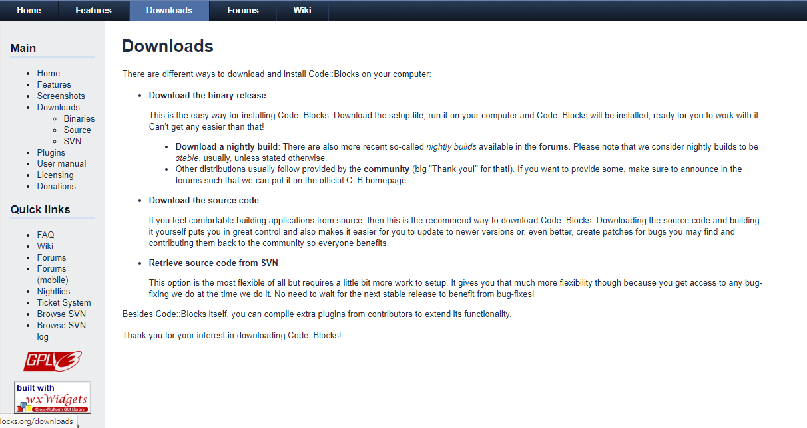
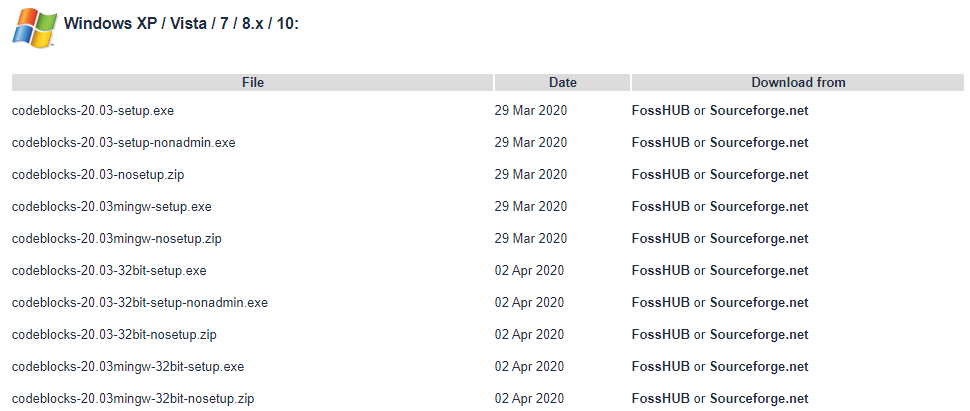
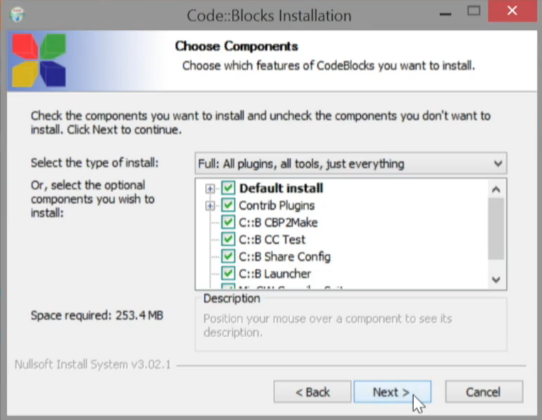
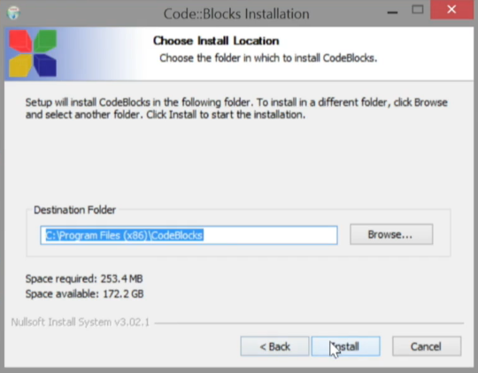
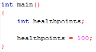
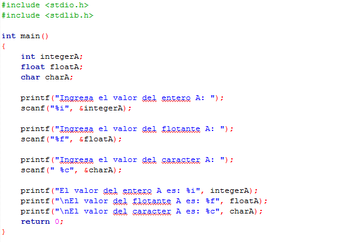
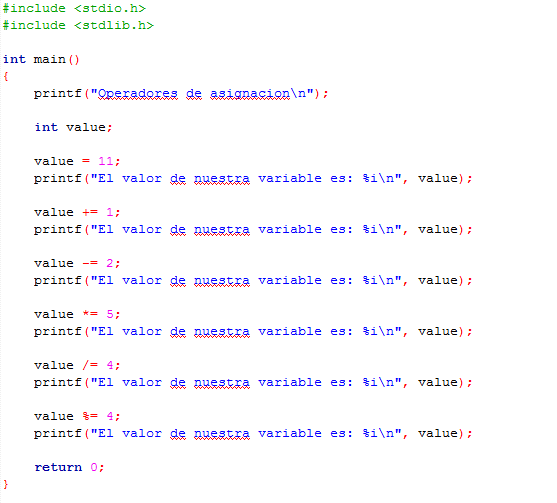
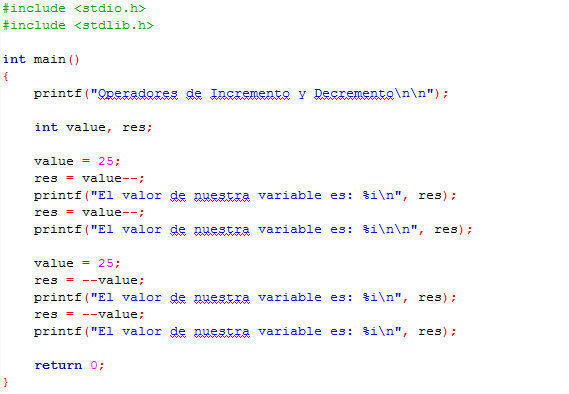

# Curso de Programación Estructurada
## Modulo 1. Introducción
### Clase 1 *Introducción al curso*

¡Bienvenidos al curso de Programación Estructurada!

Te presentamos a la profesora de este curso: Daniela Coyotzi Borja, ella es programadora de juegos en el estudio HyperBeard, también es desarrolla certificada en Unity.

La programación estructurada es una técnica para escribir programas orientados a mejorar la claridad, calidad y tiempo de desarrollo de un programa de computadora recurriendo únicamente a subrutinas y tres estructuras básicas: secuencia, selección (if y switch) e iteración (bucles for y while).

## Modulo 2. Conceptos básicos
### Clase 2 *Set up de codeblocks y compilador*

Lo que vamos aprender antes de comenzar a programar es como hacer el set up de codeblocks y el compilador que vamos a utilizar.

Nosotros usaremos el IDE un programa llamado codeblocks. Un IDE (Integrated Development Environment, Entorno de Desarrollo Integrado o Entorno de Desarrollo Interactivo) es una aplicación informática que proporciona servicios integrales para facilitarle al desarrollador o programador el desarrollo de software.

Un compilador es un software que traduce un programa escrito en un lenguaje de programación de alto nivel (C / C ++, COBOL, etc.) en lenguaje de máquina. Un compilador generalmente genera lenguaje ensamblador primero y luego traduce el lenguaje ensamblador al lenguaje máquina. 

Code :: Blocks es un IDE multiplataforma gratuito y de código abierto que admite múltiples compiladores, incluidos GCC, Clang y Visual C ++.

Se desarrolla en C ++ usando wxWidgets como el kit de herramientas GUI.

**Instalación**

Vamos a la página de codeblocks (http://www.codeblocks.org/) y vamos a Descargar o Downloads:

Damos click en «Download the binary release» y ahí elegimos el sistema operativo que cada uno tenga:

Tenemos varias opciones, nosotros seleccionaremos «codeblocks-20.03mingw-setup.exe» porque nos descarga automáticamente todo lo que necesitemos para poder instalar codeblocks:

Una vez descargamos es simplemente una instalación estándar, damos doble click o ejecutamos como administrador el programa descargado y nos aparece una ventana:

Damos click en Next, la siguiente es la ventana de licencia en la que damos click en I Agree:

Verificamos que este palomeado todo la instalación por defecto y damos click en Next:

Nos muestra la carpeta en la que se guardara el programa, damos click en Install:

Y ya está, el programa será instalado en tu computadora o laptop.

### Clase 3 *Variables y tipos de datos (Asignación y clasificación)*

**Diseño de programas de software**

Los programas tienen una secuencia de secuencia de actividades (fases) que deben ser seguida para generar un conjunto coherente de productos.

Estas fases son:

- Análisis
- Diseño
- Programación
- Codificación
- Prueba
- Mantenimiento
- Documentación

En la fase de Análisis y Diseño nos concentramos en el concepto y diseño del programa, software, aplicación o juego estamos creando.

Las siguientes fases, Programación y Codificación, es la parte que creamos el código para el software en el que estemos trabajando. La fase de Prueba es una fase muy importante porque tenemos que probar que nuestro software funciona correctamente, es cuando compilamos el código, la programación, y vemos que funciona bien. También hacemos cambios si es necesario.

La fase de Mantenimiento cambia mucho dependiendo del tipo de programa que nosotros tengamos. Por ejemplo, en los juegos en línea pasan mucho tiempo en mantenimiento porque están constantemente expuestos a los usuarios, o los programas que tengan poco mantenimiento, programas pasan mucho tiempo en desarrollo y al momento son sacadas al público no tengan mantenimiento más allá de unos pequeños bugs.

Finalmente esta la fase de Documentación, es importante porque si estamos trabajando con otras personas necesitamos documentar nuestro trabajo para que ellos también puedan entender correctamente lo que estamos haciendo.

**¿Qué es un tipo de dato?**

Es una clasificación que el programador le da a la información almacenada para avisarle al compilador como va a ser interpretada.

Un tipo de dato es, en esencia, un espacio en memoria con restricciones.

**Tipos de datos primitivos**

- **Numérico:** Este tipo de datos se divide en enteros y reales.

  - **int:** Son los números enteros, es decir, aquellos que no tienen fracciones o decimales. Pueden ser negativos o positivos y el rango puede variar de un compilador a otro. Se almacenan internamente en 2 o 4 bytes de memoria y pueden ser: unsigned int, short int, int, unsigned long o long (cada uno de estos datos puede almacenar un rango diferente de valores). Cuando el rango de los tipos básicos no es suficientemente grande para sus necesidades, se consideran tipos enteros largos. Ambos tipos long requieren 4 bytes de memoria (32 bits) de almacenamiento.

    Algunos ejemplos de números enteros pueden ser: 3, 27, -18, 0

	- **float / double:** Son los números reales o de coma flotante. Los tipos de datos flotantes contienen una coma (un punto) decimal, pueden ser positivos y negativos formando el subconjunto de los números reales. Para representar números muy pequeños o muy grandes se emplea la notación de punto flotante, que es una generalización de la notación científica. El lenguaje C soporta tres formatos de coma flotante; el tipo float requiere 4 bytes de memoria, double 8 bytes, y long double 10 bytes.

    Algunos ejemplos de números flotantes o dobles pueden ser: 3.14, -0.01, 1.8, 0.27

- **Caracteres:** El almacenamiento de caracteres en el interior de la computadora se hace en “palabras” de 8 bits (1 byte). Este tipo representa valores enteros en el rango 2128 a 1127. El lenguaje C proporciona el tipo unsigned char para representar valores de 0 a 255 y así representar todos los caracteres ASCII.

  Una característica de la parte estándar del conjunto de caracteres (los 128 primeros) es que contiene las letras mayúsculas, las minúsculas y los dígitos, y que cada uno de estos tres subconjuntos está ordenado en su forma natural, por lo que podemos manejar rangos de caracteres bien definidos. Los caracteres se almacenan internamente como números y por lo tanto se pueden realizar operaciones aritméticas con datos tipo char. Existe también el dato tipo cadena (compuesto), que es una sucesión de caracteres que se encuentran delimitados por comillas; la longitud de una cadena es el número de caracteres comprendidos entre los  delimitadores "[long_cad]".

  - **char:** Una variable tipo char se representa como un solo carácter encerrado entre comillas simples.

    Algunos ejemplos son: 'P', 'L', 'A', 'T', 'Z', 'I'

- **Booleanos:** Hay lenguajes que sólo pueden tomar uno de dos valores: verdadero (true) o falso ( false ). En lenguaje C no existe el tipo lógico pero se puede implementar con un número entero, 0 es falso y cualquier número diferente de cero es verdadero. Algunos compiladores utilizan el bool.

  - **bool:** Tipo de dato que representa algo que puede ser verdadero o falso.

**¿Qué es una variable?**

Es un espacio reservado en memoria, definido por un tipo de dato y un nombre asignado, en el cual se puede guardar un valor y se puede modificar.

**Declaración y asignación de una variable en C**

Para declarar una variable es necesario poner el tipo de dato que deseamos, seguido de su nombre. En este ejemplo, nuestro tipo de dato es un entero (int) de nombre healthpoints.

Para asignarle un valor es necesario el nombre de la variable (healthpoints) seguido del operador de asignación (=) y el valor que le daremos (100)

***NOTA: No debemos confundir el operador de asignación (=) con el de comparación (==).***

**Inicialización de una variable**

Para inicializar una variable ponemos primero el tipo de dato (int), el nombre (healthpoints) y el valor que deseamos (100).

**Diferencias entre inicializar y declarar**

Cuando declaramos una variable no le asignamos un valor inicial, en cambio cuando inicializamos una variables nosotros la estamos declarando y dándole un valor inicial.

**Usar codeblocks**

Para crear nuestro primer proyecto en codeblocks hacemos lo siguiente. Vamos en la pestaña de 'File', luego a 'New' y finalmente 'Project':

Se nos abrirá una nueva ventana en la que elegiremos 'Console application' y damos click en 'Go':

Damos click en 'Next':

Elegimos C y después damos click en 'Next':

Le ponemos un nombre a nuestro proyecto, en 'Folder to create project in' podemos elegir donde deseamos guardar nuestro proyecto, y finalmente damos click en 'Next':

Y finalmente damos click en 'Finish':

Ahora ya podemos trabajar en codeblocks, creando lo que deseemos en lenguaje C (o C++ si es lo que elegiste):

### Clase 4 *Entrada y salida de datos*

Aprenderemos como podemos tener información que entra y sale de nuestro programa, es decir, cuando nosotros usamos un input es una entrada que el usuario tiene con el programa y la información que visualizamos es la salida de los datos obtenidos. Por ejemplo, podemos obtener información mediante los teclados y posteriormente verlos en pantalla.

**¿Cómo imprimimos el valor de una variable?**

- #include<librería> usada para “incluir” las declaraciones de otro fichero en la compilación.
- stdio.h es el fichero que proporciona el núcleo de las capacidades de entrada/salida del lenguaje C (incluye la venerable función printf).
- stdlib.h es el fichero usado para realizar ciertas operaciones como conversión de tipos, generación de números pseudo-aleatorios, gestión de memoria dinámica, control de procesos, funciones de entorno, de señalización (??), de ordenación y búsqueda.
- main() sirve como punto de partida para la ejecución del programa. Normalmente, controla la ejecución del programa dirigiendo las llamadas a otras funciones del programa.
- Dentro de la función principal inicializamos un entero (int) de nombre integerA con el valor de 18, posteriormente usamos la función printf para imprimirlo en pantalla.
- La función printf (que deriva su nombre de “print formatted”) imprime un mensaje por pantalla utilizando una “cadena de formato” que incluye las instrucciones para mezclar múltiples cadenas en la cadena final a mostrar por pantalla.

**Formateadores**
Printf permite dar formato específicos a la salida de información.

Printf es una función especial porque recibe un número variable de parámetros. El primer parámetro es fijo y es la cadena de formato. En ella se incluye texto a imprimir literalmente y marcas a reemplazar por texto que se obtiene de los parámetros adicionales. Por tanto, printf se llama con tantos parámetros como marcas haya en la cadena de formato más uno (la propia cadena de formato). El símbolo "%" denota el comienzo de la marca de formato. Y al final, después de la coma, se pone el nombre de la variable a imprimir.

En el ejemplo vemos que:

- %i imprime números enteros (int).
- %.2f imprime números coma flotante decimal de precisión simple (float) con un largo de 2 dígitos, justificados a la derecha.
- %f imprime números coma flotante decimal de precisión simple (float).
- %c imprime un carácter con el código ASCII.

**Imprimir todo en una línea**

Como sabemos, printf acepta tanto parámetros como marcas haya en la cadena de formato, es decir, podemos imprimir todo el ejemplo anterior en una línea completa.

En el lenguaje C existen caracteres que no son imprimibles o visibles en la consola. También se les llama caracteres de escape, ya que siempre llevan una barra invertida "\" seguido del carácter. En el ejemplo vemos el uso de "\n" que nos proporciona un salto de línea.

**Entrada de datos**

Mediante la función scanf podemos introducir cualquier combinación de valores numéricos, caracteres sueltos y cadenas de caracteres a través del teclado. En definitiva, scanf lee datos formateados de la entrada estándar. Cuando hablamos de datos formateados, nos referimos a que los datos se pueden presentar en distintos formatos. La función devolverá el número de datos que se han introducido correctamente.

En el ejemplo usamos la función printf para imprimir un mensaje al usuario y posteriormente la función scanf para que ese usuario pueda ingresar el valor que desea.

**RETO**

- Crear dos variables
- Ingresar y guardar el valor de ambas variables
- Intercambiar el valor de las variables con ayuda de una variable auxiliar
- Imprimir el valor de las variables ya intercambiadas

### Clase 5 *Operadores aritméticos*

Se llaman operadores aritméticos a aquellos que permiten realizar cálculos con valores numéricos para obtener un resultado. Los operadores aritméticos más habituales son la suma, resta, multiplicación y división. En C y en otros lenguajes disponemos de un operador adicional al que denominamos operador módulo (%), que nos permite obtener el resto de una división entre enteros.

La mayoría de estos operadores nos resultan conocidos, pues ya los hemos estudiado con el pseudocódigo. Las reglas de prioridad son las mismas que explicamos al hablar de pseudocódigo. Los paréntesis definen la prioridad principal. El siguiente orden de prioridad corresponde a las operaciones de multiplicación y división. Las operaciones de suma y resta tienen menor precedencia. Y en último lugar tendríamos la operación para obtener el módulo de una división entera.

C no reconoce el operador ^ para el cálculo de potencias de un número, ni el operador div o barra invertida para la obtención del cociente o división entera de una división. Existen otras alternativas que permiten realizar estas operaciones.

Existen otros operadores admitidos que constituyen formas de expresar abreviadamente una operación. Por ejemplo += se puede usar para indicar que la variable a la izquierda toma el valor resultante de sumarse a sí misma con la variable o expresión a la derecha. Si A=4 y se ejecuta A +=3; entonces A pasa a tomar el valor 7, equivalente a realizar la operación A = A + 3.

Los operadores aritméticos básicos en C son:

- Suma: +
- Resta: -
- Multiplicación: *
- División: /
- Módulo: %

En nuestro ejemplo pedimos que el usuario ingrese dos números enteros, después realizamos las operaciones aritméticas y finalmente imprimimos el resultado:

**PRIMER RETO**

- Ingresa los valores necesarios para calcular el área de un cilindro (radio y altura)
- Realiza la operación
- Imprime el resultado del área y el volumen

**SEGUNDO RETO**

- Ingresa la temperatura en grados Fahrenheit
- Realiza la operación para convertir de grados Fahrenheit a Celsius
- Imprimir el resultado de la conversión

### Clase 6 *Operadores de asignación, de incremento y decremento*

Un operador de asignación altera el valor de un objeto sin alterar su tipo. El operador usual de asignación (=), copia el valor del operando de la derecha en el operando de la izquierda, aplicando las conversiones de tipo usuales cuando es necesario.

Tenemos el siguiente ejemplo:

Declaramos una variable entera de nombre value y le asignamos (=) el valor 11.

1. Le asignamos la suma (+=) de 1, es decir, le sumamos 1 (value + 1 o 11 + 1)
2. Le asignamos la resta (-=) de 2, es decir, le restamos 2 (value - 2 o 12 - 2)
3. Le asignamos el producto (*=) de 5, es decir, lo multiplicamos por 5 (value * 5 o 10 * 5)
4. Le asignamos la división (/=) de 4, es decir, dividimos por 4 (value / 4 o 50 / 4)
5. Le asignamos el módulo (%=) de 4, es decir, tenemos el resto de la división por 4 (value % 4 o 50 % 4)

Los operadores unitarios ++ (incremento) y -- (decremento), suman y restan respectivamente una unidad al valor de la expresión. Existen dos variedades "Pre" y "Post" para cada uno de ellos.

**Pre y Post incremento**

En este ejemplo podemos ver la diferencia entre el pre y el post incremento.

Mientras que el post incremento, value++, añade uno a la expresión después de que se ha evaluado, es decir, primero nos imprime el valor inicial (25) y después el incremento (26).

El pre incremento, ++value, añade uno antes de que sea evaluada la expresión, es decir, ya nos imprime el valor incrementado (26) y si lo volvemos a realizar nos imprime nuevamente el nuevo valor incrementado en más uno (27).

**Pre y post decremento**

Similar al ejemplo anterior, podemos notar las diferencias entre el pre y el post decremento.

En el post decremento, value--, resta uno a la expresión después de que se ha evaluado, es decir, primero nos imprime el valor inicial (25) y después el decremento (24).

El pre decremento, --value, resta uno antes de que sea evaluada la expresión, es decir, ya nos imprime el valor decrementado (24) y si lo volvemos a realizar nos imprime nuevamente el nuevo valor decrementado en menos uno (23).

**PRIMER RETO**

- Crear una variable llamada x con valor de 10
- Utilizando operadores de asignación, que esta variable se sume a sí misma el doble de su valor.
- Imprime el resultado

**SEGUNDO RETO**

- Ingrese un valor entero
- Usando operadores de asignación realiza la operación de modulo del valor ingresado con 5
- Imprime el resultado más uno usando operadores de incremento

### Clase 7 *Recapitulación: Conceptos Básicos*

¡Hola bienvenido al curso de Programación Estructurada!

En esta lectura vamos a recapitular la primera sección del curso, los conceptos básicos de programación. Empecemos por tipo de datos.

Como lo hablamos en el curso un tipo de dato es una clasificación que el programador le da a la información almacenada para avisarle al compilador cómo va a ser interpretada.

Los tipos de dato que vimos en el curso son:

- int - Números enteros. p/e 0, -50, 1234
- float - Números decimales. p/e -0.45, 12.5, 3.1416
- char - Caracteres. p/e ‘C’ ‘a’ ‘z’
- bool - Valor lógica binaria. p/e true y false

Estos tipos de dato que representan información pueden ser almacenados en la computadora, para esto utilizamos variables.

Las variables son un espacio reservado en memoria, definido por un tipo de dato y un nombre asignado, en el cual se puede guardar un valor y se puede modificar.

Siempre que nosotros queremos utilizar datos necesitamos reservar espacio en nuestra memoria. Aunque durante el curso usamos la palabra crear para explicar cómo utilizar una variable, en realidad el término correcto sería reservar, porque no estamos creando es espacio en la memoria, estamos reservando espacio para guardar ahí información.

Para reservar espacio en memoria para nuestros datos nosotros podemos declarar una variable, que signifca solo reservar el espacio o inicializar la variable que significa reservar el espacio y darle un valor inicial también.

La sintaxis para estos diferentes casos son:

> int declarandoInt;
> int inicializandoInt = 10;

Para inicializar una variable nosotros usamos un operador de asignación, este es el operador =, con este indicamos que a la variable anterior le estamos asignando un valor específico.

Otros operadores de asignación pueden ser:

- +=
- -=
- *=
- /=
- %=

Que como vimos en el curso, teniendo en cuenta una variable a, son una versión abreviada de:

- a += 3 ------ a = a + 3
- a -= 3 ------ a = a - 3
- a *= 3 ------ a = a * 3
- a /= 3 ------ a = a / 3
- a %= 3 ------ a = a % 3

Estos operadores nos sirven para abreviar una operación y asignar el valor dentro de la misma variable.

Otros operadores que podemos utilizar son los operadores numéricos, estos son:

- (+) Suma
- (-) Resta
- (*) Multiplicación
- (/) División
- (%) Módulo

Estos los conocemos de matemáticas básicas y el único distinto es el operador de módulo.

Este operador realiza una división, pero en vez de darnos el resultado de la división nos da el residuo de la división.

Estos son los conceptos básicos que vimos en el curso, espero que estés aprendiendo mucho y ¡nos vemos en la siguiente clase!
