# Curso de Redes de Internet
## Modulo 1. Introducción al Curso de Redes de Internet
### Clase 1 *Bienvenidos al Curso de Redes de Internet*

La profesora Yesica Cortés te da la bienvenida al curso.

En este curso vamos a hablar sobre cómo internet ha cambiado la forma en la que nos comunicamos. Además, vamos a ver cómo la economía y la política han cambiado gracias a las redes de internet. Hoy en día podemos comunicarnos sin importar en dónde nos encontramos. En este curso vamos a ver:

- Cómo funciona la comunicación en redes
- Modelos de referencia OSI y TCP/IP
- Diseño de redes y configuración

## Modulo 2. Introducción a Redes de Telecomunicaciones
### Clase 2 *Qué es la red, Internet, LAN, WAN y Topologías de Red*

Una red cumple tres características:
- Tiene un punto de partida y llegada
- Su objetivo es transportar algo de un lugar a otro
- Tiene puntos conectados por un medio

**¿Qué es la red informática?**

Según el libro de redes de computadora de Tanenbaum:

***Una red de computadoras es un conjunto de equipos informáticos y software conectados entre sí por medio de dispositivos físicos o inalámbricos que envían y reciben impulsos eléctricos, ondas electromagnéticas o cualquier otro medio para el transporte de datos, con la finalidad de compartir información, recursos y ofrecer servicios.***

**Tipos de redes**

Las redes son definidas según:
- El tamaño del área que cubre
- Cantidad de usuarios conectados
- Cantidad y tipo de servicio disponible
- El área de responsabilidad

**LAN - Local Area Network**

Son redes pequeñas, de área local, que son las que tenemos en casa, en las oficinas y en edificios pequeños.

Redes muy pequeñas interconectadas, generalmente, por cables aunque ahora contamos con dispositivos como los access point que nos permiten también hacer la conexión de estos dispositivos a través de wireless (red inalámbrica).

La cobertura es muy corta, las redes LAN están muy determinadas por el tamaño de área que cubre.

**WAN - Wide Area Network**

Cuando ampliamos el área de cobertura de las redes y la cantidad de usuarios conectados hablamos de redes WAN.

Las redes WAN interactúan con otros dispositivos como routers, que nos permite generar cobertura en rangos más amplios con cobertura inalámbrica porque no todo está conectado por cables.

Otra característica que tiene, a parte del área que cubre, es que son administradas por diferentes servicios de internet.

**MAN - Metropolitan Area Network**

Es la red existente entre la red LAN y la red WAN. Se encarga de conectar áreas más pequeñas, como barrio.

**¿Qué es internet?**

Es una red de redes interconectadas mundialmente.

Si tienes dos computadores conectados ya estás haciendo una red, si a esos dos computadores los conectas a otros edificios ya tienes una red más grande y si todos nos vamos conectando, ampliando cada vez más esa cobertura llegando a un nivel mundial, tenemos internet.

Internet es una conexión de redes LAN y redes WAN.

**Topologías de Red**

Una topología de redes es el diseño que le estamos dando a nuestra red, y podemos mostrar ese diseño de dos maneras.

**Diagrama de Topología Física**

Cuando hablamos de topología física lo que hacemos es mostrar los dispositivos conectados. Hablamos de la ubicación física de los dispositivos y de físicamente cual va a ser el dispositivo que nos ayudara a llegar a la información.

**Diagrama de Topología Lógica**

En este tipo de topología hablamos de cuáles serán las direcciones físicas y lógicas de los equipos, y cuáles son los puertos por los cuales llegara la información.

### Clase 3 *Intranet y Extranet*

En esta clase vamos a hablar de dos formas en las que podemos diseñar e implementar las redes de acuerdo con características de acceso que queremos dar a los usuarios.

**Intranet**

Son aquellas redes internas en las que el acceso a la información está estrictamente limitada a personal de la compañía. Este tipo de redes se restringen con el uso de software y se usan en situaciones en las que la información a la que pueden acceder los usuarios es confidencial.

**Extranet**

El siguiente nivel de acceso sucede cuando las compañías requieren dar acceso seguro y bajo confidencialidad a usuarios externos incluso a organizaciones diferentes a la que posee la información.
Esto puede pasar por ejemplo cuando una compañía requiere compartir documentos o información con proveedores o contratistas.

### Clase 4 *Ejemplos de Topologías de Red y sus usos*

La topología de red nos permite identificar la forma en que los nodos están conectados. La información se envía a través de los medios y de los nodos para viajar de un lugar a otro.

Ya vimos las dos formas en que podemos mostrar estos diseños, física cuando queremos mostrar los equipos de red que conforman el diseño y lógica para mostrar el direccionamiento lógico de los dispositivos.

La topología más rápida de implementar y de ver es cuando tenemos dos nodos conectados por un medio para enviar información esta es llamada Punto a Punto, un punto envía información al otro.
Luego tenemos otras topologías, veamos algunas de sus características y ventajas.

**Topología de bus**

Este tipo de topología es el más usado en redes de tipo LAN. En esta topología los nodos están conectados a un mismo medio que transporta la información.

La ventaja de este tipo de red es que es fácil de implementar y puede crecer rápidamente sin tener que hacer cambios bruscos a la red.
Esto, aunque es una gran ventaja y seguro le facilita la vida al administrador de la red, presenta dos inconvenientes, uno es que el tráfico de todos los nodos puede ser visto por los otros y el segundo es que a medida que la red crezca se va a ver afectado el rendimiento.

**Topología de anillo**

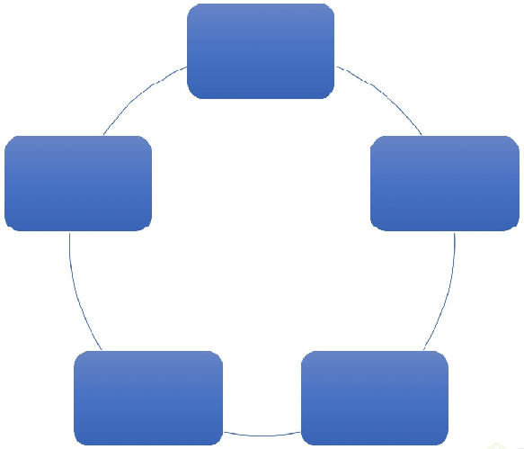

Este tipo de topología consiste en que cada nodo tiene una única conexión de entrada y una conexión de salida. Un token de confirmación viaja a través de cada nodo avisando que se envió y fue recibida correctamente.

Este tipo de topología aunque garantiza el envío de la información puede llegar a ser un poco lenta ya que ésta debe pasar por cada nodo intermedio antes de alcanzar su objetivo. En el caso de que uno de los nodos fallé esto puede afectar el funcionamiento de la red.

**Topología de estrella**

En esta topología todos los nodos están conectados a un punto central, esta implementación permite garantizar el funcionamiento de la red, de forma que si alguno de los nodos falla esto no va a afectar para nada el funcionamiento ni el rendimiento de la red.
Esta topología se usa mucho en redes LAN, por ejemplo en oficinas en las que hay un switch al que llegan todas las conexiones de los dispositivos a través de cable.

Es una topología que permite agregar nodos nuevos siempre que el dispositivo central lo permita, sin embargo en caso en que el nodo central falle toda la red dejará de funcionar.

**Topología de malla**

En las topologías de tipo malla todos los nodos están conectados entre sí, este tipo de conexión permite que cada nodo pueda actuar como servidor y como cliente.

Esta es una forma óptima de mantener la conexión entre dispositivos en una red, ya que se reduce a uno la cantidad de dispositivos por los que debe viajar la información y en caso de que un nodo de la red falle los datos pueden ser enviados por otro camino, lo que asegura disponibilidad.

**Topología de árbol**

En esta topología contamos con varios dispositivos intermedios que permiten que otros nodos se conecten. Por ejemplo, podemos tener un punto inicial que recibe la conexión a Internet desde el ISP, de allí viaja por el medio a un switch que distribuye a otros dispositivos que pueden ser nodos u otros dispositivos intermedios, switches, routers etc. quienes a su vez envían los datos a otros dispositivos iguales.

La forma de la red se parece mucho a un árbol.

También podemos hacer combinaciones de estas topologías para realizar nuestras propias implementaciones de acuerdo con las necesidades de los usuarios.

### Clase 5 *Tecnologías de acceso a internet: Banda Ancha y velocidad de Internet*

Ya sabemos que internet es un conjunto de redes interconectadas a través de medios. Estos medios tienen diferentes medidas que podemos utilizar para calcular su rendimiento, una de esas medidas es el ancho de banda.

El ancho de banda corresponde a la capacidad máxima que tiene para pasar bytes.

Para poder calcular la velocidad de banda ancha que nos ofrece nuestro proveedor de servicio de internet (IPS), debemos saber primero que es un bit y que es un byte:
Bit: es un digito que forma parte del sistema binario, representado por uno de estos valores (0 o 1).
Byte: una unidad de información digital equivalente a ochos bits (ejemplo, 0 0 1 1 0 0 1 1)

También debemos saber que nuestro proveedor nos ofrece Mb/segundo, mientras que los archivos pesan en MB.

**Si tienes una velocidad de 50Mb/segundos y deseas descargar un archivo de 10MB, ¿Cuánto tiempo te tomaría?**

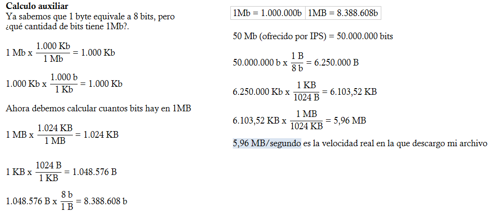

### Clase 6 *La Red Convergente*

***Las redes convergentes transportan múltiples servicios por la misma red.***

Las redes convergentes o redes de multiservicio hacen referencia a la integración de los servicios de voz, datos y video sobre una sola red basada en IP como protocolo de nivel de red. En este artículo se presenta la integración de servicios de voz sobre redes IP (VoIP) como ejemplo de red convergente. La arquitectura de esta red está constituida básicamente, por el media gateway, el controlador de media gateway, el gateway de señalización y el gatekeeper. Las redes de convergencia han tenido y tendrán aún dificultades técnicas qué superar ya que los distintos servicios por ofrecer tienen diferentes características y requerimientos de red, por tanto es importante hablar aquí de ingeniería de tráfico y mecanismos que garanticen calidades de servicio.

**Redes tradicionales separadas**

Piense en una escuela construida hace cuarenta años. En ese entonces, las aulas contaban con conexiones por cable para la red de datos, la red telefónica y la red de vídeo para los televisores. Estas redes separadas no podían comunicarse entre sí, como se muestra en la figura. Cada red utilizaba tecnologías diferentes para transportar la señal de comunicación. Cada red tenía su propio conjunto de reglas y estándares para asegurar una comunicación satisfactoria.

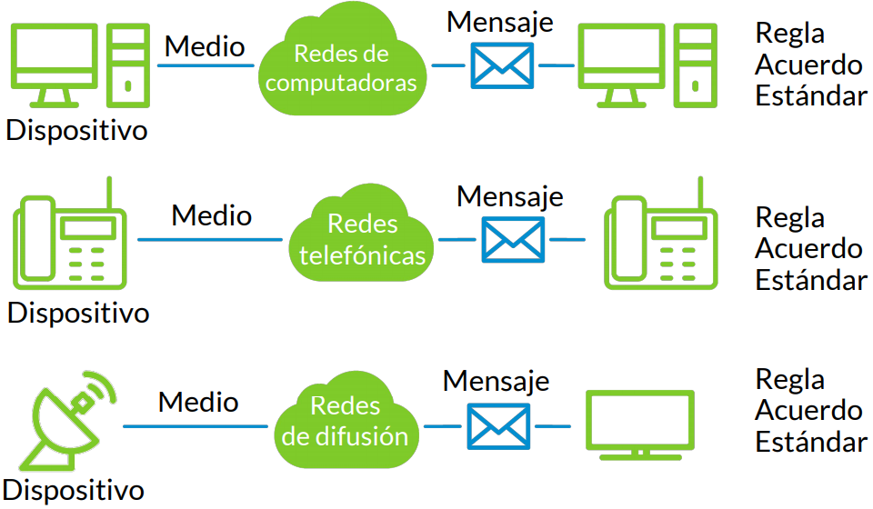

**Red convergente**

Hoy, las redes separadas de datos, telefonía y vídeo están convergiendo. A diferencia de las redes dedicadas, las redes convergentes pueden transmitir datos, voz y vídeo entre muchos tipos diferentes de dispositivos en la misma infraestructura de red, como se muestra en la figura. Esta infraestructura de red utiliza el mismo conjunto de reglas, acuerdos y estándares de implementación.

## Modulo 3. Configuración de dispositivos (IOS CISCO)
### Clase 7 *Métodos de acceso a los dispositivos*

Sistema operativo es la aplicación o la forma en que nosotros como usuarios podemos acceder al kernel y el kernel es el que accede físicamente al hardware.

Hay muchos sistemas operativos y cada marca tiene su forma de acceder a sus máquinas.

Las formas en que podemos conectarnos son:

**Acceso por consola**

Se puede tener acceso a la CLI a través de una sesión de consola, también denominada línea CTI. La consola usa una conexión serial de baja velocidad para conectar directamente un equipo o un terminal al puerto de consola en el router o switch.

El puerto de consola es un puerto de administración que provee acceso al router fuera de banda. Es posible acceder al puerto de consola aunque no se hayan configurado servicios de networking en el dispositivo. El puerto de consola se suele utilizar para tener acceso a un dispositivo cuando no se han iniciado o han fallado los servicios de networking.

Ejemplos del uso de la consola son:
- La configuración de inicio del dispositivo de red.
- Procedimientos de recuperación de desastres y resolución de problemas donde no es posible el acceso remoto.
- Procedimientos de recuperación de contraseña.

Cuando un router se pone en funcionamiento por primera vez, no se han configurado los parámetros de networking. Por lo tanto, el router no puede comunicarse a través de una red. Para preparar la puesta en marcha y configuración iniciales, se conecta un equipo que ejecuta un software de emulación de terminal al puerto de consola del dispositivo.

En el equipo conectado pueden ingresarse los comandos de configuración para iniciar el router.

Durante el funcionamiento, si no se puede acceder a un router en forma remota, una conexión a la consola puede permitir a un equipo determinar el estado del dispositivo. En forma predeterminada, la consola comunica el inicio del dispositivo, la depuración y los mensajes de error.

Para muchos dispositivos Cisco, el acceso de consola no requiere ningún tipo de seguridad, en forma predeterminada.

Sin embargo, la consola debe estar configurada con contraseñas para evitar el acceso no autorizado al dispositivo. En caso de que se pierda una contraseña, existe un conjunto especial de procedimientos para eludir la contraseña y acceder al dispositivo.

Debe colocarse el dispositivo en un cuarto cerrado con llave o en un bastidor de equipos para impedir el acceso físico.

**Acceso por SSH (Secure Shell) o Telnet (Teletype Network)**

Un método que sirve para acceder en forma remota a la sesión CLI es hacer telnet al router. A diferencia de la conexión de consola, las sesiones de Telnet requieren servicios de networking activos en el dispositivo. El dispositivo de red debe tener configurada por lo menos una interfaz activa con una dirección de Capa 3, como por ejemplo una dirección Ipv4.

Los dispositivos Cisco IOS incluyen un proceso de servidor Telnet que se activa cuando se inicia el dispositivo. El IOS también contiene un cliente Telnet.

Un host con un cliente Telnet puede acceder a las sesiones vty que se ejecutan en el dispositivo Cisco. Por razones de seguridad, el IOS requiere que la sesión Telnet use una contraseña, como método mínimo de autenticación. Los métodos para establecer las conexiones y contraseñas se analizarán en una sección posterior.

El Secure Shell protocol (SSH) es un método que ofrece más seguridad en el acceso al dispositivo remoto. Este protocolo provee la estructura para una conexión remota similar a Telnet, salvo que utiliza servicios de red más seguros.

El SSH proporciona autenticación de contraseña más potente que Telnet y usa encriptación cuando transporta datos de la sesión. La sesión SSH encripta todas las comunicaciones entre el cliente y el dispositivo IOS. De esta manera se mantienen en privado la ID del usuario, la contraseña y los detalles de la sesión de administración. Una mejor práctica es utilizar siempre SSH en lugar de Telnet, siempre que sea posible.

La mayoría de las versiones más recientes de IOS contienen un servidor SSH. En algunos dispositivos, este servicio se activa en forma predeterminada. Otros dispositivos requieren la activación del servidor SSH.

Los dispositivos IOS también incluyen un cliente SSH que puede utilizarse para establecer sesiones SSH con otros dispositivos. De manera similar, puede utilizarse un equipo remoto con un cliente SSH para iniciar una sesión de CLI segura. No se provee el software de cliente SSH de manera predeterminada en los sistemas operativos de todos los equipos. Es posible que deba adquirir, instalar y configurar el software de cliente SSH en su equipo.

**Acceso por Auxiliar**

Otra manera de establecer una sesión CLI en forma remota es a través de una conexión de marcado telefónico mediante un módem conectado al puerto auxiliar del router. De manera similar a la conexión de consola, este método no requiere ningún servicio de networking para configurarlo o activarlo en el dispositivo.

El puerto auxiliar también puede usarse en forma local, como el puerto de consola, con una conexión directa a un equipo que ejecute un programa de emulación de terminal. El puerto de consola es necesario para la configuración del router, pero no todos los routers tienen un puerto auxiliar. También se prefiere el puerto de consola antes que el puerto auxiliar para la resolución de problemas, ya que muestra de manera predeterminada la puesta en marcha del router, la depuración y los mensajes de error.

Generalmente, en la única oportunidad que el puerto auxiliar se usa en forma local en lugar del puerto de consola es cuando surgen problemas en el uso del puerto de consola, como por ejemplo cuando no se conocen ciertos parámetros de consola.

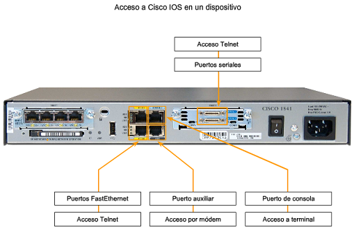

### Clase 8 *Instalación de Packet Tracer, emulador de redes*

Existe software que nos permite hacer simulación de redes, de forma que podamos probar todos los casos antes de hacer las implementaciones reales.

Para este curso vamos a estar usando Packet Tracer, este es un software que Cisco ofrece en versión de estudiante para que podamos aprender y practicar. Cisco es una de las empresas más grandes y quien manda la parada en cuanto a investigación y nuevos desarrollos en el tema de redes. Sus dispositivos son ampliamente usados en entornos empresariales y además ofrece a quien quiera aprender mucho contenido en su sitio www.netacad.com.

Uno de los contenidos que te recomiendo está aquí: [Packet Tracer](https://www.netacad.com/courses/packet-tracer "Packet Tracer"). Este es un curso gratuito que te va a abrir un mundo de oportunidades. Y ademas nos va a ayudar para que continuemos con nuestro curso de redes.

Entra al link que te dejé antes y enrólate al curso. De esta forma vamos a poder descargar e instalar Packet Tracer. La instalación es realmente sencilla, unas vez que hayas hecho el registro en Netacad vas a encontrar en los recursos del curso el instalador para tu sistema operativo, lo descargas y sigues las indicaciones del asistente.

Packet Tracer no está disponible para dispositivos con IOs por eso estaremos trabajando las simulaciones en Windows.

### Clase 9 *Práctica: Navegación por el sistema operativo, comandos y privilegios*

Ahora que tenemos Packet Tracer instalado, vamos hacer unas pequeñas configuraciones para empezar a familiarizarnos con los dispositivos.

Vamos a construir una red que consta de un switch (con dirección IP y máscara de red) y un PC de escritorio (también con su dirección IP y su máscara de red).

Para la practica ingresamos a Packet Tracer y, lo primero que podemos ver, es un gran tablero blanco en el que podemos asignar o colocar todos nuestro dispositivos para poder armar nuestra red. En la parte inferior tenemos unos iconos y accesos a diferentes dispositivos como los switch, routers, hots, etc. Y también encontramos dispositivos finales como PC de escritorio, laptops, servidores, telefonos y más. Aquí seleccionamos los dispositivos que estaremos configurando, en este caso usaremos una PC y una switch 2960.

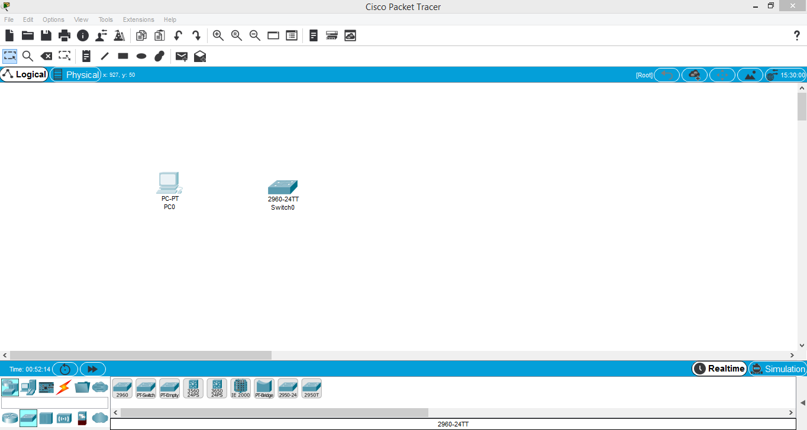

**Concepto que debemos saber antes:**

- **Switch:** es un dispositivo que permite que la conexión de computadoras y periféricos a la red para que puedan comunicarse entre sí y con otras redes.
- **IP (Internet Protocol, en español Protocolo de Internet):** es una serie de condiciones y reglas sobre las cuales se maneja todo el espectro comunicacional entre computadoras en la red.
- **Máscara de red:** combinación de bits que sirve para delimitar el ámbito de una red de computadoras. Su función es indicar a los dispositivos qué parte de la dirección IP es el número de la red, incluyendo la subred, y qué parte es la correspondiente al host.
- **Vlan:** es un método que permite crear redes que lógicamente son independientes, aunque estas se encuentren dentro de una misma red física.
- **Modo de usuario:** el modo usuario proporciona un limitado número de comandos que permiten al usuario ver información y verificar el estado del dispositivo. El modo usuario no permite ningún comando que pueda cambiar la configuración del dispositivo.
- **Modo privilegiado:** el modo privilegiado da acceso a todos los comandos del dispositivo. Los comandos de configuración y administración requieren que el administrador de red se encuentre en el modo privilegiado. Sólo usuarios autorizados deben tener acceso a los comandos de configuración deñ dispositivo.
- **Modo de configuración global:** todos los cambios de configuración hechos mediante la interfaz de línea de comando (CLI) en un router CISCO, se realizan desde el modo de configuración global. Los comandos del modo de configuración global afectan al sistema como un todo. Desde el modo de configuración global se puede acceder a otros submodos de operación más específicos dependiendo del cambio de configuración que se desea realizar.
- **Ping:** es un comando o una herramienta de diagnóstico que permite hacer una verificación del estado de una determinada conexión o host local.

**Configuración del switch**

Para configurarlo necesitamos dar doble click sobre el switch y nos abre otra ventana. Para configurarlo necesitamos dar doble click sobre el switch y nos abre otra ventana. Esta ventana nos muestra físicamente como se verá el switch, la cantidad de puertos con los que contamos y nos muestra los puertos de consola que nos permitirá acceder a través de cables.

En la pestaña 'Config' es una pestaña que nos permite hacer las configuraciones de los puertos, podemos asignarles la vlan que queremos construir y podemos hacer la configuración normal.

Sin embargo, nosotros vamos hacer las configuraciones con los comandos que nos ofrece el sistema operativo. Para eso vamos en la pestaña 'CLI', que es la consola de línea de comandos. Ahí podemos ver los parámetros iniciales del switch, nos muestra que sistema operativo tiene, la versión del sistema operativo, como se llama y desde que switch estamos accediendo.

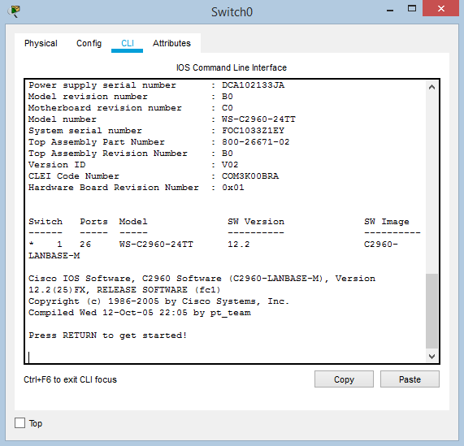

Presionamos la tecla ENTER y entramos en un modo de usuario, lo sabemos por el carácter > que esta al final del nombre del switch, para entrar al modo privilegiado ingresamos el comando 'enable' y nos debe salir el carácter # al final. Si usamos el comando 'configure terminal', ingresamos al modo de configuración global, escribiendo 'interface nombre_interfaz' nos permite hacer modificaciones al interfaz. Para salir de este modo presionamos Ctrl + Z, y después escribimos la palabra 'exit'.

Hacer todo esto nos devuelve al inicio de la pantalla, en el modo usuario, volvemos a ingresar al modo de configuración con privilegios (escribimos la palabra 'enable') y luego usamos el comando 'show running-config', este comando nos permitirá ver las configuraciones del dispositivos, como su nombre.

Ahora que vimos algunos comandos, es hora de configurar el switch. Lo primero que haremos será ingresar al modo de configuración global y asignarle un nombre al dispositivo, para eso usamos el comando 'hostname nombre_dispositivo' y vemos como su nombre cambia.

Para darle seguridad al dispositivo podemos darle una contraseña. En cada modo es posible habilitar una contraseña y darle diferentes niveles de seguridad, pero para esta práctica únicamente vamos a darle seguridad al modo de privilegios. Para dar una contraseña usamos el comando 'enable secret contraseña_dispositivo'.

A continuación le daremos un banner o aviso al dispositivo, esto nos dará un aviso que ayudara a ver cuando entramos, especialmente si no estamos cerca e ingresamos de manera remota (ya sea usando Telnet o SSH). Para configurar el aviso usamos el comando 'banner motd #mensaje#'. El carácter # señala el principio y final del mensaje.

Salimos y volvemos a ingresar, de esta forma comprobamos la seguridad y el aviso.

Ingresamos al modo de configuración global y posteriormente al modo de configuración de interfaces (en este caso configuraremos el vlan). Le asignamos la dirección IP y la máscara de red con el comando 'ip addres dirección_IP dirección_máscara'. Activamos la interfaz y nos señala el cambio con el el comando 'no shutdown'.

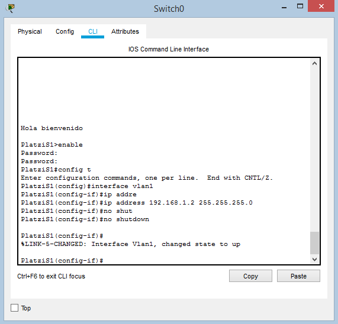

Antes de salir debemos guardar los cambios hechos en el switch, si no hacemos esto y solamente cerramos perderemos todas nuestras configuraciones. Para eso volvemos a ingresar al modo de privilegios y usamos el comando 'copy run startup-config', nos preguntara si deseamos guardar las configuraciones, presionamos la tecla ENTER y ya está.

Si deseas comprobar que los cambios fuero debidamente guardados solamente debes correr el comando 'show running-config' y vemos como el nombre del switch ha sido modificado y la contraseña esta encriptada.

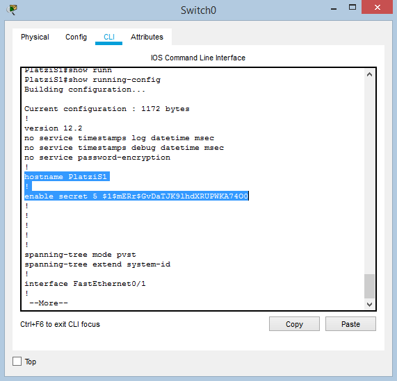

También podemos ver como la interfaz vlan tiene una dirección ip y una máscara de red, y que el aviso fue agregado.

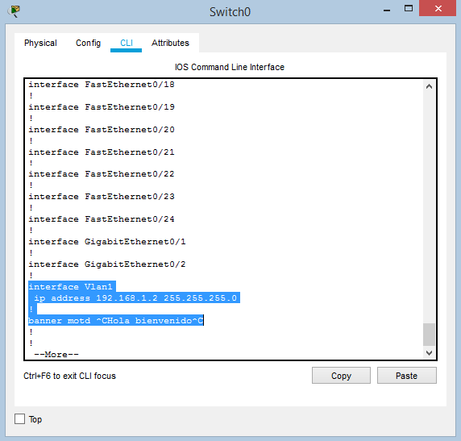

**Configuración de PC**

Hacer la configuración de la PC es un poco más sencillo. Damos doble click y nos abre una ventana, similar a la switch, esta ventana nos mostrara como se verá físicamente nuestra PC.

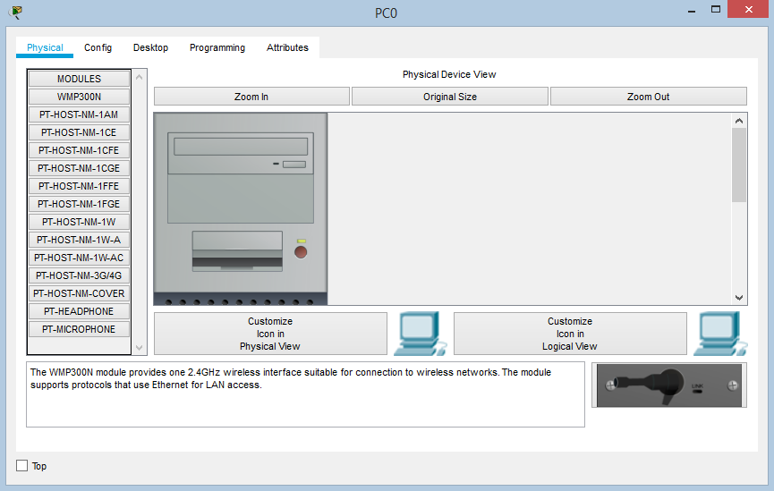

Vamos a la pestaña 'Config', después a FastEthernet0 y en la parte IP Configuration ingresamos la dirección IP y la máscara de red.

**Comprobar conexión**

La comprobación de conectividad se hace mediante un ping y para eso debemos tener un cable que conecte nuestra PC con la switch.

Elegimos un cable entre los iconos de la parte inferior y después elegimos que nuestra PC se conecte a través del FasEthernet0.

Y lo conectamos al switch a través de un FastEthernet.

Esperamos a que ambos puntos (o triángulos) se pongan de color verde, esto nos indica que están en la misma red y tiene conexión.

Volvemos a ingresar a la PC dando doble click, vamos a la pestaña 'Desktop' y después a 'Command Prompt' o 'Consola de comandos'.

En la consola escribimos 'ping dirección_IP', en este caso la dirección IP del switch es 192.168.1.2. Esperamos unos momentos y vemos como el tiempo que tarda la conexión entre ambos dispositivos.

Y ya está, con esto fue comprobado que tu PC está conectada a una switch.

## Modulo 4. Protocolos y comunicaciones de red
### Clase 10 *Suites de protocolos*

Una suite de protocolos es un conjunto de protocolos que nos ayudan desde las diferentes capas y servicios de la red a garantizar que la información viaja de un lugar a otro, de forma segura y confiable, algunos de estos sirven para garantizar que la información es entregada o no como lo son TCP y UDP.

En la siguiente clase estaremos hablando de los modelos de referencia para la transmisión de datos en Internet, el modelo OSI y el modelo TCP/IP. Veremos que son similares y una de las cosas por las que esto es así es porque los protocolos que ambos usan en sus capas son protocolos abiertos, de uso libre, de forma que pueden estar implementados en cualquier dispositivo de hardware o a través de software.

A continuación listo algunos de los protocolos usados en las diferentes capas de red y su funcionamiento:

**De la capa de Acceso a la Red (TCP/IP) / Física + Enlace de Datos (OSI)**

**ARP**

Es el protocolo que permite hacer la asignación de direcciones físicas y direcciones lógicas en el modelo OSI funciona en la capa de Enlace a Datos en la capa lógica.

**Ethernet**

Es el protocolo que nos permite definir los estándares relacionados con los medios cableados y la señalización en la capa física.

**Controladores de NIC**

Corresponde a la definición de los algoritmos que llevan las instrucciones a la máquina para recibir y enviar datos a través de la tarjeta de acceso a Internet del dispositivo.

**Capa de Internet (TCP/IP) / Capa de Red (OSI)**

**IP**

Protocolo de Internet, es el protocolo encargado de la asignación de direcciones lógicas a los dispositivos, recibe los segmentos de la capa de transporte y los direcciona a través de la red.

**NAT**

Network Address Translation, este protocolo hace la traducción de direcciones IP privadas en direcciones IP públicas únicas globalmente.

Es un protocolo que permite a los routers enviar mensajes a través de Internet. Cada dispositivo en la red LAN sale a Internet a través de un dispositivo llamada Router que contiene un listado de direcciones IP privadas vs direcciones IP públicas.

Cuando un host quiere enviar un mensaje a un dispositivo externo el router determina a través de NAT a donde debe enviar.

Con el uso de direcciones IPv6 se espera que el uso de este protocolo no sea necesario ya que es posible asignar a cada host en en el mundo una dirección lógica única.

**ICMP**

Este protocolo apoya al protocolo IP proporcionando mensajes y notificaciones de error cuándo un mensaje no puede alcanzar su destino. Valida que el mensaje haya alcanzado su destino, valida también si la el tiempo de vida del mensaje ya ha sido superado entre otras cosas. Su labor es únicamente informar sobre el error sin ejecutar acción alguna para resolverlo.

**Capa de Transporte (TCP/IP) / Capa de Transporte (OSI)**

Los protocolos de esta capa son TCP y UDP, de ellos estaremos hablando mas adelante en el curso.

**Capa de Aplicación (TCP/IP) / Capa de sesión + Capa de Presentación + Capa de Aplicación (OSI)**

**DNS**

Domain Name System, es el protocolo encargado de hacer la traducción de direcciones IP (172.217.14.163) en textos que podamos leer y recordar fácilmente como www.google.com

**DHCP**

Es el protocolo encargado de asignar direcciones IP de forma dinámica a los dispositivos. Esta pendiente de liberar las direcciones cuando estás ya no están siendo usadas.

**SMTP**

Este es un protocolo de envío de correo, pongo en negrita la palabra porque este es precisamente su funcionamiento, tanto desde los hosts como desde los servidores, el protocolo SMTP es en encargado de enviar los mensajes.

**POP**

Junto con IMAP, POP es un protocolo encargado de la recepción de los mensajes en el dispositivo de destino. POP descarga los mensajes desde el servidor a tu pc y son eliminados del servidor. Si recibes un mensaje usando el protocolo POP ese mensaje puede ser consultado sin conexión a Internet luego de ser descargado al pc, pero si se borra de tu pc ya no hay manera de recuperarlo.

**IMAP**

El otro protocolo para recuperación de correo, en este caso los mails son revisados desde el servidor, de forma que se requiere conexión a Internet para leer los mensajes, puedes acceder a tus mails desde diferentes dispositivos y no tienes que preocuparte por la recuperación ya que el servidor realiza copias de seguridad para garantizar que el mail sigue disponible.

**FTP/TFTP**

Son protocolos para transferencia de archivos.

**HTTP/HTTPS**

Este es tal vez el protocolo que todos sabemos que es familiar, porque es el que usamos todo el tiempo siempre que estamos consultando información en internet. El protocolo HTTP es el conjunto de reglas que definen la forma en que son enviados los mensajes para el intercambio de texto a través de la red.

### Clase 11 *Aspectos básicos de comunicación*

**Elementos básicos de comunicación**

- **Origen o Emisor:** son personas o dispositivos electrónicos que necesitan enviar un mensaje a otras personas o dispositivos.
- **Mensaje:** contenido que se desea transmitir.
- **Canal o medio:** proporcionan la ruta por la que viaja el mensaje desde el origen hasta el destino.
- **Destino o Receptor:** recibe el mensaje y lo interpreta.

Los protocolos son las reglas que rigen la comunicación. Necesitamos establecer protocolos que nos ayuden a ver que la información pasen por todas las capas que tiene los procesos de comunicación.

**Característica de los protocolos de internet**

- **Codificación del mensaje:** es el proceso de convertir información en otra forma aceptable, para su transmisión. La decodificación invierte este proceso para interpretar la información.
- **Formato y encapsulamiento del mensaje:** los formatos de mensajes dependen del tipo de mensaje y del canal que se utiliza para entregar el mensaje. El proceso de colocar un formato de mensaje (la letra) dentro de otro formato de mensaje (el sobre) se denomina encapsulación. La desencapsulación ocurre cuando el destinatario invierte el proceso y la carta se retira del sobre.
- **Tamaño del mensaje:** cuando las personas se comunican entre sí, los mensajes que envían generalmente se dividen en partes u oraciones más pequeñas. Estas oraciones tienen un tamaño limitado a lo que la persona receptora puede procesar al mismo tiempo, como se muestra en la imagen. También facilita que el receptor lea y comprenda.
- **Sincronización:** imagina a dos personas hablando al mismo tiempo, luego se produce una "colisión de información", y es necesario que las dos retrocedan y comiencen de nuevo. Del mismo modo, cuando un dispositivo quiere transmitir en una LAN inalámbrica, es necesario que la tarjeta de interfaz de red WLAN (NIC) determine si el medio inalámbrico está disponible. Para impedir esa "colisión de información", esta la sincronización.
- **Opciones de entrega**
  - **Unicast / Unidifusión:** una persona quiere comunicar información a un solo individuo
	- **Muticast / Multidifusión:** una persona puede necesitar enviar información a un grupo de personas al mismo tiempo.
	- **Broadcasting / Difusión:** una persona envía información a todas las personas en la misma área.

### Clase 12 *Modelos de referencia; modelo OSI, modelo TCP/IP*

Los modelos de referencia nos ayudan a definir cuáles son los protocolos y los estándares que están en cada una de las capas por las que tiene que viajar un mensaje hasta ser llevado desde su emisor hasta su receptor a través de los medios.

**Modelo TCP/IP**

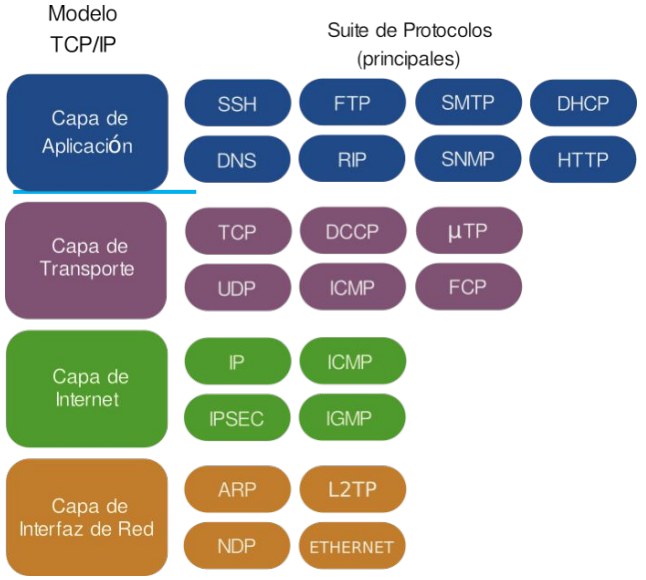

**Modelo OSI**

- Física: son los medios por los que se transportan las señales que llevan los mensajes. Son los cables que permiten transmitir los mensajes.
- Enlace de datos: son los equipos que hacen los direccionamientos. Son los dispositivos físicos que codifican y decodifican la información.
- Red: se encarga del direccionamiento lógico. Es la capa que se encarga del direccionamiento de IP.
- Transporte: conexión extremo a extremo y garantiza la fiabilidad de los datos. Son los protocolos que nos aseguran que el mensaje se envía y es recibido.
- Sesión: mantiene abierta la comunicación entre los dispositivos.
- Presentación: se refieren a la representación de los datos, tipos de archivos, etc.
- Aplicación: que acceden a información desde internet.

### Clase 13 *Segmentación de los mensajes y Unidades de Datos de Protocolo PDU*
Segmentación de los mensajes y unidades de datos de protocolo PDU

La segmentación consiste en tomar un mensaje muy grande y dividirlo en pequeñas partes.

Si envío mensajes a través de la red, que están segmentados, y somos los únicos que enviamos esos mensajes porque llegaran todos uno detrás del otro. Pero qué pasa si ese mismo medio lo usar una o varias personas más, van a ver muchos fragmentos de mensajes que se estarán enviado por el medio, para ensamblar nuevamente los mensajes tenemos la multiplexación.

La multiplexación es el proceso que nos permite combinar dos canales por un mismo medio.

Para que ese mensaje que viaja a través de las diferentes capas de red llegue completo y no se pierda ninguna información (porque va segmentación), lo que hacemos es agregar pequeñas capas que nos ayudan a identificarlos (PDU).

**PDU (Protocol Data Unit):** unidad que nos permite identificar la información a medida que es transmitida a través de las capas.
