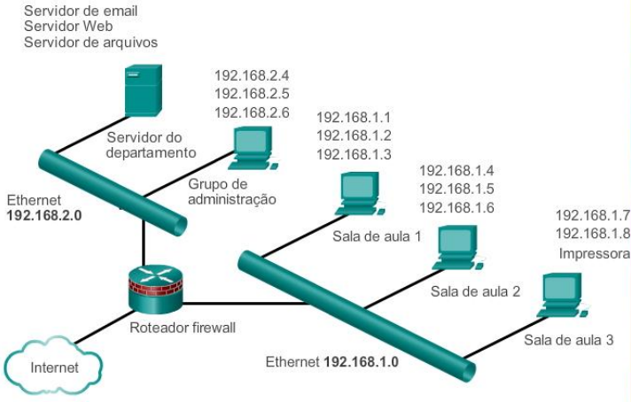
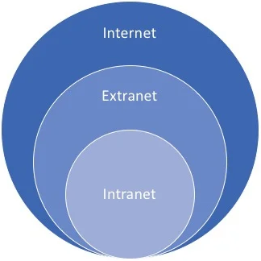
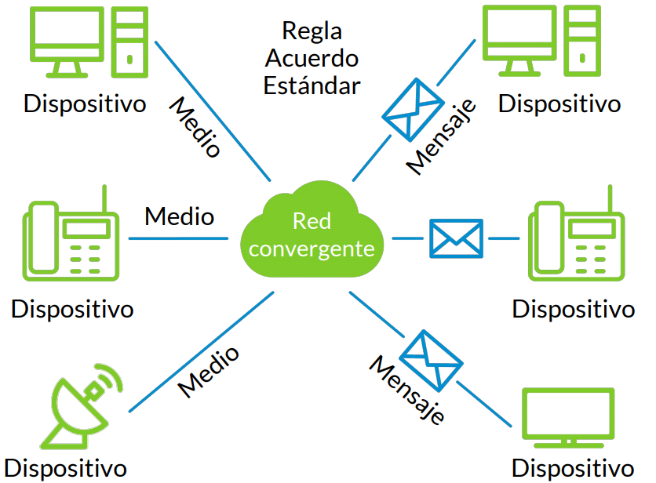

# Curso de Redes de Internet
## Modulo 1. Introducción al Curso de Redes de Internet
### Clase 1 *Bienvenidos al Curso de Redes de Internet*

La profesora Yesica Cortés te da la bienvenida al curso.

En este curso vamos a hablar sobre cómo internet ha cambiado la forma en la que nos comunicamos. Además, vamos a ver cómo la economía y la política han cambiado gracias a las redes de internet. Hoy en día podemos comunicarnos sin importar en dónde nos encontramos. En este curso vamos a ver:

- Cómo funciona la comunicación en redes
- Modelos de referencia OSI y TCP/IP
- Diseño de redes y configuración

## Modulo 2. Introducción a Redes de Telecomunicaciones
### Clase 2 *Qué es la red, Internet, LAN, WAN y Topologías de Red*

Una red cumple tres características:
- Tiene un punto de partida y llegada
- Su objetivo es transportar algo de un lugar a otro
- Tiene puntos conectados por un medio

**¿Qué es la red informática?**

Según el libro de redes de computadora de Tanenbaum:

***Una red de computadoras es un conjunto de equipos informáticos y software conectados entre sí por medio de dispositivos físicos o inalámbricos que envían y reciben impulsos eléctricos, ondas electromagnéticas o cualquier otro medio para el transporte de datos, con la finalidad de compartir información, recursos y ofrecer servicios.***

**Tipos de redes**

Las redes son definidas según:
- El tamaño del área que cubre
- Cantidad de usuarios conectados
- Cantidad y tipo de servicio disponible
- El área de responsabilidad

**LAN - Local Area Network**

Son redes pequeñas, de área local, que son las que tenemos en casa, en las oficinas y en edificios pequeños.

Redes muy pequeñas interconectadas, generalmente, por cables aunque ahora contamos con dispositivos como los access point que nos permiten también hacer la conexión de estos dispositivos a través de wireless (red inalámbrica).

La cobertura es muy corta, las redes LAN están muy determinadas por el tamaño de área que cubre.

**WAN - Wide Area Network**

Cuando ampliamos el área de cobertura de las redes y la cantidad de usuarios conectados hablamos de redes WAN.

Las redes WAN interactúan con otros dispositivos como routers, que nos permite generar cobertura en rangos más amplios con cobertura inalámbrica porque no todo está conectado por cables.

Otra característica que tiene, a parte del área que cubre, es que son administradas por diferentes servicios de internet.

**MAN - Metropolitan Area Network**

Es la red existente entre la red LAN y la red WAN. Se encarga de conectar áreas más pequeñas, como barrio.

**¿Qué es internet?**

Es una red de redes interconectadas mundialmente.

Si tienes dos computadores conectados ya estás haciendo una red, si a esos dos computadores los conectas a otros edificios ya tienes una red más grande y si todos nos vamos conectando, ampliando cada vez más esa cobertura llegando a un nivel mundial, tenemos internet.

Internet es una conexión de redes LAN y redes WAN.

**Topologías de Red**

Una topología de redes es el diseño que le estamos dando a nuestra red, y podemos mostrar ese diseño de dos maneras.

**Diagrama de Topología Física**

Cuando hablamos de topología física lo que hacemos es mostrar los dispositivos conectados. Hablamos de la ubicación física de los dispositivos y de físicamente cual va a ser el dispositivo que nos ayudara a llegar a la información.

**Diagrama de Topología Lógica**

En este tipo de topología hablamos de cuáles serán las direcciones físicas y lógicas de los equipos, y cuáles son los puertos por los cuales llegara la información.

### Clase 3 *Intranet y Extranet*

En esta clase vamos a hablar de dos formas en las que podemos diseñar e implementar las redes de acuerdo con características de acceso que queremos dar a los usuarios.

**Intranet**

Son aquellas redes internas en las que el acceso a la información está estrictamente limitada a personal de la compañía. Este tipo de redes se restringen con el uso de software y se usan en situaciones en las que la información a la que pueden acceder los usuarios es confidencial.

**Extranet**

El siguiente nivel de acceso sucede cuando las compañías requieren dar acceso seguro y bajo confidencialidad a usuarios externos incluso a organizaciones diferentes a la que posee la información.
Esto puede pasar por ejemplo cuando una compañía requiere compartir documentos o información con proveedores o contratistas.

### Clase 4 *Ejemplos de Topologías de Red y sus usos*

La topología de red nos permite identificar la forma en que los nodos están conectados. La información se envía a través de los medios y de los nodos para viajar de un lugar a otro.

Ya vimos las dos formas en que podemos mostrar estos diseños, física cuando queremos mostrar los equipos de red que conforman el diseño y lógica para mostrar el direccionamiento lógico de los dispositivos.

La topología más rápida de implementar y de ver es cuando tenemos dos nodos conectados por un medio para enviar información esta es llamada Punto a Punto, un punto envía información al otro.
Luego tenemos otras topologías, veamos algunas de sus características y ventajas.

**Topología de bus**

Este tipo de topología es el más usado en redes de tipo LAN. En esta topología los nodos están conectados a un mismo medio que transporta la información.

La ventaja de este tipo de red es que es fácil de implementar y puede crecer rápidamente sin tener que hacer cambios bruscos a la red.
Esto, aunque es una gran ventaja y seguro le facilita la vida al administrador de la red, presenta dos inconvenientes, uno es que el tráfico de todos los nodos puede ser visto por los otros y el segundo es que a medida que la red crezca se va a ver afectado el rendimiento.

**Topología de anillo**

Este tipo de topología consiste en que cada nodo tiene una única conexión de entrada y una conexión de salida. Un token de confirmación viaja a través de cada nodo avisando que se envió y fue recibida correctamente.

Este tipo de topología aunque garantiza el envío de la información puede llegar a ser un poco lenta ya que ésta debe pasar por cada nodo intermedio antes de alcanzar su objetivo. En el caso de que uno de los nodos fallé esto puede afectar el funcionamiento de la red.

**Topología de estrella**

En esta topología todos los nodos están conectados a un punto central, esta implementación permite garantizar el funcionamiento de la red, de forma que si alguno de los nodos falla esto no va a afectar para nada el funcionamiento ni el rendimiento de la red.
Esta topología se usa mucho en redes LAN, por ejemplo en oficinas en las que hay un switch al que llegan todas las conexiones de los dispositivos a través de cable.

Es una topología que permite agregar nodos nuevos siempre que el dispositivo central lo permita, sin embargo en caso en que el nodo central falle toda la red dejará de funcionar.

**Topología de malla**

En las topologías de tipo malla todos los nodos están conectados entre sí, este tipo de conexión permite que cada nodo pueda actuar como servidor y como cliente.

Esta es una forma óptima de mantener la conexión entre dispositivos en una red, ya que se reduce a uno la cantidad de dispositivos por los que debe viajar la información y en caso de que un nodo de la red falle los datos pueden ser enviados por otro camino, lo que asegura disponibilidad.

**Topología de árbol**

En esta topología contamos con varios dispositivos intermedios que permiten que otros nodos se conecten. Por ejemplo, podemos tener un punto inicial que recibe la conexión a Internet desde el ISP, de allí viaja por el medio a un switch que distribuye a otros dispositivos que pueden ser nodos u otros dispositivos intermedios, switches, routers etc. quienes a su vez envían los datos a otros dispositivos iguales.

La forma de la red se parece mucho a un árbol.

También podemos hacer combinaciones de estas topologías para realizar nuestras propias implementaciones de acuerdo con las necesidades de los usuarios.

### Clase 5 *Tecnologías de acceso a internet: Banda Ancha y velocidad de Internet*

Ya sabemos que internet es un conjunto de redes interconectadas a través de medios. Estos medios tienen diferentes medidas que podemos utilizar para calcular su rendimiento, una de esas medidas es el ancho de banda.

El ancho de banda corresponde a la capacidad máxima que tiene para pasar bytes.

Para poder calcular la velocidad de banda ancha que nos ofrece nuestro proveedor de servicio de internet (IPS), debemos saber primero que es un bit y que es un byte:
Bit: es un digito que forma parte del sistema binario, representado por uno de estos valores (0 o 1).
Byte: una unidad de información digital equivalente a ochos bits (ejemplo, 0 0 1 1 0 0 1 1)

También debemos saber que nuestro proveedor nos ofrece Mb/segundo, mientras que los archivos pesan en MB.

**Si tienes una velocidad de 50Mb/segundos y deseas descargar un archivo de 10MB, ¿Cuánto tiempo te tomaría?**

### Clase 6 *La Red Convergente*

***Las redes convergentes transportan múltiples servicios por la misma red.***

Las redes convergentes o redes de multiservicio hacen referencia a la integración de los servicios de voz, datos y video sobre una sola red basada en IP como protocolo de nivel de red. En este artículo se presenta la integración de servicios de voz sobre redes IP (VoIP) como ejemplo de red convergente. La arquitectura de esta red está constituida básicamente, por el media gateway, el controlador de media gateway, el gateway de señalización y el gatekeeper. Las redes de convergencia han tenido y tendrán aún dificultades técnicas qué superar ya que los distintos servicios por ofrecer tienen diferentes características y requerimientos de red, por tanto es importante hablar aquí de ingeniería de tráfico y mecanismos que garanticen calidades de servicio.

**Redes tradicionales separadas**

Piense en una escuela construida hace cuarenta años. En ese entonces, las aulas contaban con conexiones por cable para la red de datos, la red telefónica y la red de vídeo para los televisores. Estas redes separadas no podían comunicarse entre sí, como se muestra en la figura. Cada red utilizaba tecnologías diferentes para transportar la señal de comunicación. Cada red tenía su propio conjunto de reglas y estándares para asegurar una comunicación satisfactoria.

**Red convergente**

Hoy, las redes separadas de datos, telefonía y vídeo están convergiendo. A diferencia de las redes dedicadas, las redes convergentes pueden transmitir datos, voz y vídeo entre muchos tipos diferentes de dispositivos en la misma infraestructura de red, como se muestra en la figura. Esta infraestructura de red utiliza el mismo conjunto de reglas, acuerdos y estándares de implementación.

## Modulo 3. Configuración de dispositivos (IOS CISCO)
### Clase 7 *Métodos de acceso a los dispositivos*

Sistema operativo es la aplicación o la forma en que nosotros como usuarios podemos acceder al kernel y el kernel es el que accede físicamente al hardware.

Hay muchos sistemas operativos y cada marca tiene su forma de acceder a sus máquinas.

Las formas en que podemos conectarnos son:

**Acceso por consola**

Se puede tener acceso a la CLI a través de una sesión de consola, también denominada línea CTI. La consola usa una conexión serial de baja velocidad para conectar directamente un equipo o un terminal al puerto de consola en el router o switch.

El puerto de consola es un puerto de administración que provee acceso al router fuera de banda. Es posible acceder al puerto de consola aunque no se hayan configurado servicios de networking en el dispositivo. El puerto de consola se suele utilizar para tener acceso a un dispositivo cuando no se han iniciado o han fallado los servicios de networking.

Ejemplos del uso de la consola son:
- La configuración de inicio del dispositivo de red.
- Procedimientos de recuperación de desastres y resolución de problemas donde no es posible el acceso remoto.
- Procedimientos de recuperación de contraseña.

Cuando un router se pone en funcionamiento por primera vez, no se han configurado los parámetros de networking. Por lo tanto, el router no puede comunicarse a través de una red. Para preparar la puesta en marcha y configuración iniciales, se conecta un equipo que ejecuta un software de emulación de terminal al puerto de consola del dispositivo.

En el equipo conectado pueden ingresarse los comandos de configuración para iniciar el router.

Durante el funcionamiento, si no se puede acceder a un router en forma remota, una conexión a la consola puede permitir a un equipo determinar el estado del dispositivo. En forma predeterminada, la consola comunica el inicio del dispositivo, la depuración y los mensajes de error.

Para muchos dispositivos Cisco, el acceso de consola no requiere ningún tipo de seguridad, en forma predeterminada.

Sin embargo, la consola debe estar configurada con contraseñas para evitar el acceso no autorizado al dispositivo. En caso de que se pierda una contraseña, existe un conjunto especial de procedimientos para eludir la contraseña y acceder al dispositivo.

Debe colocarse el dispositivo en un cuarto cerrado con llave o en un bastidor de equipos para impedir el acceso físico.

**Acceso por SSH (Secure Shell) o Telnet (Teletype Network)**

Un método que sirve para acceder en forma remota a la sesión CLI es hacer telnet al router. A diferencia de la conexión de consola, las sesiones de Telnet requieren servicios de networking activos en el dispositivo. El dispositivo de red debe tener configurada por lo menos una interfaz activa con una dirección de Capa 3, como por ejemplo una dirección Ipv4.

Los dispositivos Cisco IOS incluyen un proceso de servidor Telnet que se activa cuando se inicia el dispositivo. El IOS también contiene un cliente Telnet.

Un host con un cliente Telnet puede acceder a las sesiones vty que se ejecutan en el dispositivo Cisco. Por razones de seguridad, el IOS requiere que la sesión Telnet use una contraseña, como método mínimo de autenticación. Los métodos para establecer las conexiones y contraseñas se analizarán en una sección posterior.

El Secure Shell protocol (SSH) es un método que ofrece más seguridad en el acceso al dispositivo remoto. Este protocolo provee la estructura para una conexión remota similar a Telnet, salvo que utiliza servicios de red más seguros.

El SSH proporciona autenticación de contraseña más potente que Telnet y usa encriptación cuando transporta datos de la sesión. La sesión SSH encripta todas las comunicaciones entre el cliente y el dispositivo IOS. De esta manera se mantienen en privado la ID del usuario, la contraseña y los detalles de la sesión de administración. Una mejor práctica es utilizar siempre SSH en lugar de Telnet, siempre que sea posible.

La mayoría de las versiones más recientes de IOS contienen un servidor SSH. En algunos dispositivos, este servicio se activa en forma predeterminada. Otros dispositivos requieren la activación del servidor SSH.

Los dispositivos IOS también incluyen un cliente SSH que puede utilizarse para establecer sesiones SSH con otros dispositivos. De manera similar, puede utilizarse un equipo remoto con un cliente SSH para iniciar una sesión de CLI segura. No se provee el software de cliente SSH de manera predeterminada en los sistemas operativos de todos los equipos. Es posible que deba adquirir, instalar y configurar el software de cliente SSH en su equipo.

**Acceso por Auxiliar**

Otra manera de establecer una sesión CLI en forma remota es a través de una conexión de marcado telefónico mediante un módem conectado al puerto auxiliar del router. De manera similar a la conexión de consola, este método no requiere ningún servicio de networking para configurarlo o activarlo en el dispositivo.

El puerto auxiliar también puede usarse en forma local, como el puerto de consola, con una conexión directa a un equipo que ejecute un programa de emulación de terminal. El puerto de consola es necesario para la configuración del router, pero no todos los routers tienen un puerto auxiliar. También se prefiere el puerto de consola antes que el puerto auxiliar para la resolución de problemas, ya que muestra de manera predeterminada la puesta en marcha del router, la depuración y los mensajes de error.

Generalmente, en la única oportunidad que el puerto auxiliar se usa en forma local en lugar del puerto de consola es cuando surgen problemas en el uso del puerto de consola, como por ejemplo cuando no se conocen ciertos parámetros de consola.

### Clase 8 *Instalación de Packet Tracer, emulador de redes*

Existe software que nos permite hacer simulación de redes, de forma que podamos probar todos los casos antes de hacer las implementaciones reales.

Para este curso vamos a estar usando Packet Tracer, este es un software que Cisco ofrece en versión de estudiante para que podamos aprender y practicar. Cisco es una de las empresas más grandes y quien manda la parada en cuanto a investigación y nuevos desarrollos en el tema de redes. Sus dispositivos son ampliamente usados en entornos empresariales y además ofrece a quien quiera aprender mucho contenido en su sitio www.netacad.com.

Uno de los contenidos que te recomiendo está aquí: [Packet Tracer](https://www.netacad.com/courses/packet-tracer "Packet Tracer"). Este es un curso gratuito que te va a abrir un mundo de oportunidades. Y ademas nos va a ayudar para que continuemos con nuestro curso de redes.

Entra al link que te dejé antes y enrólate al curso. De esta forma vamos a poder descargar e instalar Packet Tracer. La instalación es realmente sencilla, unas vez que hayas hecho el registro en Netacad vas a encontrar en los recursos del curso el instalador para tu sistema operativo, lo descargas y sigues las indicaciones del asistente.

Packet Tracer no está disponible para dispositivos con IOs por eso estaremos trabajando las simulaciones en Windows.
