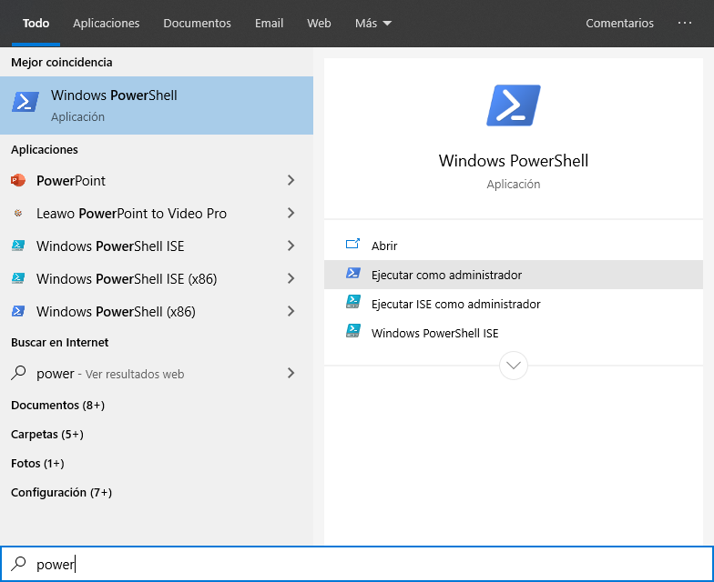
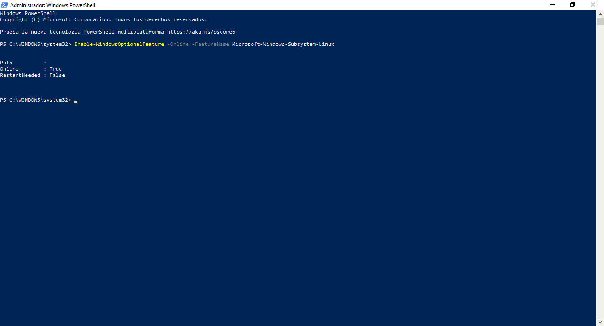
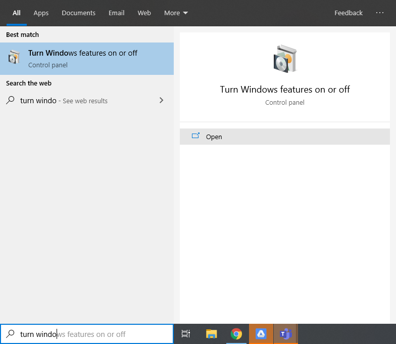
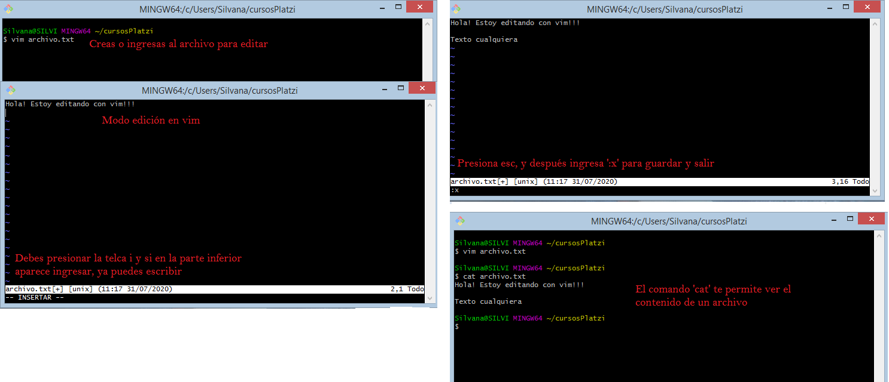

# Introducción a la Terminal y Línea de Comandos
## Modulo 1. Comprender las ventajas del uso de la terminal
### Clase 1 *Introducción al curso: ¿Qué es y cómo funciona la terminal?*
Que aprenderás:
- Que es la terminal
- Porque usar la terminal
- Como usar la terminal
- Como aprovechar la terminal al máximo

La termina es un programa que recibe instrucciones de una forma medianamente cómoda, las traduce a un lenguaje que el computador comprende, las ejecuta y muestra los resultados. Utiliza un entorno 100% texto, por tanto, es muy eficiente y rápida, y a través de ella se puede automatizar tareas repetitivas.

Se compone de:
- **Prompt:** es un conjunto de caracteres al principio de cada línea y muestra información propia del sistema en que se esté utilizando.
- **Cursor:** es un 'underscore' que titila en la pantalla del terminal, y en conjunto con el prompt, indica que están a la espera de recibir órdenes.

En la terminal se ingresan instrucciones, también conocidas como 'comandos', los cuales están compuestos por:
- Nombre del programa
- Parámetros
- Modificadores

La terminal también cuenta con otras utilidades como:
- Comodines
- Combinación de teclas
- Sustitución de comandos

***Diferencia entre:
Parámetro: información adicional para la ejecución del programa.
Modificadores: alteración de lo que el programa va hacer.***

Algunos comandos son:
- date: muestra la fecha
- echo: permite imprimir en la terminal
- man <nombre de comando>: muestra información sobre los comandos
- history: historial de los comandos que hemos realizado en algún momento
- ! + número obtenido del history: ejecuta el comando con el número
### Clase 2 *Windows Subsystem for Linux (WSL): Cómo acceder a la terminal en Windows*
Para acceder a la terminal de Linux desde Windows es necesario que tengas instalado el Windows Subsystem for Linux.

Una vez instalado podrás colocar allí cualquier distribución de Linux que desees (si no conoces ninguna te recomiendo comenzar con Ubuntu).

Para continuar necesitarás tener acceso como administrador a tu computadora, asumiré que lo tienes para mostrarte el proceso de instalación.

Comencemos abriendo una terminal Window PowerShell (como administrador):

Una vez allí escribe el siguiente comando: *Enable-WindowsOptionalFeature -Online -FeatureName Microsoft-Windows-Subsystem-Linux.*

Deberías ver algo como:

Alternativamente (dependiendo de tu versión de Windows) puedes encontrar un modo más simple:

Cuando te sea requerido, reinicia tu computadora.

Al reiniciar estará todo listo para instalar tu distribución favorita.

Ingresa a la tienda de Windows:

Busca Linux:

Selecciona tu distribución favorita:

Da click en Obtener:

Selecciona instalar y, cuando haya terminado, “Lanzar”

Allí comenzará el proceso de instalación/configuración (¡pero ya dentro de Linux!):

Ingresa tu nombre de usuario (el de Linux, que puede ser completamente diferente al de Windows):

Y crea tu contraseña:

¡Y listo! Ya tienes una consola de Linux dentro de tu Windows!

Para acceder nuevamente o crear una ventana paralela:

Tienes una nueva entrada en tu menú de inicio.

¡Felicitaciones! Ya puedes operar sobre la terminal de Linux sin problemas.

Un último detallito importante: los archivos que tienes en tu Linux le pertenecen… Para acceder a los archivos que tienes en Windows (o grabar nuevos archivos desde tu Linux) debes ingresar en /mnt/c/Users/TU_USUARIO, donde TU_USUARIO debe ser reemplazado por tu nombre de usuario de Windows.

Ahora sí, cualquier archivo que guardes en esa localización podrá ser accedido con las herramientas propias de Windows.

¡Diviértete!

***OBSERVACION: Esto no esta disponible para Windows 8 y 8.1***
## Modulo 2. Comprender las ventajas del uso de la terminal
### Clase 3 *¿Qué es y cómo funciona el sistema de archivos?*

**Organización de información**

Nuestras computadoras están llenas de información (imágenes, videos, archivos, etc.) y el almacenamiento de esta información supone dos preguntas: ¿Cómo vamos a lograr que esta información esté presente? ¿Cómo vamos a organizar esa información?

De cómo almacenamos la información se encarga la computadora y el sistema operativo.

Como organizamos esa información es algo que nosotros debemos resolver. Y para eso contamos de dos maneras:
- Archivo: todo lo que contiene información
- Directorio: una forma de agrupar archivos y otros directorios.
Todos los archivos, directorios y subdirectorios forma parte del «Árbol de directorio», en donde cada archivo tiene una ruta para llegar.

Identificación de archivos
- Nombre
- Ubicación

En un sistema de archivos no puede existir dos archivos o directorios que tengan el mismo nombre completo, si puede pasar que dos archivos tengan el mismo nombre que otros mientras vivan en diferentes directorios.

Comando para organizar archivos:
- ls: permite ver los archivos de una carpeta
	- ls -a: muestra los archivos, incluso los ocultos
	- ls -l: muestra los archivos en una lista
	- ls -al: muestra todos los archivos (incluido los ocultos) en una lista
- pwd: muestra la ruta de carpetas en la que te encuentras actualmente
- cd: permite navegar entre carpetas
	- cd ~: nos envía a la ruta del usuario
	- cd -: nos envía al último directorio visitado
	- cd /: nos envía a la ruta principal
	- cd carpeta/: navega entre carpetas
	- cd ..: nos devuelve una carpeta atrás

Como organizar los archivos
- mkdir nombre: nos permite crear carpetas
- cp archivo.txt carpeta/: copia un archivo
- rm: nos permite eliminar un archivo. CUIDADO, si realizas mal este comando puedes borrar tu disco duro
	- rmdir: nos permite borrar una carpeta
- mv: nos permite mover un archivo

### Clase 4 *Práctica: Comandos para organizar el Sistema de Archivos*

### Clase 5 *Manejo de archivos de texto y utilidades interactivas*
**Tipos de archivos**
- Texto
- Binario

**Archivos binarios**
- Programas ejecutables
- Archivos de datos

**Archivos de texto**
- Páginas web
- Código fuente

**Utilidades interactivas**

Programas que procesan texto en tiempo real

- vim
- nano

***Archivos binarios: son archivos que solo pueden ser entendibles por las computadoras
Archivos de texto: son todos los archivos legibles por humanos***

**vim**
- Creas o editas un archivo texto con «vim archivo.txt»
- Ingresar oprimiendo la tecla 'i' para insertar caracteres
- Con la tecla esc sales del modo editor
- Guardas los cambios del archivo con ':w'
- Sales del editor con ':q'
- Guardar y salir al mismo tiempo ':wq' o ':x'

**nano**
- Ingresas con nano archivo.txt
- Desde un inicio estas en modo edición
- En la parte inferior puedes encontrar ayudas

### Clase 6 *Utilidades batch y batch avanzadas*
**Utilidades batch sencillas**
- cat: permite ver el contenido de un archivo (Ej. cat nombre_archivo.txt)
- head: permite ver las primeras líneas (Ej. head nombre_archivo.txt)
	- head -n num: muestra las num líneas indicadas (Ej. head n- 5 nombre_archivo.txt)
- tail: muestra las últimas líneas (Ej. tail nombre_archivo.txt)
	- tail -n num: muestra las num líneas (Ej. tail -n 3 nombre_archivo.txt)

**Utilidades batch avanzadas**
- grep: nos permite la búsqueda por epresiones regulares, nos muestra las líneas que coincidas con la expresión que utilizamos (Ej. grep Hanks dump1.sql [comando expesión_regular archivo])
	- grep -i: busca sin tener en cuenta la minuscula o la mayuscula (Ej. grep -i hanks dump1.sql)
	- También podemos buscar la expresión de una frase que termina con la misma palabra que estemos buscando (Ej. grep -i "hanks'),$")
- sed: tratamiento de flujos de caracteres, podemos editar expresiones que están dentro del flujo de texto
- awk: sirve para el tratamiento de texto delimitado o texto estructurados como archivos separados por ';'.

***Procesamientos por lotes o batch: programas que procesan texto y emiten el resultado***

### Clase 7 *Práctica: Tratamiento de texto*

## Modulo 3. Comprender los mecanismos de comunicación y administración entre procesos
### Clase 8 *Comunicación entre procesos: Qué son y como se utilizas los flujos estándar*

Procesamiento de datos
- Datos
- Proceso
- Información

Flujo estándar
- Entrada
- Salida
- Error

Los datos entran a un proceso donde son transformados y posteriormente salen como información.

Los distintos canales están conectados por defecto a nuestros periféricos, pero en ocasiones queremos los datos que están en un archivo existente sean procesados sin necesidad de volverlos a ingresar, para esto usamos un proceso llamado redirección, consiste en cambiar la entrada estándar por el modificador.
La otra forma de redirección es la redirección de la salida, que en vez de que nos muestre la información en pantalla, la almacena en algún archivo.

- **mysql -h 127.0.0.1 -u root -p1234 < dump1.sql** Redirección de entrada

- **ls > archivos.txt** Redirección de salida

- **ls -l >> archivo.txt**

**Pipes**

La función de los pipes es conectar los distintos procesos hechos con los tipos de redireccionamiento para reducir el tiempo que toma hacerlo todo manualmente.

- **ls -l |more** Nos muestra el resultado del primer comando en distintas iteraciones
- **cat <archivo.txt> | wc** Permite contar cuantos caracteres, palabras o líneas existe en un archivo
- **cat <archivo.txt> | wc -l** Cuenta la cantidad de líneas

### Clase 9 *Práctica: Comunicación entre procesos*

### Clase 10 *Administración de procesos en background y foreground*

Ejecución en primer plano: aquellos que, mientras un comando este en ejecución, la terminal no te permite que puedas realizar otra acción

Ejecución en segundo plano: aquellas que, mientras un comando está ejecutándose, puedes seguir realizando otras acciones en la terminal

**mysql -h 127.0.0.1 -u root -p1234 < dump1.sql &** 	El símbolo ampersand (&) pone en segundo plano desde el inicio la ejecución

**Ctrl + Z** 	Pone en segundo plano durante la ejecución

El comando *fg* coloca nuevamente el proceso en un primer plano

**Herramientas**
- ps: permite ver los procesos que se están ejecutando
	- ps ax: permite ver los procesos del sistema
- top: muestra los procesos que están ejecutando en tiempo real
	- Para salir debes oprimir la tecla 'q'

**Como detener un proceso**
- kill
- killall

Una forma de detener un proceso que se está ejecutando es con Ctrl + C, sin embargo, si el proceso se ejecuta en un segundo plano se requiere averiguar el número de comando con 'ps ax' y posteriormente ejecutar *kill -9 numero_proceso*. Otra forma es identificarlo mediante el nombre con *kill -9 'nombre_ejecutable.txt'*

### Clase 11 *Permisos sobre archivos: El sistema de permisos octal*

Desde sus comienzos Unix fue diseñado como un sistema multiusuarios, lo que implica que ciertas cuestiones básicas de seguridad están intrínseca al sistema. Una de estas cuestiones es que los archivos pertenecientes a un usuario no pueden ser accedidos por otro usuario salvo que el primer usuario le de los permisos.

Usuarios
- Dueño
- Grupo
- Otros

Todos los archivos de Unix tiene un dueño asociado, quien es la persona que ha creado el archivo; un grupo de usuarios que pueden accederlo; y, luego esta, que se le permite hacer a cualquier usuario que no sean el dueño y/o perteneciente al grupo asociado al archivo.

Operaciones que pueden hacerse sobre un archivo:
- Lectura
- Escritura
- Ejecución

Con el comando *ls -l*, podemos ver desde la terminal al principio de cada fila una serie de caracteres como esta:

### drwxr-xr-x

Cada uno de los caracteres y su ubicación tiene un significado:
- **Caracteres**
	- **d/l**, la letra que está al principio especifica que el archivo es un directorio o un link
	- **r**, lectura (read)
	- **w**, escritura (write)
	- **x**, ejecución (execute)
	- **-**, indica que no se tiene permiso o que no es un directorio o un link

- **Ubicación**
	- Primera posición: los primeros tres caracteres después del identificado de directorio hacen referencia a los permisos del dueño
	- Segunda posición: los siguientes tres caracteres que le siguen hacen referencia a los permisos que los grupos específicos de usuarios
	- Tercera posición: los últimos tres caracteres son los permisos para cualquier otro usuario

Para alterar los permisos de usuarios se utiliza alguno de los siguientes comandos:
- chmod: modifica los permisos individualmente
	- chmod o-w archivo.txt

	*chmod [usuario] [agregar o quitar permiso][especificar permiso] [archivo]*

	Usuarios:

	- **u**, dueño (user)
	- **g**, grupos (group)
	- **o**, otros (other)
	- Si no ingresas ninguna de esas tres letras al principio, hará el cambio de agregar o quitar permisos en todo

	Agregar o quitar permisos:

	- **+**, agrega
	- **-**, quita

- chown: modifica quien es el usuario que es propietario del archivo
	- chown [usuario] archivo.sql
	- sudo chown [usuario] archivo.sql
- chgrp: modifica quien es el grupo de usuarios que puede acceder al archivo
	- chgrp [usuario] archivo.txt
	- sudo chgrp [usuario] archivo.txt

***sudo permite operar como usuario root (administrador de sistema)***

***Usuario root, existe en todo sistema Unix y es quien puede leer, escribir  y ejecutar sobre cualquier archivo del sistema más otras operaciones exclusivas para él***

Notación Binaria

- 4, únicamente permiso para leer
- 6, permisos para leer y escribir
- 7, permisos para la lectura, escritura y ejecución

- **chmod:**
	*chmod 760 archivo.php*

### Clase 12 *Práctica: Usuarios, Grupos y Permisos*
### Clase 13 *Sistemas de manejo de paquetes*

Es muy común encontrarnos en la necesidad de usar software que no viene con el sistema de fábrica, lo que nos lleva a tener que instalar dicho software y para eso tenemos que seguir los siguientes pasos:
1. Descargar el programa
2. Copiar los archivos a algún lugar en nuestra computadora
3. Hacer las configuraciones del programa para que este corra en nuestra computadora

**Paquetes de Software:** se encargan de hacer todas las tareas por nosotros sin la necesidad de hacer paso por paso manualmente.

**Administradores de paquetes:** son una colección de herramientas que nos sirve para automatizar el proceso de instalación, actualización, configuración y eliminación de paquetes de software.

**Paquetes binarios**

Son archivos ya ejecutables. Dependiendo del sistema, se pueden utilizar diferentes manejadores de paquetes

- apt: se usan en las distribuciones basadas en Debian y nos sirve para poder gestionar la instalación de programas y paquetes.
	- apt-get install nombre_paquete
	- sudo apt-get install nombre_paquete
- zypper: se usa en aplicaciones como YaST, Zypper y la implementación de PackageKit para openSUSE y SUSE Linux Entrepise
	- zypper install nombre_paquete
- rpm: es el formato de paquete de partida del Linux Standard Base
	- rpm -ivh nombre_paquete.rpm
	- sudo rpm -ivh nombre_paquete.rpm

***lynx: es un navegador de línea de comandos***

**Paquetes de lenguajes**

Cuando programamos necesitamos paquetes de liberarías hechas para el lenguaje que solemos utilizar, dependiendo del lenguaje encontraremos el paquete que necesitamos:

- pip: es el paquete que se utiliza con Python
	- python get-pip.py (Windows)
	- sudo apt-get install python-pip (Linux)
	- sudo easy_install pip (Mac OS)
- composer: es el paquete se utiliza con PHP
	- php composer install
- npm: es el paquete se utiliza con Node.js
	- npm install nombre_paquete (local)
	- npm install -g nombre_paquete (global)

**Otros**

Existen otros tipos de administradores que tratan de ser un poco más genéricos que permiten instalar ya sea paquetes binarios o paquetes de lenguajes
- conda: es un gestor de paquetes y un sistema de gestión de entornos de código abierto
- homebrew: es un sistema de gestión de paquetes en los sistemas operativos Mac OS de Apple y GNU/Linux

## Modulo 4. Conocer herramientas avanzadas
### Clase 14 *Proximo*
### Clase 15 *Proximo*
### Clase 16 *Proximo*
### Clase 17 *Proximo*
### Clase 18 *Proximo*
### Clase 19 *Proximo*

## Modulo 5. Automatizar tareas: el verdadero poder de la terminal
### Clase 20 *Proximo*
### Clase 21 *Proximo*
### Clase 22 *Proximo*
